## Part I: miscellenea

# Lesson 29: Accidents and casualties

## An accident without injuries

### Free the road

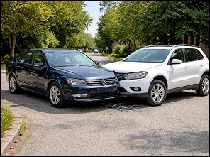 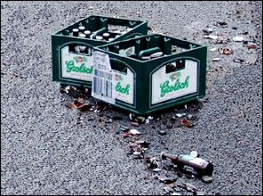

If your vehicle is **defective** or you are **involved in an accident without injury**:

* you first and foremost **try to park your vehicle** in a place where it is allowed to stand.
* even in the event of an accident without injuries at an intersection, if possible, you free up the intersection.
* if some cargo has fallen on the road, remove it as soon as possible.

### Ensure the safety of the other traffic and avoid further collisions

If a vehicle can no longer be moved, or the fallen load is quite large, then you make every effort to prevent more accidents from happening in that place.

|  |  |
| --- | --- |
| 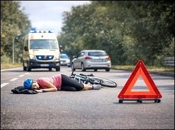 | That's what you do:   * Place the **warning triangle**. * If they're still working, keep the **four warning lights** on. * To prevent a fire outburst, **turn off the engine**. * And of course you **don't smoke** at the scene of the accident. |

### The warning triangle

|  |  |
| --- | --- |
| 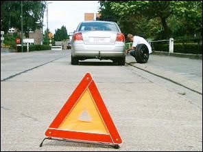 | The warning triangle shall be clearly visible:   * on **ordinary roads** at least **30 meters** before the accident site, * on **motorways** at least **100 meters**.   It shall be **visible to approaching vehicles from 50 meters**. |

Must be present in a car:

* warning triangle;
* fire extinguisher;
* fluorescent jacket;
* first aid kit.

### The European Accident Form

|  |  |
| --- | --- |
| 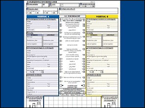 | In the event of an accident without injury:   * you should **not let the police come** * but the **European collision form** must be completed and signed by those involved.   With your signature you confirm that you agree with what is entered on the document. |

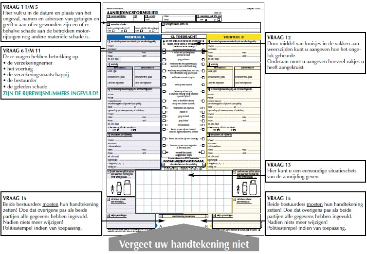

#### TIP 1

In the section of the situation sketch, it is best to indicate:

* the road situation;
* the direction of travel of the vehicles;
* the position of the vehicles at the time of the collision;
* road signs (lights, signs, lines); street names (or roads).

#### TIP 2

Front form:

* must be filled in and signed by both parties together.

Back form:

* fill it in afterwards (e.g. at home) separately.

#### TIP 3

You always have to stay on site if you are involved in an accident.

From the **age of 15** you are obliged to show your identity card, if one of the people involved asks for it.

|  |  |
| --- | --- |
| 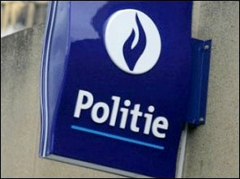 | In case of discussion, or if someone doesn't want to sign the collision form, you let the police come.  If the police can't come, you're going to report it to the police station as soon as possible. |

### Damaged property

|  |  |
| --- | --- |
| 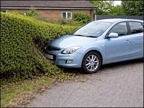 | If you have harmed someone's vehicle or property and you do not find the owner:   * do everything to leave your identity details * or notify the police. |

### A broken down vehicle

|  |  |
| --- | --- |
| 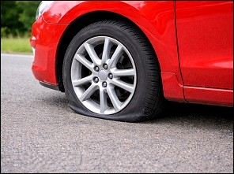 | You should never leave a defective vehicle on public roads for **more than 24 hours**. |

---

## An accident with injuries

### Avoid further accidents

If there are only minor injuries:

* you park the vehicle in a place where it is allowed to stand.

If that is not possible, or if there are serious injuries, then you do everything again to prevent more accidents from happening:

* Warning triangle;
* Warning lights;
* Turning off the engine;
* Don't smoke.

### Police

|  |  |
| --- | --- |
| 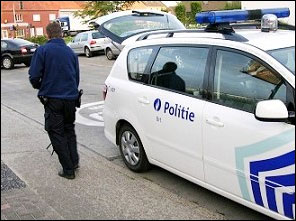 | In **every accident with injuries**, the **police must come** to make the necessary findings.  (If there are no injuries, the police do not have to come and the parties complete the European accident report.) |

### Reflective safety jacket

|  |  |
| --- | --- |
| 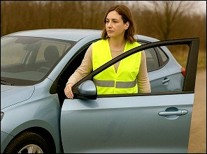 | Don't forget to put on the fluorescent jacket when you leave the car **on a motorway or express road**.   * Driver: is that mandatory. * Passengers: not mandatory, but do the best.   The vest must be kept **inside the vehicle**, not in the boot. |
| 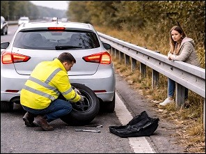 | Accidents sometimes also happen on the hard shoulder. If it is not really necessary, **do not stay in the vehicle and do not walk around on the hard shoulder. Wait behind the crash barriers.** |

### Estimate the situation

|  |  |
| --- | --- |
| 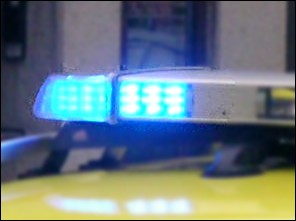 | Before you notify the emergency services, you must first estimate the situation:   * Where are you? * Are there one or more light or serious injuries? * Are there any people trapped in a vehicle? * Is there a fire or a risk of fire? |

### Rescue strip

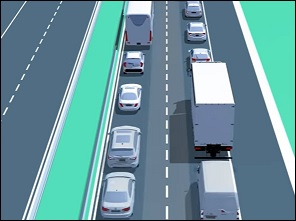 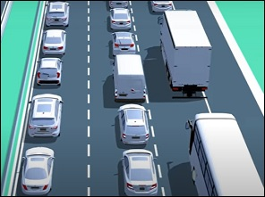

|  |  |
| --- | --- |
| Geen video ondersteuning in deze browser... | Rules In the event of traffic jams, drivers travelling on a roadway with two or more through lanes in their direction of travel (i.e. not only on motorways) must pre-emptively form a rescue strip for the emergency services.  This must be done before traffic comes to a standstill.   * On **a two-lane lane**: between the left and right lanes. * On **a three-lane lane**: between the left and middle lanes.   In principle, when forming a rescue lane, drivers in the right lane should not divert to the closed rush-hour lane, a breakdown lane, a bus lane or a special over-drive bed for buses. |

---

## The injured

### Don't move

|  |  |
| --- | --- |
| 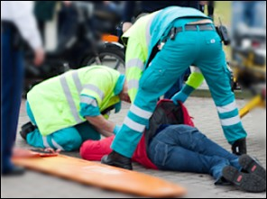 | If it's not vital, don't move injured people yourself. After all, they can have fractures or internal bleeding. |
| 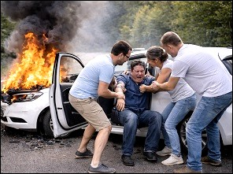 | In case of fire or fire risk, the victim must be **removed from the vehicle as quickly as possible** or moved away from it. |

### Leave the helmet

|  |  |
| --- | --- |
| 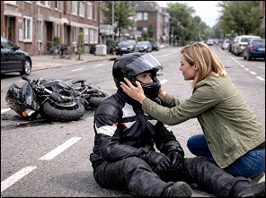 | A helmet leaves you on the head - unless the injured person has breathing difficulties or vomiting, for example.  What this woman wants to do with good intentions is incorrect. |

### Drinks and medicines

|  |  |
| --- | --- |
| 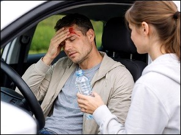 | Do not give an injured person any drink (not even water) or medicines (also no painkillers). |

### Bleeding

|  |  |
| --- | --- |
| 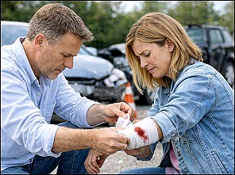 | In case of heavy bleeding, cover the wound with a clean handkerchief or use a pressure bandage.  What you must not do is tie off the arm above the wound. |

---

## Medically unfit to drive

|  |  |
| --- | --- |
| 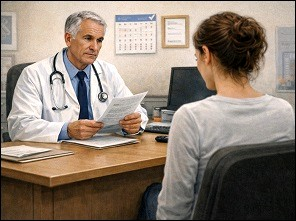 | If a doctor decides that you are no longer considered healthy enough to drive physically and/or mentally, you must report this to the municipality **within four days** after the day (Saturday-Sunday-public holidays not included).  The driving license can be obtained again on presentation of a fitness certificate issued by a doctor, which shows that you are again suitable for driving a vehicle. |

---

## Tunnels

### Lights

|  |  |
| --- | --- |
| 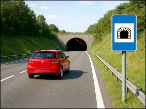 | In a tunnel it is often darker than outside on the roadway.   * That's why it's best **to take off your sunglasses**, * and **turn on the dipped-beam lights** - well before you enter a tunnel.   If you were to do this just before, or only in the tunnel itself, it would seem to the rear of the car that you suddenly brake. This could lead to a shock reaction in your rear seats. |
| 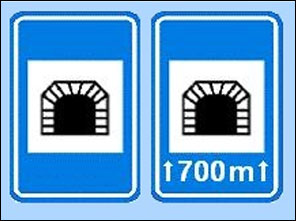 | Usually there is also no escape or breakdown lane in a tunnel. So be careful and adjust your speed if necessary. |

### Traffic sign

|  |  |
| --- | --- |
| 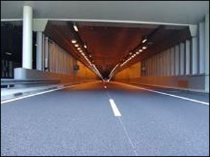 | When a tunnel is **longer than 500 meters**, it is indicated by the first sign.  The exact length can be indicated on the board. |

### What is not allowed

|  |  |
| --- | --- |
| 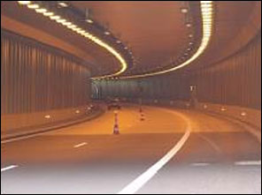 | In a tunnel is forbidden:   * parking * waiting * reversing |

### Accident in a tunnel

|  |  |
| --- | --- |
| 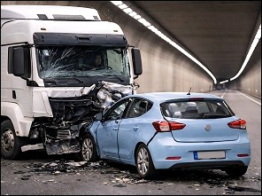 | 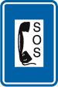  Preferably notify the emergency services **via the emergency telephone in the tunnel**.  If there is no emergency phone, use your mobile phone (112). |

### Fire or dense smoke

|  |  |
| --- | --- |
| 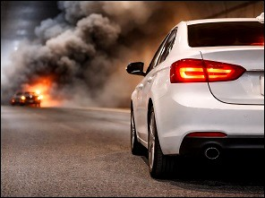 | In the event of a fire or heavy smoke:   * Park the car as far to the right as possible * Leave the key in the ignition * Leave the tunnel (via the emergency exit) |

### Emergency exit

|  |  |
| --- | --- |
| 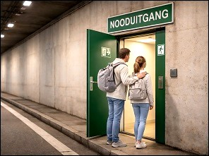 | In case of fire or heavy smoke, you must leave the tunnel via the emergency exit. Instructions are often given through loudspeakers installed in the tunnel. The emergency exit leads pedestrians to shelters with escape routes. |

---

## Smoking in the car

|  |  |
| --- | --- |
| 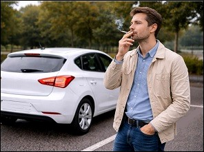 | In Flanders and in Wallonia, is smoking in the car prohibited when children are in the car. |

---

## Hit and run

|  |  |
| --- | --- |
| 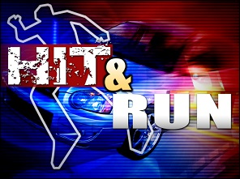 | You commit a hit-and-run if you deliberately leave the scene of an accident because you think or know the cause or cause of an accident, and your intention is to escape the findings and the consequences.  Being convinced that no one has seen you is a big mistake and thinking that people will never find you an equal size.  Never commit a hit-and-run, because there are severe punishments and no one can help you with that anymore. |

---

[Back to the previous page](theory)