## Part I: miscellenea

# Lesson 28: Alcohol - drugs

## Alcohol

### Why not drink alcohol and drive

|  |  |
| --- | --- |
| 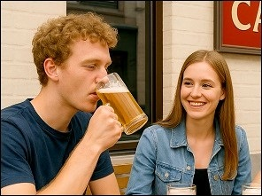 | Alcohol and driving really don't go together.  Alcohol lessens **the ability to observe/concentrate, judge or react**. As a result, if this person has to brake, the reaction distance will be longer.  A drunk driver is more likely to be tired and will sometimes behave overconfidently and recklessly. Because a drunk driver is a danger not only to himself, but also to other road users, the police often organize alcohol controls. |

---

## Alcohol control: for whom

|  |  |
| --- | --- |
| 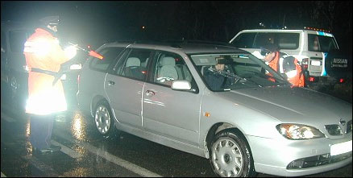 | An alcohol check can be imposed on:   * anyone preparing to drive a vehicle or ride an animal on a public road. Also cyclists and riders. * a driving instructor or a supervisor can also be subjected to a check. * also someone who (presumably) caused an accident, in that case even to a pedestrian.   Alcohol checks will **not** be requested from passengers, or anyone sleeping in the car or pedestrians. |

---

## The breath test

### What

|  |  |
| --- | --- |
| 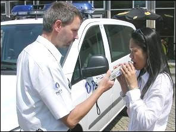 | In a breath test, traces of alcohol are detected in the exhaled air by means of a portable device.  A driver is asked to blow hard and persistently into the mouthpiece of the breath tester for a few seconds (+/- 7 sec.) until the (green) flashing light goes off.  A continuous whistle indicates that the blowing is correct. |
| 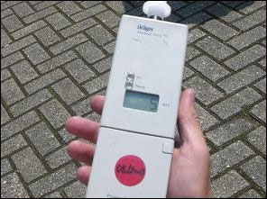 | The result appears on the screen of the device a few seconds later. The appliance will then give an indication whether you have been drinking.  In other words, it determines the category in which the result of the alcohol concentration will lie. |

The breather detects the alcohol content in the exhaled air. But **the result is only an indication** and not yet a really exact result. So it doesn't provide any criminal evidence yet. This requires additional breath analysis or, in the absence of a breath analyser, a blood analysis.

### Result

|  |  |
| --- | --- |
|  | A "S" appears (Safe/ Safe)   * The alcohol content is below the legally permitted maximum. * You can **continue driving**. |
|  | An "A" appears (Alarm)   * The result is **positive**. * The alcohol level is at least 0.22 mg/litre of exhaled alveolar air (0,5 °/°°) but below 0,35 mg/l (0,8 °/°°). * You **will need to do a breath analysis** to know the exact result. |
|  | A "P" appears (Positive)   * The result is **positive**. * The alcohol level is at least 0.35 mg/l (0.8 °/°°) or more. * You **will need to do a breath analysis** to know the exact result. |

### Refuse

If you refuse the breath test, you will be considered (P)ositive and you will be banned from driving for **six hours**.

---

## Breath analysis

### What

|  |  |
| --- | --- |
| 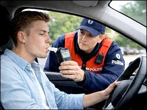 | For a breath analysis, you need to blow into a device that measures the alcohol concentration in the exhaled alveolar air.  The exact result of the breath analysis is displayed on the screen of the device (e.g. 0.25 mg/l.)  The device also prints a ticket, on which the result is stated and you will receive a copy of it. |

### Result

|  |  |
| --- | --- |
| 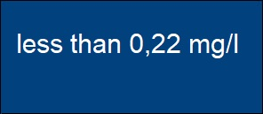 | If you have less than 0.22 mg of alcohol per litre of exhaled air:   * You can **continue driving**. |
| 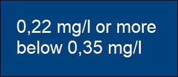 | Is the result 0.22 or more, but less than 0.35:   * You must hand in your driver's license for **3 hours**. * It's a felony and you get a fine. |
| 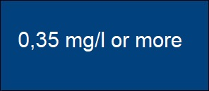 | If the result is 0,35 or more:   * You must hand in your driver's license for **6 hours**. * An immediate withdrawal of your driving license is also possible. * You'll be fined. * After those 6 hours, a new breath analysis will follow. |

---

## Blood test

### What

|  |  |
| --- | --- |
| 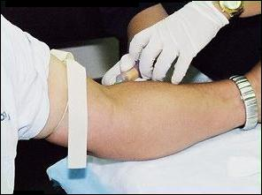 | A blood test is taken when a breath test or breath analysis is not possible, for example because the driver has been taken to the hospital.  But a blood test can also happen immediately, if, for example, a driver has asthma or is too drunk to blow.  It's not the police, it's a doctor who's going to take the blood test. |

---

## Drugs

### A saliva test

|  |  |
| --- | --- |
| 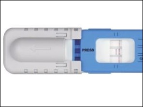 | The standardized test uses a swab sample from the mouth in order to check the presence of drugs.  If the result exceeds the permitted value:   * You must hand in your driver's license immediately **for 12 hours**. * An immediate withdrawal of the driving license is also possible.   After the 12 hours a new saliva test is done. |

### Refuse

Refuse saliva test = immediately 12 hours driving ban.

---

## Combination drugs, alcohol and medicines

|  |  |
| --- | --- |
| 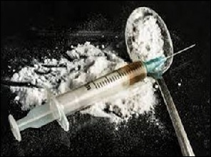 | A **combination of drugs and alcohol** is, of course, even worse than just alcohol.  Certain **medications** already have a negative effect on a persons driving ability. Alcohol can add to that.  Certain **sleeping aids** can even have an effect on driving ability the next day. |

---

[Back to the previous page](theory)