## Part F: priority

# Lesson 19: Crossing and traffic signs

## Priority road

### Priority sign

|  |  |
| --- | --- |
| 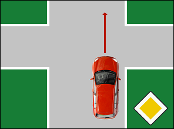 |   The yellow priority sign you see here indicates that you are **driving on a priority road** and that you have **priority at the following intersections**.  (Of course, you must always take into account the traffic lights and the orders of an authorized person.) |

### Overtaking on the left is allowed

|  |  |
| --- | --- |
| 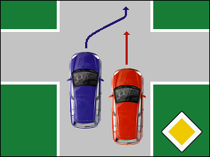 | 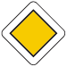  If you are driving on a priority road, **you may overtake another vehicle on the left just before or at an intersection**, if it is safe to do so. |

### End of a priority road

|  |  |
| --- | --- |
| 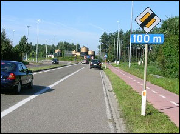 |   The priority sign with a black stripe indicates the end of a priority road. You have to give way at the next junction.  The combination of signs (in the photo) says that 100 meters further the priority road ends and that you will have to give way. |

---

## Priority at the next junction

### Priority signs

|  |  |
| --- | --- |
| 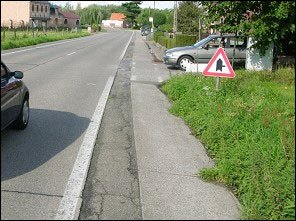 |  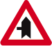  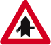 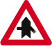  Traffic signs like these make it clear that you only have **priority at the next intersection**.  If you see this sign, you may, just like on a priority road, even just before or at the intersection, overtake a vehicle on the left. |
| Geen video ondersteuning in deze browser... |  |

### Diverting road

|  |  |
| --- | --- |
| 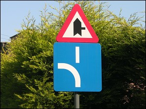 | An intersection where you have the right of way does not always go straight ahead, but can also make a turn.  A thick white line on the blue plate indicates in which direction the priority route turns. |

---

## Giving priority

### Sign

|  |  |
| --- | --- |
| 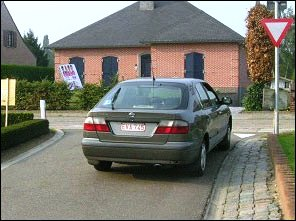 |   An **inverted triangle** means that **you must give way** to drivers who are on the public road you want to enter and that **you must stop if necessary**.  If there are no drivers on the intersecting road, you do not have to stop and you can enter the intersection. |

### Shark teeth

|  |  |
| --- | --- |
| 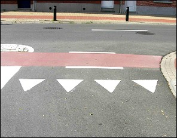 | **A line formed by inverted triangles**, also called shark teeth, indicates **where to stop if necessary**.  If it is not really necessary, you do not have to stop completely. |
| Geen video ondersteuning in deze browser... |  |

### White plate

|  |  |
| --- | --- |
| 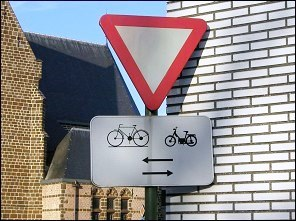 | A white plate can indicate that you have to be extra careful when entering the intersection, because **cyclists or moped riders can drive on the cycle lane in both directions**. |

### Do you see the difference

|  |  |
| --- | --- |
| 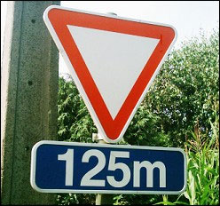 | This combination says that there is an intersection 125 meters further with an inverted triangle, **where you have to give way and stop if necessary**. |
| 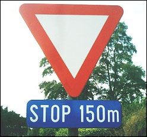 | In this combination, the word STOP is on the bottom plate. It says there is an intersection 150 meters further with a stop sign and where **you will have to stop and give way**. |

---

## Stop

### STOP sign

|  |  |
| --- | --- |
| 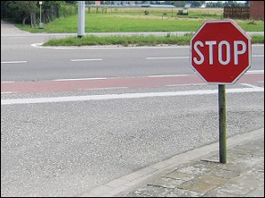 | If there is a STOP sign, **you must always stop** completely before the stop line before you are allowed to enter the intersection. |
| Geen video ondersteuning in deze browser... |  |

### Plate

|  |  |
| --- | --- |
| 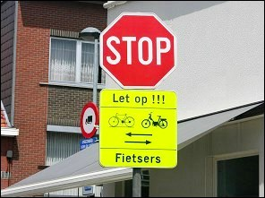 | Even with a STOP sign, **a bottom sign** can remind you to be extra careful, because **cyclists or moped riders from both directions can get hit**. |

---

## Roundabout

### How is a roundabout indicated

|  |  |
| --- | --- |
| 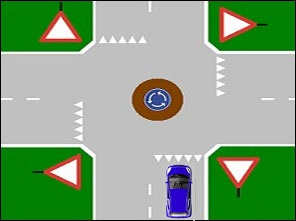 |     A roundabout is indicated:   * by the blue road sign * and at the entering roads is one of the two signs that regulate the priority. |

Important You cannot watch YouTube videos on our website if you do not accept all cookies. [View our cookie policy](cookies) [Accept all cookies](cookies/aanvaard/alles/dGhlb3J5L2Nyb3NzaW5nLWFuZC10cmFmZmljLXNpZ25z)

Important You cannot watch YouTube videos on our website if you do not accept all cookies. [View our cookie policy](cookies) [Accept all cookies](cookies/aanvaard/alles/dGhlb3J5L2Nyb3NzaW5nLWFuZC10cmFmZmljLXNpZ25z)

### Direction indicator

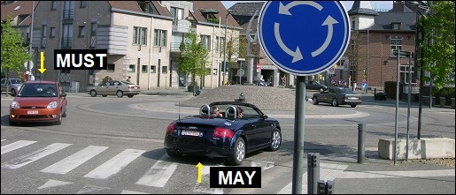

* When **entering a roundabout**, you **may turn on** the direction indicator, but you must not.
* When **leaving a roundabout**, you **must turn on** the right-hand direction indicator.

### Priority

|  |  |
| --- | --- |
| 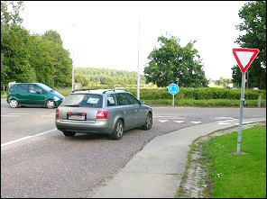 | When entering a roundabout, you must give way to drivers already on the roundabout.  *(That makes sense, because a characteristic of a roundabout is that there is a sign on the approach roads that says you must give way or stop.)* |

### A cycle lane

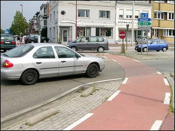 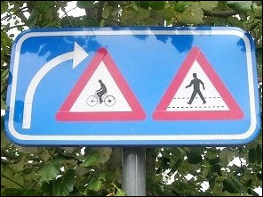

Most roundabouts have an adjacent cycle lane on the roundabout.

When leaving the roundabout, you must be extra careful and **give way to cyclists who continue to follow the cycle lane at the roundabout** and to pedestrians who wish to cross.

|  |  |
| --- | --- |
| Geen video ondersteuning in deze browser... |  |

Important You cannot watch YouTube videos on our website if you do not accept all cookies. [View our cookie policy](cookies) [Accept all cookies](cookies/aanvaard/alles/dGhlb3J5L2Nyb3NzaW5nLWFuZC10cmFmZmljLXNpZ25z)

### Crossing for cyclists at a roundabout

|  |  |
| --- | --- |
| 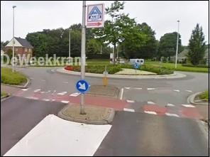 | There are **crossings for cyclists** at some roundabouts. These crossings are usually a bit outside the roundabout and cyclists see a small inverted triangle. Then **you do not have to give priority to the cyclists**, unless they have already entered the roadway. |

Important You cannot watch YouTube videos on our website if you do not accept all cookies. [View our cookie policy](cookies) [Accept all cookies](cookies/aanvaard/alles/dGhlb3J5L2Nyb3NzaW5nLWFuZC10cmFmZmljLXNpZ25z)

### No roundabout

|  |  |
| --- | --- |
| 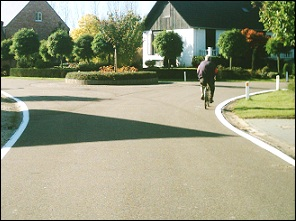 | On an **ordinary round square** (so no roundabout), or a **round traffic guide**, where there are no traffic signs to regulate the priority, the priority of right simply applies. |
| Geen video ondersteuning in deze browser... |  |

---

## Traffic signs

| Sign | Kind | Meaning |
| --- | --- | --- |
|  | Priority sign | You must give way and stop if necessary. |
|  | Priority sign | You must stop and give way. |
| 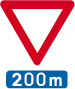 | Priority sign | 200m advance warning sign of giving priority and stop if necessary. |
| 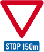 | Priority sign | 150m advance warning of a STOP sign. |
|  | Priority sign | Priority road. |
| 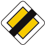 | Priority sign | End priority road. |
| 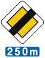 | Priority sign | 250m advance warning end of priority road. |
| 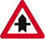 | Priority sign | Priority of right at the next junction. |
| 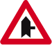 | Priority sign | Priority of right at the next junction. |
|  | Priority sign | Priority of right at the next junction. |
|  | Priority sign | Priority of right at the next junction. |
|  | Priority sign | Priority of right at the next junction. |
|  | Priority sign | An additional plate of the traffic signs B1, B3, B5, B7 and B15 indicates the priority through road. |
|  | Priority sign | An additional plate of the traffic signs B1, B3, B5, B7 and B15 indicates the priority through road. |
|  | Priority sign | An additional plate of the traffic signs B1, B3, B5, B7 and B15 indicates the priority through road. |
|  | Priority sign | An additional plate of the traffic signs B1, B3, B5, B7 and B15 indicates the priority through road. |
| 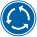 | Information sign (or informative or indication sign) | A roundabout. |

---

[Back to the previous page](theory)