## Part E: crossing/passing and overtaking

# Lesson 14: Crossing

## Crossing/passing

### Where are you allowed to drive when crossing on the right

|  |  |
| --- | --- |
| 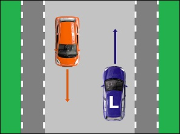 | Crossing means passing oncoming traffic.  Vehicles must keep **to the right on the road** as far as possible, and when there are lanes, on the right lane, in order to pass safety to the right of the oncoming traffic.  If the road is not wide enough, you may drive onto **the levelled verge**. |

### Where are you not allowed to drive when crossing on the right

|  |  |
| --- | --- |
| 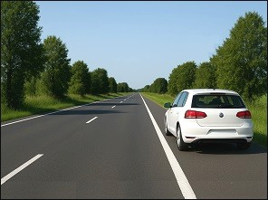 | Sometimes there is a **white solid lane** painted at the side of the road. It is called the **imaginary border of the lane**. Next to this line is a part of the public road where cars can **wait or park**.  You are not allowed to drive here in order to pass a vehicle. |
| 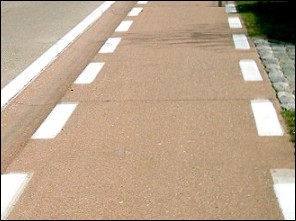 | It is also **not allowed on the cyclist lane**, because the cyclist lane is not a part of the carriage way.  But you may drive on a cyclists suggested lane to pass the oncoming traffic, because that is a part of the carriage way. |

### The distance between the vehicles while crossing

|  |  |
| --- | --- |
| 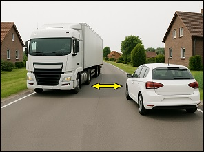 | The traffic code does not specify the exact lateral distance required when meeting another vehicle. It states that: When meeting oncoming traffic, the driver must leave **a sufficient lateral distance** and, if necessary, keep further to the right. |
| 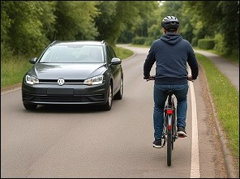 | However, when crossing a cyclist, you must leave: **1 metre** in built-up areas, **1.5 metres** outside built-up areas. |
| 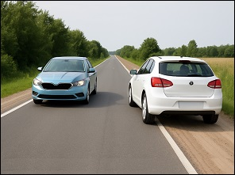 | If the width of the carriageway does not allow crossing easily, the driver may use **the level shoulder**, provided no road users on it are endangered. |

### Crossing/passing a tram

|  |  |
| --- | --- |
| 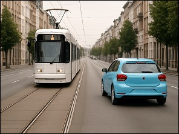 | You should always pass **a tram** (or other vehicles on rails) **to the right**.  You may only **pass a tram to the left if**   * the passage to the right is too narrow. * a parked vehicle is blocking the passage to the right. * a fixed obstacle is blocking the passage to the right.   It goes without saying that when passing to the left you must not endanger or hinder oncoming traffic. |

### Crossing/passing on a crossroads without arrows on the road surface

|  |  |
| --- | --- |
| 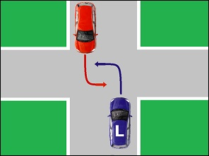 | At a crossroads without arrows on the road surface you **cross to the right**. |
| Geen video ondersteuning in deze browser... |  |

### Crossing/passing on a crossroads with arrows on the road surface

|  |  |
| --- | --- |
| 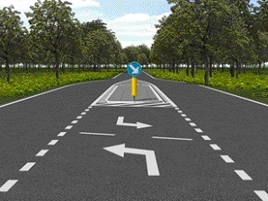 | At a crossroads without arrows on the road surface **you cross according to the arrows**. |
| Geen video ondersteuning in deze browser... |  |

---

## Road narrows

### Traffic signs indicating road narrows

|  |  |
| --- | --- |
| 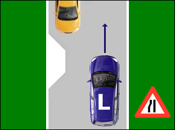 |   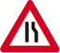  Sometimes the road narrows. It is indicated by one of these warning / danger signs. |

### Priority when there are no signs

|  |  |
| --- | --- |
| 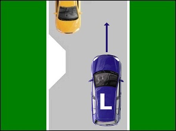 | When there are no traffic signs indicating priority, the driver on whose side the narrowing or obstacle is, **must give priority**.  In this example the brown car has priority at the road narrows, because the narrowing is on the other side of the road. |

### Priority when there are traffic signs

|  |  |
| --- | --- |
| 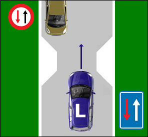 |    The driver who sees **the red sign** on his right side, **must give priority**.  The driver who sees **the blue sign** on his right side, **has priority**. |

---

## One-way traffic

### A public road with one-way traffic

|  |  |
| --- | --- |
| 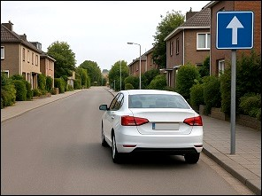 | On some carriageways you will see a sign indicating **a one-way road**. You will therefore not meet drivers coming from the opposite direction. |
| 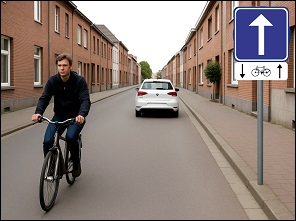 | **But be careful**: an **additional white panel** may indicate that certain road users — for example cyclists — are allowed to travel in the opposite direction.  (in this example cyclists may ride in the opposite direction.) |
| 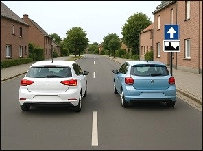 | If you are driving on a one-way road, you must normally also **drive on the right**, unless there is an exception explained in another lesson.  (For example, within a built-up area, you can choose which lane to drive in.) |
| 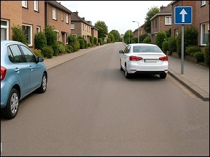 | On a one-way carriageway, you may **park on the right or on the left**, provided that at least 3 metres of free space remain between vehicles so that other road users can pass. |

### Difference

|  |  |
| --- | --- |
| 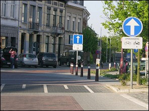 |  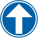  Although we focus more in another lesson, I want to point out that there is a big difference between these two traffic signs.  This sign indicates a road with one-way traffic.  This sign indicates the obligatory direction. |

### Turn left

|  |  |
| --- | --- |
| 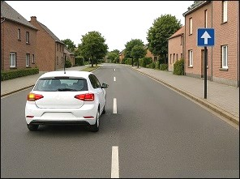 | If you want **to turn left**, you must position yourself **as far left as possible**, and in the **left-hand lane** if there are several lanes.  (The driver of this car has moved into the left lane because he wants to drive up the driveway of his house a bit further ahead.) |
| Geen video ondersteuning in deze browser... | If you want to turn left, you must get into the lane on the left. |

### Turn left and other drivers

|  |  |
| --- | --- |
| Geen video ondersteuning in deze browser... | When other drivers (cyclists, mopeds) are allowed to drive in the opposite direction, you must of course leave enough space for them. |

---

## Traffic signs

| Sign | Kind | Meaning |
| --- | --- | --- |
| 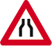 | Warning (or danger sign) | Road narrows. |
|  | Warning (or danger sign) | Road narrows to the left. |
|  | Warning (or danger sign) | Road narrows to the right. |
| 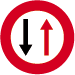 | Priority sign | Narrow passage, you must give way to the oncoming traffic. |
| 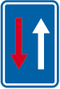 | Priority sign | Narrow passage, you have priority over the oncoming traffic. |
| 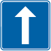 | Information sign (or informative or indication sign) | One-way traffic |
|  | Sign giving orders (or mandatory sign) | Obligatory direction ahead only. |
|  | Sign giving orders (or mandatory sign) | Obligatory direction to the left only. |

---

[Back to the previous page](theory)