## Part A: the public road

# Lesson 5: Express road and regular roads

## In general

### What is it

|  |  |
| --- | --- |
| 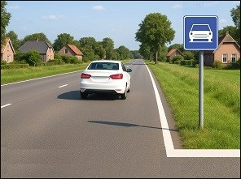  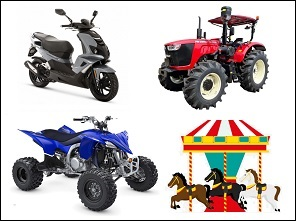 | 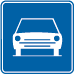 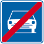  An **express road** is a public road. The beginning is indicated by the first traffic sign. The end is indicated by the second traffic sign.  The important difference between a motorway and an express road is that there can be cross roads and traffic lights on an express way.  Motor vehicles with trailers are allowed on the motorway, except:   * mopeds, * farm vehicles, * motorized quads without passenger space, * and tows of fairground vehicles. |

### Lanes

|  |  |
| --- | --- |
| 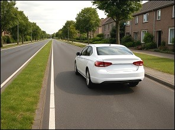 | An expressway may have **two or more traffic lanes**.  The driving directions may be separated:   * by **road markings**, or * by a **central reservation**. |
| 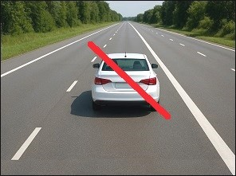 | When a public road has **two or three clearly separated carriageways** — for example by a median strip, an area inaccessible to vehicles, a height difference, or a continuous white line — drivers may **not** use the carriageway located on the **left** relative to their driving direction, unless local regulations allow it. |

---

## Speed

### Driving directions divided by a central reservation – 120kph

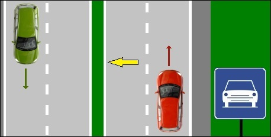

On express roads and on regular roads outside a built up area, you are allowed to drive **120kph** in normal circumstances:

* when every **direction has at least two lanes**.
* and when the directions are **divided by a central reservation**.

### Directions divided by a central reservation – (another speed limit)

Traffic signs can impose a lower speed limit.

When the road is **within a built-up area**, the maximum speed limit is **50kph**. (Brussels region: 30kph).

### Directions divided by a road marking

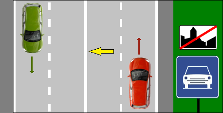

On express roads and regular roads **outside a built up area**, where the travel directions are separated by road markings, you are allowed to drive maximum:

* in the Flanders: **70kph**.
* in Wallonia: **90kph**.
* in Brussels region: **70kph**.

Naturally a traffic sign can impose another maximum speed.

### No minimum speed limit

There is **no minimum speed limit** on an express road or on a regular road.

BUT: don't forget that with driving too slow, you can hinder others so that they have to overtake you. That is also an offence.

---

## Breakdown - accident

### Warning triangle

|  |  |
| --- | --- |
| 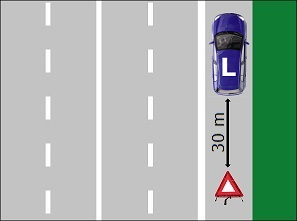 | When you have a **breakdown or an accident** on an express road or a regular road, you have to place immediately a warning triangle at least:   * **30 meters** behind your car (on motorway 100 meters). * The triangle must always be visible for oncoming traffic from a **distance of 50 meters**. |

### Reflective safety jacket

|  |  |
| --- | --- |
| 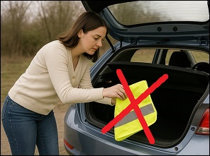 | A **driver** who leaves the vehicle **on an express road**, must wear a **reflective safety jacket**, that is **obligatory in the car**.  Passengers are not obliged, but should do it too. |

---

## Overtaking

### Overtaking on the left

|  |  |
| --- | --- |
| 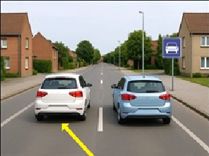 | You have to drive **on the right lane** as much as possible.  If the driver in front of you drives slower than the maximum speed limit, then you are allowed to **overtake on the left**.  Obstinate drivers who always drive in de middle or on the left lane are a pest on the motorway. They act as if the road belongs to them alone, and they provoke others to overtake on the right witch is prohibited. **It is a serious offence.** |

### Traffic jam

|  |  |
| --- | --- |
| 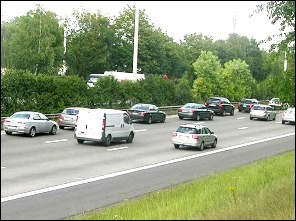 | When there is a lot of traffic, or there are queues of traffic it doesn’t matter if the traffic on the right lane is faster than the one on the left or in the middle, because **this is not considered as overtaking** in the traffic regulations.  It is safer to use your queue to drive on. |

---

## What is prohibited on an expressway?

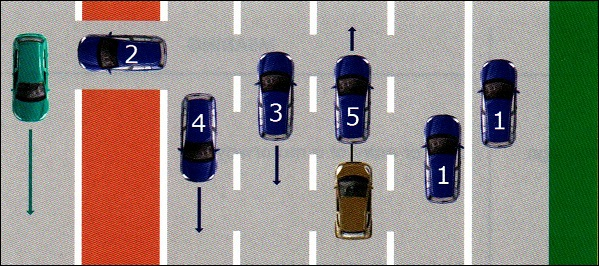

**On an expressway, it is forbidden** **to:**

1. Stop or park on the carriageway or the hard shoulder. Tip: this prohibition also applies to entry and exit ramps.
2. Drive on the central reservation or on cross-connections.
3. Reverse (even if you missed an exit).
4. Drive against the driving direction (ghost driving).
5. Tow another vehicle using an emergency solution (e.g., a rope). (This is allowed on ordinary roads, at a maximum of 30 km/h.)

---

## Traffic signs

| Sign | Kind | Meaning |
| --- | --- | --- |
|  | Information sign | Start of an express road. |
|  | Information sign | End of an express road. |
|  | Information sign | Start or access of a motorway. |
|  | Information sign | End or exit of a motorway. |
|   | Information sign | Start of a built up area. |
|   | Information sign | Start of a built up area. |
|   | Information sign | End of a built up area. |
|  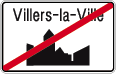 | Information sign | End of a built up area. |

---

[Back to the previous page](theory)