## Part C: the car

# Lesson 10: Load and passenger seat

## General remark

The load carried by a car must not:

* endanger other road users.
* damage other vehicles.
* damage the properties of others.
* obstruct the view.
* drag along or fall on the road.

---

## The height of the car

### Load on the roof

|  |  |
| --- | --- |
| 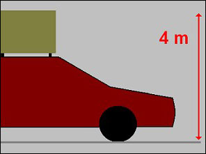 | The maximum height of a car, load included is **4 meters**.  Is the load higher, then it is categorized under **exceptional transport**. |

### Prohibitive sign

|  |  |
| --- | --- |
| 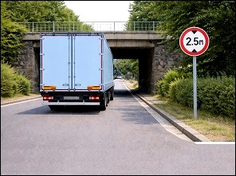 |   Because bridges and tunnels can be lower, then this traffic sign impose **another maximum height**. |

### To transport a load on the roof

|  |  |
| --- | --- |
| 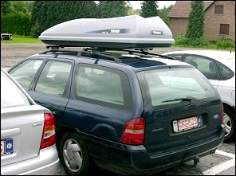 | Transporting something on the roof can increase the air resistance and fuel consumption.  That's why you have **to take off the ski box or the carrier** of the roof of your car when you don’t need it. |
| 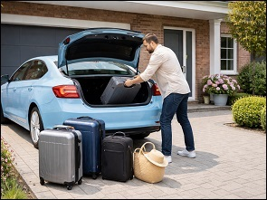 | Heavy objects should preferably be placed **in the trunk**, not on the roof, to prevent the vehicle from becoming unbalanced when cornering. |

### Bicycle

|  |  |
| --- | --- |
| 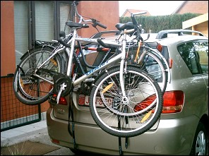 | It's better to place your bicycle **at the rear of the car** instead of on the roof.  A load at the rear of a vehicle **may never cover the rear lights** or the number plate.  *(The driver shown in the image is therefore NOT a good example.)* |

---

## The width of a car

### Maximum

|  |  |
| --- | --- |
| 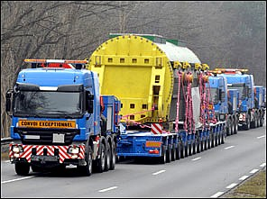 |   A car together with its load may not exceed **2.55 meters**.  When it is wider it is exceptional transport. |

---

## Front - rear

### At the front

|  |  |
| --- | --- |
| 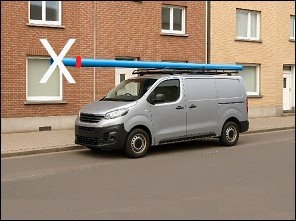 | The load may **never protrude beyond the front end** of the vehicle body.  Keep this in mind, for example, when transporting a ladder on roof racks. |

### At the rear

|  |  |
| --- | --- |
| 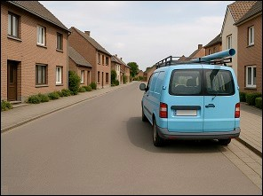 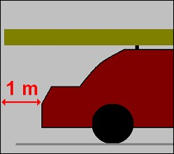 | At the rear, the load may **not protrude more than 1 metre** beyond the back of the vehicle. |

### Extra load

|  |  |
| --- | --- |
| 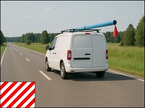 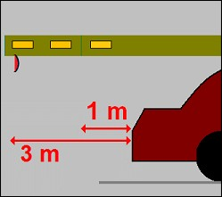 |   If you need to transport a **long and indivisible object** that cannot be folded or slid in, it may protrude **up to 3 metres beyond the rear** end of the vehicle, **provided that** you attach this **warning sign.**  *(The load shown in the image is therefore not correctly signalled.)*  When vehicle lighting is mandatory, the sign must also be fitted with:   * a **red rear light**, and * an **orange reflector on both sides.** |

### Prohibitive sign

|  |  |
| --- | --- |
| 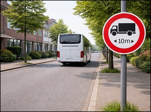 | This sign indicates no entry to **all vehicles** or combination of vehicles (so not only trucks) which, **load included**, exceed the limit shown. |
| 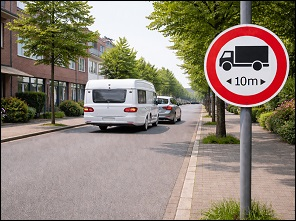 | This therefore also applies to drivers of a **vehicle combination**: if your car is towing a caravan, you are considered the driver of a combination  (vehicle + trailer = vehicle combination). |

---

## Dangerous loads

### Prohibitive signs

|  |  |  |
| --- | --- | --- |
|   Drivers of vehicles transporting dangerous goods are prohibited to drive past this sign. | 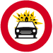  Drivers of vehicles transporting dangerous inflammable or explosive goods are prohibited to drive past this sign. |   Drivers of vehicles transporting contaminated goods are prohibited to drive past this sign. |

When your car runs on LPG (gas) you are allowed to drive past these signs. These signs are about the goods that you transport and not about the fuel of the car.

---

## Seating

### Driver and passenger

|  |  |
| --- | --- |
| 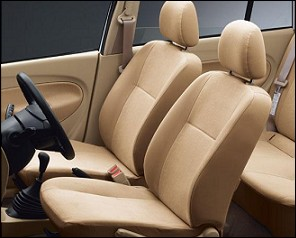 | For the driver’s comfort, but above all to ensure proper vehicle control, the driver must have at **least 55 cm of lateral space**.  The front passenger must have **at least 40 cm of space**. |
| 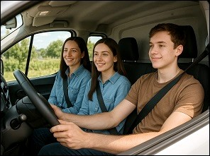 | When a car is fitted at the front with a **bench seat** designed to carry **three occupants**, it must have a **minimum width of 135 cm**:   * **55 cm** for the driver; * **2 × 40 cm** for the passengers. |
| 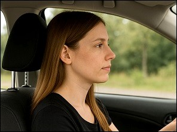 | The **head restraint** must be adjusted so that its **upper edge is at the same height as the crown of the head**, in order to ensure **optimal protection** and a **correct driving position**. |

### Seat belt

|  |  |
| --- | --- |
| 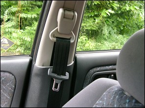 | Every seat in the car must have a seat belt and the driver as well as the passengers must wear the seat belt.  You must wear a seat belt **ABOVE the arm**. |

### Who doesn’t have to wear a seat belt

|  |  |
| --- | --- |
| 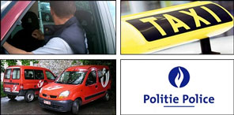 | Are exempt from wearing a seat belt:   * a driver who is reversing. * a taxi driver when a client sits in the car. * a postman collecting and delivering post from door to door. (read well: ‘postman’. So not someone from only deliveres packages) * authorized persons and emergency vehicles if the nature of their assignment justifies it. |

### Appropriate safety restraint system

|  |  |
| --- | --- |
| 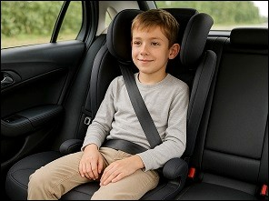 | Children **under 18 years** of age and **shorter than 1.35 m** must be transported in an **approved and appropriate child restraint system.**  If they are taller than 1.35 m, they may still use the system, but it is no longer mandatory.  If they do not use a system and are taller than 1.35 m, they must use the **regular seat belt**. |
| 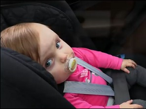 | Children under 18 years may **not** be transported in a rear-facing child seat on a front passenger seat protected by a **frontal airbag**, unless the airbag is deactivated or automatically and reliably switched off.  The l**ower part of the seat belt** must pass over the child’s legs **within** the child restraint system.  **Info**: Approved = compliant with ECE standards. This is not always the case for products bought online or outside the ECE zone. |

### Uitzondering:

There is an exception to the use of a child restraint system, valid **only** for children:

* older than 3 years, and
* taller than 1.35 m,
* making a **short journey** in a vehicle **not driven by one of the parents**,
* and only in **exceptional circumstances**.

In that case, they may use a **regular seat belt only**, but may **not sit in the front seat**.

If you have a small car with several children and it is not possible to install three child restraint systems in the rear, **one child over 3 years and taller than 1.35 m** may wear a regular seat belt, **but only in the rear seat**.

**Warning: an incorrect answer about seat belts for children automatically costs 5 points on the exam.**

---

## The blind spot

### Every vehicle has blind spots.

|  |  |
| --- | --- |
| 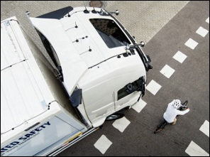 | Even if the **mirrors** are correctly adjusted, there are always areas **beside or behind the vehicle** that the driver of a **lorry** or a **car** cannot see in the mirrors. These areas are called **blind spots**. |

### Blind spot detection system

|  |  |
| --- | --- |
| 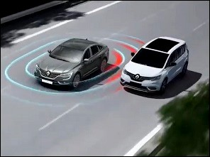 | Modern vehicles are increasingly equipped with **blind spot detection systems**, which warn the driver when a vehicle or another **road user** is present in the blind spot. A **warning light (LED)** then lights up in the exterior mirror. When this light is on, **you must not overtake** and you wait until the light goes out. You must of course also **check over your shoulder** to observe the situation yourself. |

---

## Trailer

### Are you allowed to tow a trailer

|  |  |
| --- | --- |
| 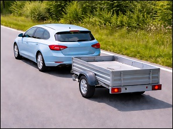 | If you have a **provisional driving license**, you are **not allowed** to tow a trailer.  If you have a definitive driving license B, you can tow a trailer with a Maximum Allowed Weight (M.A.W.) of up to 750 kilograms. |

### A trailer with a higher M.A.W.

|  |  |
| --- | --- |
| 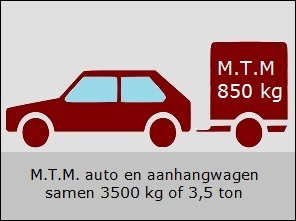 | If the M.A.W. of the trailer is more than 750 kilograms (for example 850 kg), you can still pull that trailer with a definitive driving license B, provided that the M.A.W. of the car and trailer together is a maximum of 3500 kg or 3.5 tons. |

---

## Traffic signs

| Sign | Kind | Meaning |
| --- | --- | --- |
| 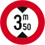 | Prohibitive sign | No entry to vehicles which, load included, exceed the height shown. |
| 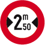 | Prohibitive sign | No entry to vehicles which, load included, exceed the width shown. |
| 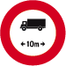 | Prohibitive sign | No entry to vehicles or combination of vehicles which, load included, exceed the length shown. |
|  |  | Any load that can not be taken apart and that projects between 1 meter and 3 meters behind the car must carry a warning marker. |
| 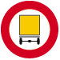 | Prohibitive sign | No entry to vehicles transporting dangerous goods. |
|  | Prohibitive sign | No entry to vehicles transporting dangerous inflammable or explosive goods. When the car rungs on LPG, it may drive past this sign. |
|  | Prohibitive sign | No entry to vehicles transporting dangrous contaminated goods. |

---

[Back to the previous page](theory)