## Part C: the car

# Lesson 9: M.a.w. and m.g.w.

## Driving licence B

### Which vehicles are you allowed to drive

With a **temporary or an official driving licence B** you are allowed to drive with:

* a **car**,
* a **car for double use**,
* a **minibus**,
* a **light truck**,

when the M.A.W. or the Maximum Authorized Weight is not higher than 3.5 ton or 3500 kg.

---

## Maximum Authorized Weight (M.A.W.)

### What is it

|  |  |
| --- | --- |
| 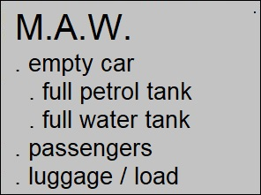 | The M.A.W. is the **maximum total weight** of a car, together with the petrol, the driver, the passengers and the full load.  That weight is determined **by the manufacturer**. He knows how strong the vehicle is.  When the car is overloaded it doesn’t answer to the safety regulations.  So, with a driving licence B you are allowed to drive **cars with a M.A.W. of 3500kg**. |
| 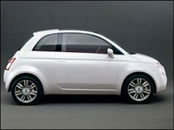 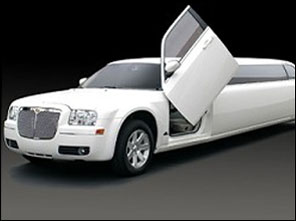 | The smaller a car, the lower the M.A.W.  The bigger a car, the higher the M.A.W. |

### Traffic signs concerning the Maximum Authorized Weight

|  |  |  |  |
| --- | --- | --- | --- |
|   |   |   |   |

### A possible examination question

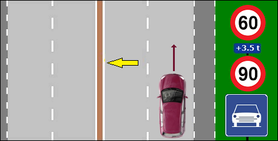

Question: What is the maximum speed this car is allowed to drive past this signs?

Let's look into:

* It is an express road with 2x2 lanes segregated by a verge. Normally you can drive 120kph.
* But there are traffic signs.
* The sign above with the blue plate indicates that drivers of vehicles with a M.A.W. of more than 3.5 ton are allowed to drive maximum 60kph.
* So this doesn't apply to a car, because it has a M.A.W. of 3500 kg.
* The sign in de middle indicates that other drivers are allowed to drive maximum 90kph.

The answer is: 90kph.

---

## Maximum Gross Weight (M.G.W.)

### What is it

The M.G.W. is the **exact weight** of the car and of the people and of the load/luggage when you put all that weight together on a scale at some particular time.

The M.G.W. varies, caused by the weight of the load, but may never exceed the M.A.W

### An example

|  |  |
| --- | --- |
| 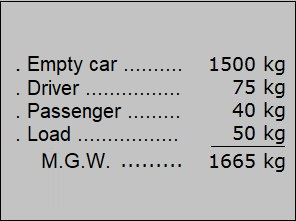 | Suppose the M.A.W. of a car is specified by the manufacturer as 2200 kg.  We put the car on a scale:   * Weight of empty car + petrol amounts 1500 kg. * The driver weighs 75 kg. * The only passenger weighs 40 kg. * The sack of potatoes in the trunk of the car weighs 50 kg.   Then the M.G.W. at that moment is 1665 kg, which is lower that the M.A.W. of the manufacturer. |

### Traffic signs concerning the Maximum Gross Weight

|  |  |
| --- | --- |
|  |   |

### A possible examination question

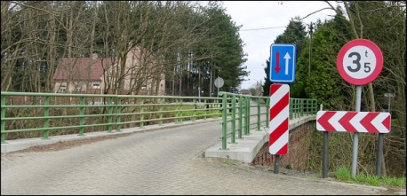

Are you allowed to cross this bridge with your car? The answer is: yes.

Is a truck with a load of 5 ton allowed to cross this bridge? The answer is: no.

---

## The following accessories must be in a car

### What should be in a car

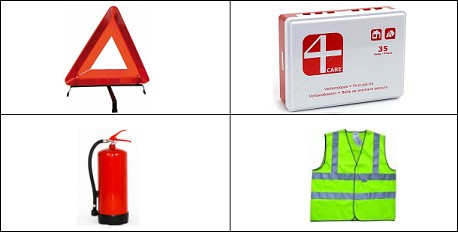

* a **red warning triangle,**
* a **first aid kit,**
* a **fire extinguisher,**
* a **reflective safety jacket.**

### What is not obligatory in a car

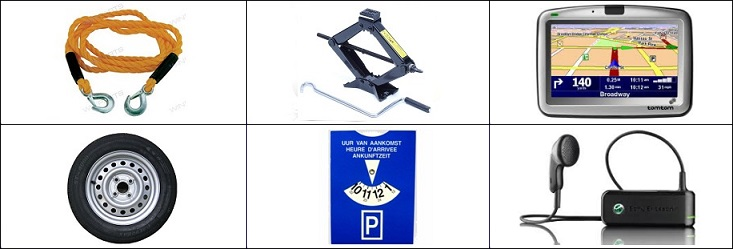

* a pulling cable,
* a spare wheel,
* a jack,
* a parking disk,
* a GPS,
* a handsfree kit

### Phone in the car

To telephone someone in the car with a handsfree kit is as much distracting a without a handsfree kit. It takes away the attention you need to drive a car.

---

## The following documents must be in a car

### For the driver

* **identity card**
* **driving licence**

### In the car

* the **car registration**
* the **certificate of conformity**
* the **car insurance**
* the **certificate of the technical control center** (when the car must be controlled)

---

## Trailer

### Are you allowed to tow a trailer

|  |  |
| --- | --- |
| 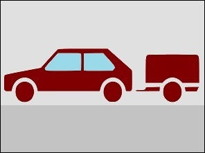 | If you have a **provisional driving license**, you are **not allowed** to tow a trailer.  If you have a definitive driving license B, you can tow a trailer with a Maximum Allowed Weight (M.A.W.) of up to 750 kilograms. |

### A trailer with a higher M.A.W.

|  |  |
| --- | --- |
| 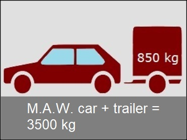 | If the M.A.W. of the trailer is more than 750 kilograms (for example 850 kg), you can still pull that trailer with a definitive driving license B, provided that the M.A.W. of the car and trailer together is a maximum of 3500 kg or 3.5 tons. |

---

## Car sharing

### What is car sharing

|  |  |
| --- | --- |
| 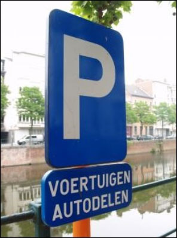 | Buying a car is expensive, especially if you only need it occasionally. If you share a car, you use one car with several people. You use the car when you need it. When you don't need it, someone else can drive it. In this way, a car is used better and thoughtfully and not everyone has to buy a car.  Car sharing comes in many shapes and sizes. The best-known initiative is Cambio, which offers its own fleet of cars in fixed parking spaces in various cities. Cambio members can lend cars in any of these cities if they need one and return it afterwards, provided they have a B driver's license for 3 years. |

---

## Traffic signs

| Sign | Kind | Meaning |
| --- | --- | --- |
|  | Sign concerning being stationary and parking | Parking allowed. |
|   | Sign concerning being stationary and parking | Parking allowed for vehicles with a M.A.W. of more than 3,5 ton. |
|  | Prohibitive sign | From the next traffic sign on until the next juntion, good vehicles or combination of vehicles with a maximum authorized weight exceeding 3500 kg may not overtake on the left a vehicle with more than 2 wheels or animal harness. |
|  | Prohibitive sign | From the next traffic sign on until the next junction, you may not exceed the indicated speed. |
|   | Prohibitive sign | From the next traffic sign on until the next junction, drivers of vehicles with a M.A.W. of more than 3,5 ton may not exceed the indicated speed. |
| 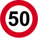  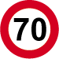 | Prohibitive sign | From the next traffic sign on until the next junction, drivers of vehicles with a M.A.W. of more than 3,5 ton may not exceed 50 kph. Other drivers may drive maximum 70 kph. |
|  | Prohibitive sign | No entry to vehicles exceeding indicated maximum gross weight. |
| 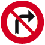 | Prohibitive sign | No right turn at the following junction. |
|   | Prohibitive sign | No right turn at the following junction for drivers of vehicles with a M.G.W. of more than 3,5 ton. |
|  | Prohibitive sign | No left turn at the following junction. |
|   | Prohibitive sign | No left turn at the following junction for drivers of vehicles with a M.G.W. of more than 3,5 ton. |
|  | Prohibitive sign | No entry to drivers of motor vehicles or towing vehicles built for the carriage of goods. |
|   | Prohibitive sign | No entry to drivers of motor vehicles or towing vehicles built for the carriage of goods with a M.A.W. of more than 3,5 ton. |

---

[Back to the previous page](theory)