## Part G: directions

# Lesson 24: Obligatory direction

## Arrow and obstacle

### Slanting arrow signs

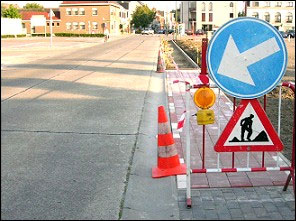 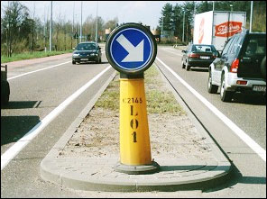

On obstacles, command or indication signs with **slanting arrows** can indicate that the obstacle must be **passed in the direction of the arrow**.

This sign can be placed on a pole or on a yellow bollard.

---

## Follow direction

### Command / indication signs

  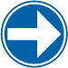    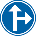

These **command traffic signs** with arrows indicate that the drivers are **obliged to follow the direction(s) of the arrow(s)**.

### Plate

|  |  |
| --- | --- |
| 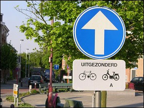 | A plate can indicate that **cyclists or drivers of mopeds class A** are not obliged to follow the direction indicated by the arrow. |

### Difference

|  |  |
| --- | --- |
| 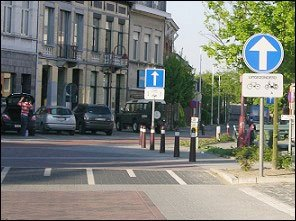 |    There is a **big difference** between these two traffic signs.   * At the back you can see an **information sign** which indicates a road with **one-way traffic**. * At the front there is a **command / instruction sign** which indicates the **obligatory direction to follow**. |

---

## Choice of direction

|  |  |
| --- | --- |
| 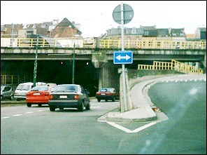 | This sign on a pole or a yellow bollard indicates that **you may pass to the left or the right**. |

---

## Traffic controls

 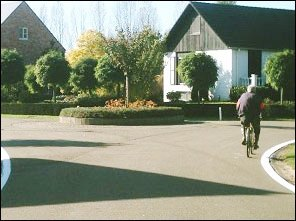

Sometimes there are no signs, but there are **road markings** or **islands** which control the traffic.

You have to pass them **to the right**.

---

## Traffic signs

Je moet voor het examen kennen welk soort verkeersbord het is en de betekenis.

| Sign | Kind | Meaning |
| --- | --- | --- |
|  | Sign giving orders (or mandatory sign) | The obligatory direction is indicated by the arrow. The place determines the position of the arrow. When the sign is placed on an obstacle, it means that you have to pass it in the direction of the arrow. |
|  | Sign giving orders (or mandatory sign) | The obligatory direction is indicated by the arrow. The place determines the position of the arrow. When the sign is placed on an obstacle, it means that you have to pass it in the direction of the arrow. |
| 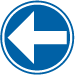 | Sign giving orders (or mandatory sign) | The obligatory direction is indicated by the arrow. The place determines the position of the arrow. When the sign is placed on an obstacle, it means that you have to pass it in the direction of the arrow. |
|  | Sign giving orders (or mandatory sign) | The obligatory direction is indicated by the arrow. The place determines the position of the arrow. When the sign is placed on an obstacle, it means that you have to pass it in the direction of the arrow. |
|  | Sign giving orders (or mandatory sign) | The obligatory direction is indicated by the arrow. The place determines the position of the arrow. When the sign is placed on an obstacle, it means that you have to pass it in the direction of the arrow. |
| 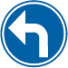 | Sign giving orders (or mandatory sign) | The obligatory direction is indicated by the arrow. The place determines the position of the arrow. |
|  | Sign giving orders (or mandatory sign) | The obligatory direction is indicated by the arrow. The place determines the position of the arrow. |
| 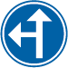 | Sign giving orders (or mandatory sign) | The obligatory direction is indicated by the arrow. The place determines the position of the arrow. |
|  | Sign giving orders (or mandatory sign) | The obligatory direction is indicated by the arrow. The place determines the position of the arrow. |
| 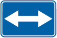 | Information sign (or informative sign or indication sign) | You may pass to the left or the right. |
|  | Information sign (or informative sign or indication sign) | Public road with one-way traffic. |
| 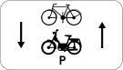 | Bottom board | Cyclists and pedelecs can drive in both directions. |
| 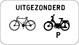 | Bottom board | Except cyclists and pedelecs. |
| 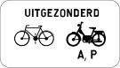 | Bottom board | Except cyclists, pedelecs and mopeds class A. |

---

[Back to the previous page](theory)