## Part E: crossing/passing and overtaking

# Lesson 16: Overtaking on the left prohibited

## Road markings

### Overtaking a vehicle on the left

 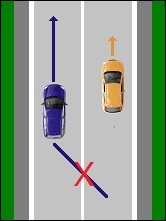 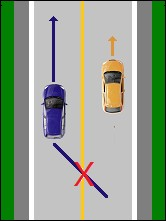 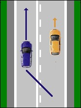

* You may **cross a broken white or yellow line** when overtaking a vehicle on the left.
* You may **not cross a solid white or yellow line** when overtaking on the left.
* When there is **a solid line with a broken line** next to it you must take into account the line on your side. When the broken line is on your side, you may overtake on the left. Once you have overtaken, you must cross the solid line in order to go back to the right.

---

## Speed hump

|  |  |
| --- | --- |
| 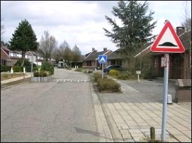 | The maximum permitted speed on certain raised sections of the road is 30 km/h in three cases (see below):  On public roads equipped with raised sections:   1. which are indicated by the A14 and F87 signs, or 2. which, at intersections, are indicated only by an A14 sign, or 3. which are located in an area delimited by the F4a and F4b signs.   Drivers must approach these raised sections with extra caution and at a moderate speed, so as to cross them at a speed not exceeding 30 km/h. 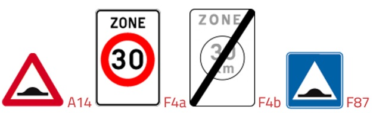 |
| 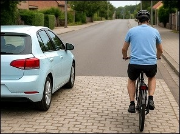 | You may overtake a cyclist or a step only on the left. |
| 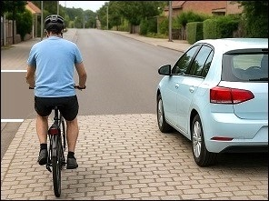 | You may overtake on the right a cyclist who is about to turn left. |

---

## Traffic signs

### Prohibitive sign

|  |  |
| --- | --- |
| 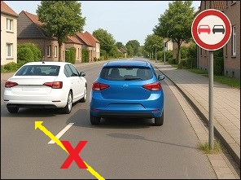 |    The red prohibitive sign indicates for drivers no overtaking on the left of:   * animals in harness. * a vehicle with more than two wheels.   A driver is allowed to overtake a two-wheeled motorcycle on the left.  A driver of a motorcycle may not overtake a car, because a car has more than two wheels.  This overtaking prohibition applies:   * until the next junction. * or it stops at the second sign. |

### Prohibitive sign

|  |  |
| --- | --- |
| 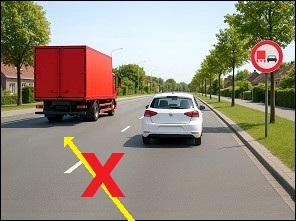 | 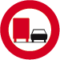   The red prohibitive sign indicates that good vehicles or combination of vehicles with a maximum authorized weight exceeding 3,500kg may not overtake on the left:   * animals in harness. * a vehicle with more than two wheels.   A driver of a car is allowed to overtake a goods vehicle, a lorry, a truck on the left past this sign.  A driver of a bus is also allowed to overtake on the left, because it is not a goods vehicle.  This overtaking prohibition applies:   * until the next junction. * or it stops at the second sign. |

---

## Traffic regulations

The next rules tell us when and where overtaking on the left is prohibited of:

* animals in harness,
* a vehicle with more than two wheels,
* and a two-wheeled motor vehicle.

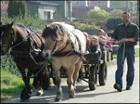 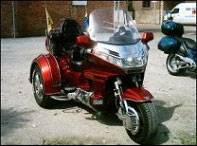 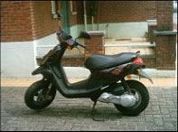

### Level crossing

|  |  |
| --- | --- |
| 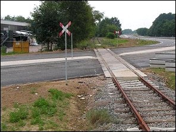 |    At a level crossing indicated by two of the signs above, overtaking on the left is prohibited of:   * animals in harness, * a vehicle with more than two wheels, * and a two-wheeled motor vehicle.   A cyclist is not a motor vehicle and therefore you are always allowed to overtake.  Overtaking on the left is allowed when the level crossing has:   * barriers * or traffic lights and the white light is on. |

### At a junction with priority of the right

|  |  |
| --- | --- |
| 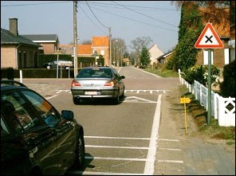 |   At a junction with no authorized persons, no traffic lights, no signs which regulate priority, or with the sign above and where the priority from the right rule applies, overtaking on the left is prohibited of:   * animals in harness, * a vehicle with more than two wheels, * and a two-wheeled motor vehicle.   A cyclist is not a motor vehicle and therefore you are always allowed to overtake. |

#### At a junction where you must give way

|  |  |
| --- | --- |
| 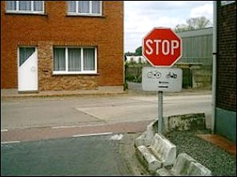 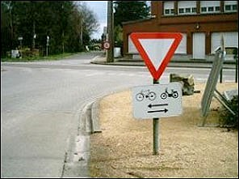 |    At a junction where you have to give way, overtaking on the left is prohibited of:   * animals in harness, * a vehicle with more than two wheels, * and a two-wheeled motor vehicle.   A cyclist is not a motor vehicle and therefore you are always allowed to overtake. |

### Sleep hill

|  |  |
| --- | --- |
| 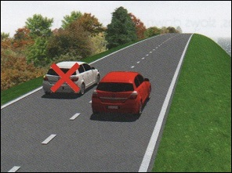 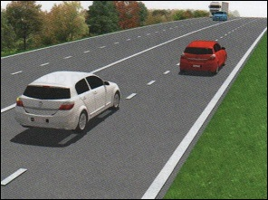 | 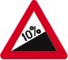  When approaching the brow of a hill, overtaking on the left is prohibited of:   * animals in harness, * a vehicle with more than two wheels, * and a two-wheeled motor vehicle.   A cyclist is not a motor vehicle and therefore you are always allowed to overtake.  You may however overtake on the left if you do not cross the solid white line that segregate the directions and the road is divided into lanes. |

### Dangerous bend

|  |  |
| --- | --- |
| 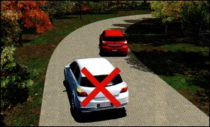 |  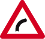 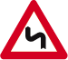 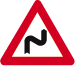  In or before a dangerous bend (in other words a blind corner) when the view is restricted, overtaking on the left is prohibited of:   * animals in harness, * a vehicle with more than two wheels, * and a two-wheeled motor vehicle.   A cyclist is not a motor vehicle and therefore you are always allowed to overtake. |
| 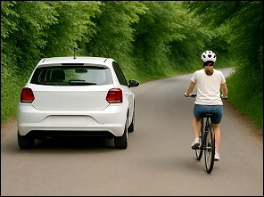 | You may however overtake on the left if you do not cross the solid white line that segregate the directions and the road is divided into lanes. |

### Crossing

|  |  |
| --- | --- |
| 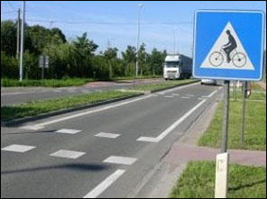 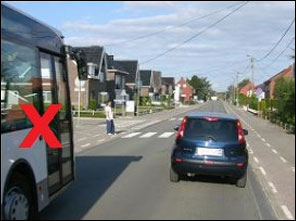 |    You are not allowed to overtake a driver on the left who approaches, slows down or stops in front of:   * a **crossing for pedestrians**, * a **crossing for cyclists or two-wheeled mopeds**.   Don't forget: you are not allowed to wait or park **on the crossing** or **on the road within 5 meters of the crossing**. It's allowed past the crossing. |

---

## Triple overtaking

### What is it

|  |  |
| --- | --- |
| 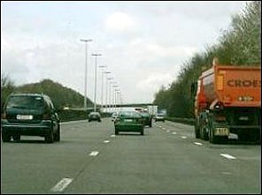 | Dutch: *tripleren* Triple overtaking means overtaking a wide vehicle which is itself overtaking another vehicle. |

### What is allowed on a way with two-way traffic

On a road with two-way traffic you may overtake a vehicle which itself is overtaking a two-wheeled moped or a motorbike.

You are not allowed to overtake a car, while it is overtaking another vehicle.

### What is allowed on a road with one-way traffic with at least 3 lanes

On a road with one-way traffic with at least 3 lanes in the direction being followed, you may overtake a car which is overtaking another car.

---

## Traffic signs

| Sign | Kind | Meaning |
| --- | --- | --- |
|  | Prohibitive sign | From this traffic sign on until the next junction no overtaking on the left of motor vehicles with more than 2 wheels or of animals in harness. |
| 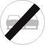 | Prohibitive sign | End of restriction. |
| 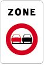 | Information sign | Start of a zone with no overtaking on the left of motor vehicles with more than 2 wheels or of animals in harness. |
| 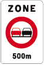 | Information sign | At 500m start of a zone with no overtaking on the left of motor vehicles with more than 2 wheels or of animals in harness. |
| 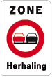 | Information sign | The regulation applicable within a zone can be repeated in the zone by a similar sign as that of the start of the zone, with the word 'Herhaling' (Repetition) added. |
| 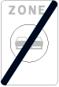 | Information sign | End of a zone with no overtaking on the left of motor vehicles with more than 2 wheels or of animals in harness. |
|    | Prohibitive sign | No overtaking of (...) starts at 200m and the speed limit of 90 kph as well. |
|    | Prohibitive sign | Start at 200m of the speed limit of 90 kph and no overtaking of (...) as well. |
|  | Prohibitive sign | From this traffic sign on until the next junction goods vehicles or combination of vehicles with a maximum authorized weight exceeding 3500kg may not overtake on the left a vehicle with more than 2 wheels or animals in harness. |
| 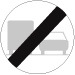 | Prohibitive sign | End of restriction. |
|  | Warning (or danger sign) | Steep hill. |
|  | Information sign | Pedestrian crossing. |
|  | Information sign | Crossing for cyclists and two-wheeled mopeds. |
|  | Warning (or danger sign) | Single line level crossing. |
|  | Warning (or danger sign) | Level crossing with 2 or more tracks. |
|  | Information sign | One-way traffic. |
|  | Warning (or danger sign) | (Dangerous) bend to the right. |
| 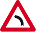 | Warning (or danger sign) | (Dangerous) bend to the left. |
| 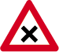 | Priority sign | Crossroads with priority from the right. |

---

[Back to the previous page](theory)