## Part E: crossing/passing and overtaking

# Lesson 15: Overtaking on the left

## The difference between overtaking on the left and passing

### Overtaking a vehicle on the left

|  |  |
| --- | --- |
| Geen video ondersteuning in deze browser... | When a vehicle drives slower than the maximum authorized speed limit, you are allowed to **overtake on the left**.  To be able to talk about overtaking, the vehicle ahead of you **must be moving**. |

### Passing a vehicle

|  |  |
| --- | --- |
| Geen video ondersteuning in deze browser... | When the **vehicle is not moving**, then we are not overtaking according the traffic regulation, but we are **passing**. |

---

## Before overtaking a vehicle

### Questions

|  |  |  |
| --- | --- | --- |
| 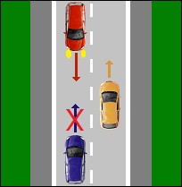 | 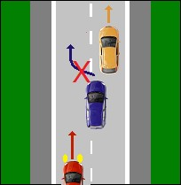 | 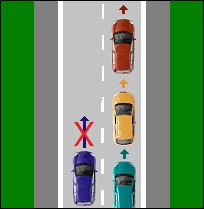 |

Before overtaking a vehicle on the left, ask yourself a few questions:

1. Does the driver in front of me drive **slower than the maximum authorized speed**?
2. Can I overtake him **in a very short time** without committing a speeding offense myself?
3. Is there an **oncoming vehicle** approaching?
4. Am I maybe **being overtaken by a vehicle behind me**?
5. And is there enough space so that you **can reinsert after overtaking**?
6. Are there **signs or traffic rules** prohibiting overtaking on this road? (By the way, our next lesson will be about those rules).

---

## How does overtaking happen

### The use of indicators

When you have considered the previous points and overtaking can be done safely:

1. Switch on the left direction indicator, after which you make the sideways shift to the left.
2. Once the sideways shift is complete, turn off the indicator.
3. You can overtake the vehicle.
4. As soon as you have overtaken the vehicle, turn on the right direction indicator.
5. Move back to the right.

### The safe distance between vehicles

|  |  |
| --- | --- |
| 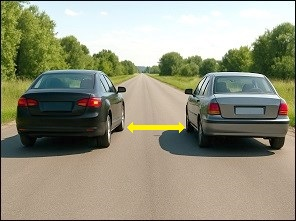 | When **overtaking vehicles**, you must keep a **sufficient lateral distance**. The traffic regulations use the word sufficient — they do not specify an exact value. |

---

## Overtaking a cyclist – moped rider – pedestrian

### Outside built-up areas:

|  |  |
| --- | --- |
| 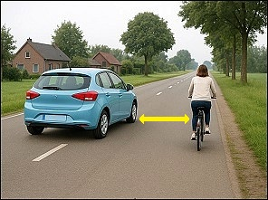 | **- On the roadway::** When overtaking a pedestrian walking on the road, or a cyclist or moped rider using the roadway, you must keep **at least 1.5 metres** of lateral distance. **- on a cycle path:** If the cyclist or moped rider is using a cycle path, you must also respect this **1.5 metre** distance.  (This distance also applies when meeting a cyclist coming from the opposite direction.) |

### Inside built-up areas:

|  |  |
| --- | --- |
| 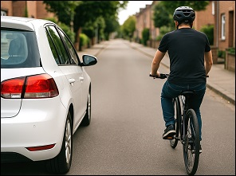 | The lateral distance must be **at least 1 metre** within built-up areas. |

---

## Can you overtake two vehicles at the same time

### Normal lane (1x1)

If you are driving on a normal lane (1x1), you must return to the right lane after overtaking the first vehicle, if this is possible without objection, before you start to overtake the second vehicle.

Suppose: a car is driving in front of you and another car is driving 50 meters in front of that car. If you have overtaken the car in front of you, you must first return to the right lane before overtaking the second car.

But if those two cars were to drive very close behind each other, so that it would be dangerous to turn right immediately after overtaking the first, then you can overtake them both on the left.

### When should you not immediately go back to the right?

The driver must not return to his right-hand position if he immediately wants to overtake again:

* **on two-way traffic lanes**, divided into four or more lanes, provided that the lanes intended for traffic in the direction of travel are used only;
* **on one-way traffic lanes**.

Suppose you are driving on a motorway (2x2) and a car is driving in front of you and another car is driving 50 meters in front of that car. If you are overtaking the car in front of you, you should not immediately return to the right lane before overtaking the second car.

---

## In only two cases is overtaking on the right allowed

### The driver in front of you turns to the left

|  |  |
| --- | --- |
| 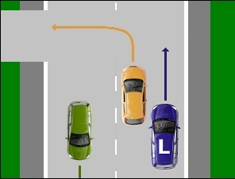 | Overtaking on the right is allowed when the driver in front of you has moved to the left in order to turn left and he has made this clearly by using the direction indicator.  When overtaking on the right you are not allowed to drive on:   * the right lane next to a solid white line, which can only be used to park. * on a cycle lane.   You are allowed on a levelled verge. |

### Tram

|  |  |
| --- | --- |
| 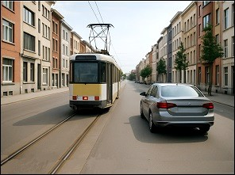 | A tram must be **overtaken on the right**. |
| 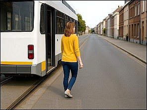 | When the tram tracks are located **in the middle of the roadway** and a passenger gets off, vehicles driving on the roadway must **slow down and, if necessary, stop so the passenger can cross the roadway safely.**  This is not required when there is a **raised platform** next to the tram track where pedestrians can wait until the roadway is clear. |
| 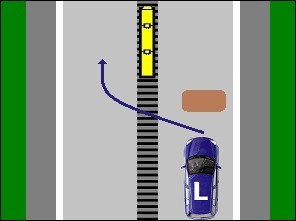 | When overtaking on the right is not possible because there is too little room, or if the available space is obstructed by a parked car or road works (…) you may overtake a tram on the left, providing it is safe. |
| 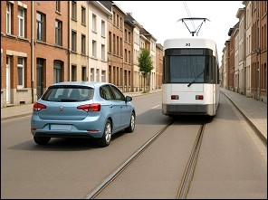 |  |

---

## What is not overtaking according to the traffic rules

### Traffic jam

|  |  |
| --- | --- |
| 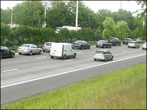 | The traffic regulations don’t talk about overtaking **when there is a traffic jam** and the traffic on one lane is faster than on the other lane. |

### Information signs

|  |  |
| --- | --- |
| 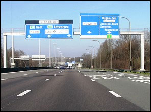 | 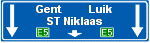 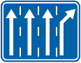   When you follow these information signs and you can **choose a direction or a destination** and therefore a certain lane, then it is not considering as overtaking. |

### Within a built-up area

|  |  |
| --- | --- |
| 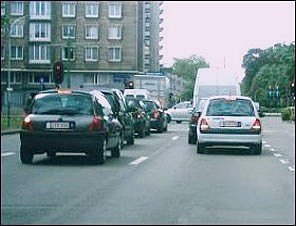 | We don’t talk about overtaking when drivers **within a built-up area** follow the lane which is the most interesting for their destination.   * or on a **one-way road, segregated into lanes**. * or on a **two-way road, with four or more lanes with at least two lanes in every direction**. |

---

## Motorcycles

|  |  |
| --- | --- |
| 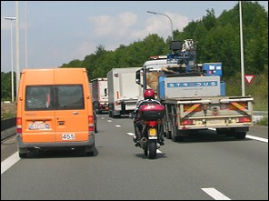 | On motorways and express roads motorcyclists are allowed to ride between the **two leftmost lanes** and queues of traffic.   * They may never go **faster than 50kph**. * The speed difference with the other vehicles may **not exceed 20kph**. |

---

## Traffic signs

Je moet voor het examen kennen welk soort verkeersbord het is en de betekenis.

| Sign | Kind | Meaning |
| --- | --- | --- |
|  | Information sign (or informative sign or indication sign) | Advance warning or arrow road markings, showing your choice of lane. |
| 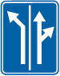 | Information sign (or informative sign or indication sign) | Advance warning of arrow road markings, showing your choice of lane. |
|  | Information sign (or informative sign or indication sign) | Advance warning of arrow road marking, showing your choice of lane.  The downward pointing arrows indicate the number of lanes and the destinations for through traffic; inclined arrows indicate a destination which can be reached by leaving the motorway at the next junction: these signs enable you to get into the appropriate lane in plenty of time. |

---

[Back to the previous page](theory)