## Part F: priority

# Lesson 20: Priority from the right

## General rule

### Priority from the right

|  |  |
| --- | --- |
|  | At intersections where:   * is **not an authorized person**, * and when there are **no traffic lights**, * and **no signs regulating the priority**,   the priority from the right applies.  This rule says: that every driver (whether of a car or motorcycles or two-wheel mopeds or bicycles) must give way to a driver coming in from the right,   * unless he is driving on a roundabout * or if the driver coming from the right is coming from a forbidden direction of travel. |
| 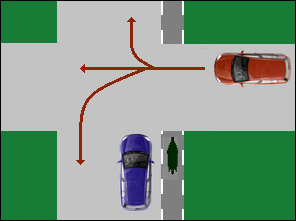 | It doesn't matter if the driver who comes from the right:   * want to drive straight ahead, * or to the left, * or turn right. |
| Geen video ondersteuning in deze browser... |  |
| 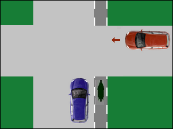 | Stopped Even if the driver coming from the right slows down, or stops completely, he retains his priority and is allowed to enter the intersection first. |
| Geen video ondersteuning in deze browser... |  |
| 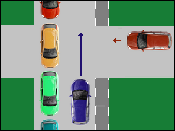 | Stopped and blocked But if the driver coming from the right cannot take precedence, because a series of cars cross the roadway, then the driver who has to give priority should not wait uselessly, but be allowed to drive into the intersection. |
| Geen video ondersteuning in deze browser... |  |

### Overtaking on the left is prohibited

|  |  |
| --- | --- |
| 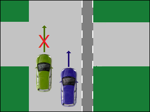 | At intersections where the priority from the right applies, **left overtaking is prohibited**   * + of a **hitched carriage** (e.g. horse and cart),   + of a **two-wheel motor vehicle** (e.g. moped),   + or a **vehicle with more than two wheels** (e.g. three-wheeled bicycle).   Even if no driver comes hit from the right.  You are **allowed to overtake a cyclist**, because he is not a motorized vehicle. |

### Traffic sign

|  |  |
| --- | --- |
| 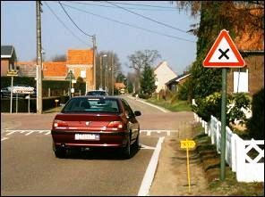 |   The priority rule is therefore basically the same as if this road sign were at the crossroads. |

---

## Exceptions

### A continuous cycle lane

|  |  |
| --- | --- |
| 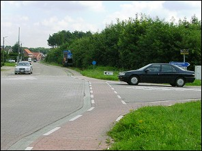 | The priority from the right rule does not apply when there is **a continuous cycle lane**.  In that case:   * cyclists and drivers of two-wheel mopeds authorized to ride on that cycle lane may first enter the intersection, * followed by the drivers coming from the right, * and finally the driver who has given priority from the right. |
| Geen video ondersteuning in deze browser... |  |
| 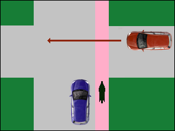 | BUT: On a cycle reserved lane (bicycle suggestion strip) the priority from the right still applies.  In that case, the driver of the car coming from the right must NOT stop and do not let the cyclists and moped riders who are in the suggestion lane go ahead.  But the blue car and/or cyclists and moped riders must let the brown car go first, even if it has stopped for a while first. |
| Geen video ondersteuning in deze browser... |  |

### A continuous pavement and pedestrian crossing

|  |  |
| --- | --- |
| 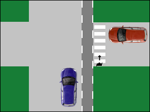 | A second exception is when there is **a continuous sidewalk or a pedestrian crossing**.  In that case, too, the driver coming from the right must let the pedestrians go in front, before he and the driver who has given priority, be allowed to enter the intersection. |
| Geen video ondersteuning in deze browser... |  |

### Prohibited direction of travel

|  |  |
| --- | --- |
| 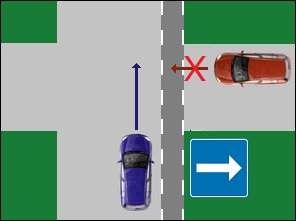 | When a driver comes from a prohibited direction of travel, the priority from the right does not apply either. |
| 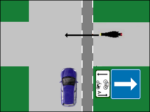 | Please note that a sub-sign **may indicate that certain drivers may drive out of that street**.  In that case, of course, you have to give priority. |
| Geen video ondersteuning in deze browser... |  |

### Tram

|  |  |
| --- | --- |
| 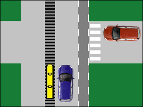 | Finally, I would like to mention that **rail vehicles should not give priority from the right** and should therefore first enter the intersection, after which the normal priority of the rule of law will be applied further.  In this example:   1. first the tram, 2. than the brown car. 3. than the blue car |

---

## No priority

### A path of track

|  |  |
| --- | --- |
| 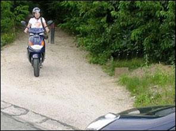 | The priority from the right rule does not apply at intersections with a regular roadway and an EARTH ROAD or PATH.  In this example, the moped rider must give priority. |
| 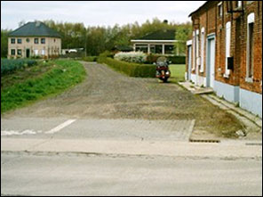 | And even when the last meters of an earth road are paved, as in this example, the primacy of the right does not apply. |

### Private exit

|  |  |
| --- | --- |
| 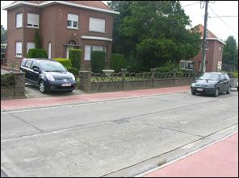 | When connecting a PRIVATE EXIT with the roadway. The driver leaving the private exit must stop and give priority to road users (including pedestrians) on public roads. |

### Leaving a parking areas

|  |  |
| --- | --- |
| 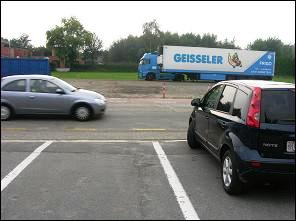 | When leaving a PARKING LOT. The driver leaving a car park must give priority to road users (including pedestrians) on public roads. |

### Roundabout

|  |  |
| --- | --- |
| 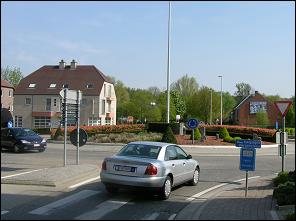 | When entering a ROUNDABOUT, the priority from the right rule doesn’t apply.  Drivers who are already on the roundabout have priority. |

---

## Traffic signs

| Sign | Kind | Meaning |
| --- | --- | --- |
|  | Priority sign | Crossroads with priority from the right. |
|  | Priority sign | You must give way and stop if necessary. |
|  | Priority sign | You must stop and give way. |

---

[Back to the previous page](theory)