## Part F: priority

# Lesson 21: Priority when turning off

## Priority and change of direction

### Driver A goes straight ahead – driver B turns left

|  |  |
| --- | --- |
| 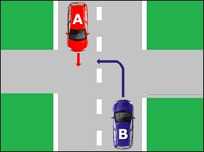 | The driver (A) who continues straight ahead has **priority**. The driver (B) who wants to turn left must **give way to oncoming traffic**.  Any driver who turns left must give way to oncoming traffic. Failure to do so constitutes a **serious traffic offence**. |

### One driver turns left, the other turns right

|  |  |
| --- | --- |
| 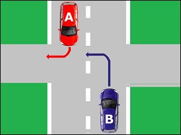 | The driver (A) who wants to turn right has **priority**. The driver (B) who wants to turn left must **give way to oncoming traffic**.  Any driver who turns left must give way to oncoming traffic. Failure to do so constitutes a **serious traffic offence**. |

### Both drivers want to turn left

|  |  |
| --- | --- |
| 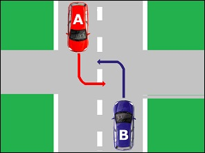 | If there are n**o directional arrows marked on the carriageway**, the vehicles must pass **to the right of each other**. |

### Pedestrians and cyclists

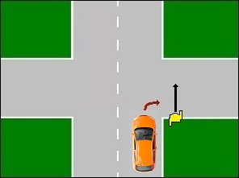 

A driver who intends to turn left or right must **give way to pedestrians and cyclists crossing the carriageway he intends to enter, even if no pedestrian crossing is provided.**

---

## Turning left

### One-way street

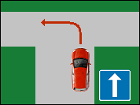 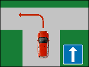 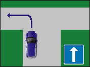

When driving in a one-way street and intending to turn left, the driver must position the vehicle **as close as possible to the left-hand edge of the carriageway**. (see img 3)

### Ordinary road with two-way traffic

|  |  |
| --- | --- |
| 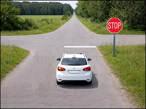 | When driving on a road with **two-way traffic**, whether or not it is divided into lanes by road markings, and intending to turn **LEFT**, the driver must position the vehicle **as close as possible to the centre line of the carriageway**. When intending to turn **RIGHT**, the driver must position the vehicle **on the right-hand side of the carriageway**. The driver must ensure that **no other road users are present on the right-hand side.** |
| 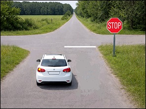 | The driver is **not allowed** to pre-select: on the extreme right of the carriageway, or on a lane intended for oncoming traffic. |

### When turning left

* check the mirrors;
* check the blind spot;
* activate the indicator;
* slow down and brake if necessary;
* turn left;
* give way to pedestrians crossing the road he intends to enter, **even if they are not using a pedestrian crossing**

---

## Change of direction and other road users

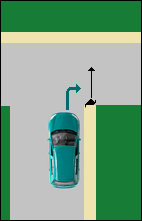 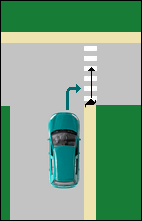 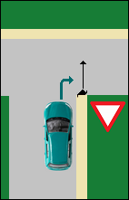 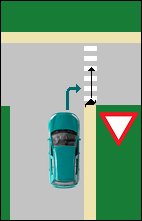

**A driver who changes direction must give way to pedestrians crossing the carriageway he intends to enter.**

De bestuurder die van richting verandert moet ook **voorrang verlenen aan bestuurders en voetgangers die zich op andere delen van dezelfde openbare weg bevinden.**

---

## Manœuvres general principles

### What is a manoeuvre?

|  |  |
| --- | --- |
| 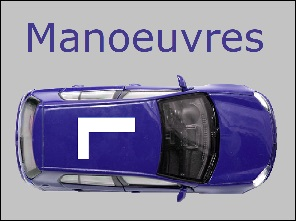 | A manoeuvre occurs when a driver performs an action with the vehicle (for example reversing) that **is not specifically regulated by the traffic code..** |

### What must you do when performing a manoeuvre?

When carrying out a manoeuvre, you must:

* first **carefully observe your surroundings**;
* **give way to all road users**, including both drivers **and** pedestrians.

---

## Examples of manœuvres

**The following actions are considered manoeuvres:**

* changing lanes or changing queues;
* crossing the carriageway;
* entering a parking space;
* leaving a parking space;
* entering a driveway of an adjacent property;
* leaving an adjacent property.

### Changing lanes or queues

|  |  |
| --- | --- |
| 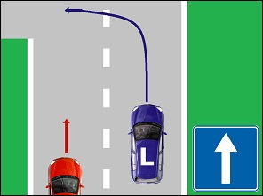 | Example: You are driving on a one-way road and want to move to the left-hand lane in order to turn left afterwards..  Changing lanes is a **manoeuvre**. You must therefore **give way to the other road users** (in this example: the red car). |

### Making a U-turn

|  |  |
| --- | --- |
| 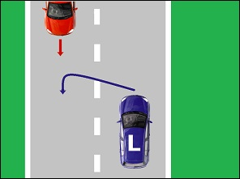 | Making a U-turn means that you want to drive **in the opposite direction..**  This is also a **manoeuvre**. You must therefore **give way to the other road users** (in this example: the red car). |
| 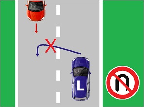 | If you see a **no U-turn traffic sign**, this means that you are not allowed to make a U-turn **up to and including the next junction..**  In other words: until you have passed the first following junction. |
| 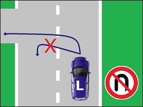 | IMPORTANT: The sign only prohibits **U-turns**. It **does not prohibit** turning left. |

### Reversing

|  |  |
| --- | --- |
| 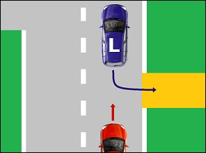 | **Reversing** is also a manoeuvre. You must proceed with extra caution. |

### Crossing the carriageway outside a junction

|  |  |
| --- | --- |
| 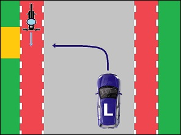 | **Crossing the carriageway outside a junction** is a manoeuvre. You must give way to all other road users. |

### Merging into the adjacent lane when the lane you are following ends due to traffic signs

|  |  |
| --- | --- |
| 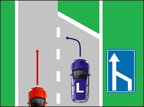 | This **traffic sign** indicates a **lane reduction on the right.** If you want to move to the left-hand lane, you must **give way.**  (Note: in heavy traffic or traffic queues, the “zip merge” principle applies and different rules apply.) |
| 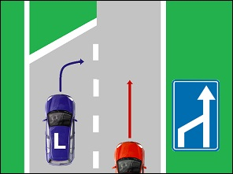 | This **traffic sign** indicates a **lane reduction on the left**. If you want to move to the right-hand lane, you must give way.  (Note: in heavy traffic or traffic queues, the “zip merge” principle applies and different rules apply.) |
| 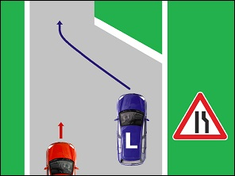 | Important: The wording states: “when the lane being followed ends”. This means that **lanes must be present..**  In the case of a simple narrowing of the carriageway on the right, the blue car has priority because it continues driving on the right-hand side of the carriageway. |

---

[Back to the previous page](theory)