## Part G: directions

# Lesson 23: Prohibited direction

## No entry for drivers in this direction

### Prohibitive traffic sign

|  |  |
| --- | --- |
| 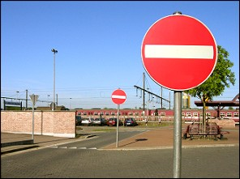 | This prohibitive sign indicates **no entry to any driver** (including cyclists) to drive past this sign **in this direction**.  Of course oncoming traffic is possible. |

### Plate

|  |  |
| --- | --- |
| 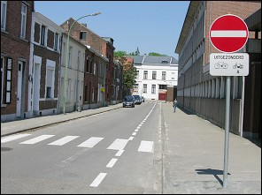 | **A plate** can indicate when **cyclists and/or drivers of a moped class A** are allowed to drive past this sign. |

---

## No entry for drivers in both directions

### Prohibitive traffic sign

|  |  |
| --- | --- |
| 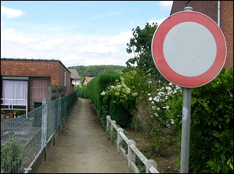 | This prohibitive sign indicates that no drivers (including cyclists) are allowed **to drive in both directions past this sign**.  Oncoming traffic is impossible. |

### Plate

|  |  |
| --- | --- |
| 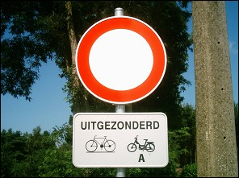 | A plate can indicate when **cyclists and drivers of a moped class A** are allowed to drive past this sign. |

### Except local traffic

|  |  |
| --- | --- |
| 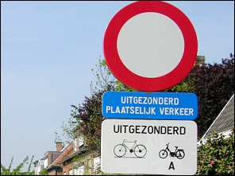 | Sometimes you can see a **blue plate** with the text: 'Uitgezonderd plaatselijk verkeer'.  Who is allowed to drive past the sign:   * the vehicles of the residents of that street and of the visitors of these residents. * the vehicles for delivering goods or maintenance or supervision. * the emergency vehicles and priority vehicles. * and cyclists and moped riders. |

---

## No entry for vehicles

### Prohibitive traffic sign 1

|  |  |
| --- | --- |
| 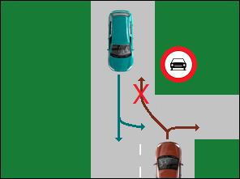 | 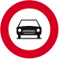  This prohibitive sign indicates **no entry in this direction** past this sign to drivers of all vehicles:   * having more than two wheels. * and motorcycles with a side car.   Oncoming traffic is allowed. |

### Prohibitive traffic sign 2

|  |  |
| --- | --- |
| 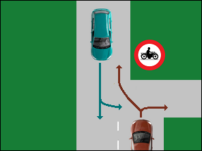 |   This prohibitive sign indicates **no entry in this direction** past this sign for drivers of:   * **motorcycles,** * **and motorcycles with a side car.**   However, they are allowed to drive in the opposite direction. A driver of a car is allowed to drive past this sign. |

### Prohibitive traffic sign 3

|  |  |
| --- | --- |
| 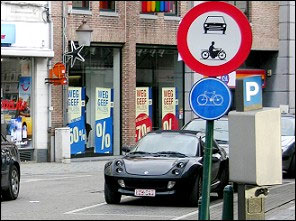 |   A combination of these two signs is also possible.  It prohibits to drive past this sign:   * **drivers of motor vehicles with more than two wheels,** * **and all motorcycles.**   However, they are allowed to drive in the opposite direction. |

### Prohibitive traffic sign 4

|  |  |
| --- | --- |
| 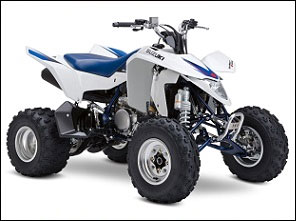 | 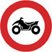  No entry for quad bike drivers = four-wheel motor vehicles, constructed for unpaved terrain, with an open body, a motorcycle-like handlebar and a saddle. |

---

## Maximum gross weight

### M.G.W.

|  |  |
| --- | --- |
| 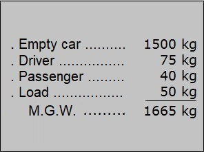 | In lesson 9 we read that the M.G.W. is the weight of a car with the driver and the passengers and its load when one puts this on a scale **at a particular moment**. |

### Prohibitive traffic sign

|  |  |
| --- | --- |
| 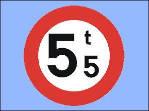 | This traffic sign indicates no entry to vehicles exceeding the maximum gross weight.  With your car (3,5 ton) you may drive past this sign. |

---

## Turn or U turn

### Turning

|  |  |
| --- | --- |
| 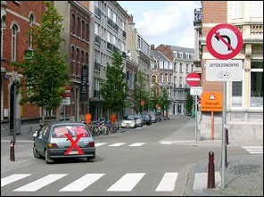 | 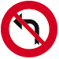   These signs indicate that **turning to the left or to the right** is prohibited at the next junction to **all drivers** (including cyclists), except for drivers indicated on the white plate. |

### U turn

|  |  |
| --- | --- |
| 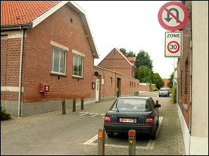 |   This sign indicates that from this sign, until the next junction a U turn is prohibited. |

---

## Traffic signs

| Sign | Kind | Meaning |
| --- | --- | --- |
| 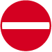 | Prohibitive sign | No entry to any driver. |
|  | Prohibitive sign | No entry in both directions to any driver. |
|  | Prohibitive sign | No entry to drivers of all vehicles of more than two wheels and motorcycles with a side car. |
|  | Prohibitive sign | No entry to drivers of motorcycles. |
| 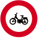 | Prohibitive sign | No entry to drivers of mopeds. |
|  | Prohibitive sign | No entry to drivers of motor vehicles with four wheels, designed for off road use, with open bodywork, a handlebar for steering, as on a motorcycle, and a saddle type seat. |
| 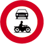 | Prohibitive sign | No entry to drivers of motor vehicles with more than two wheels and motorcycles with or without a side car. |
| 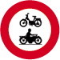 | Prohibitive sign | No entry to drivers of mopeds and motorcycles. |
| 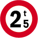 | Prohibitive sign | No entry to drivers of vehicles exceeding the maximum gross weight (M.G.W.). |
| 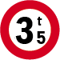 | Prohibitive sign | No entry to drivers of vehicles exceeding the maximum gross weight (M.G.W.). |
| 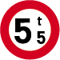 | Prohibitive sign | No entry to drivers of vehicles exceeding the maximum gross weight (M.G.W.). |
|  | Prohibitive sign | No right turn at the following junction. |
|  | Prohibitive sign | No left turn at the following junction. |
| 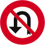 | Prohibitive sign | No 'U' turn until the following junction. |
|  | Information sign | Buslane on the right. |
| 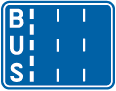 | Information sign | Buslane on the left. |

---

[Back to the previous page](theory)