## Part D: speed

# Lesson 12: Speed

## Motorways

### Speed on a motorway

|  |  |
| --- | --- |
|  |    On a motorway (also on the entrance and exit) the maximum permitted speed is: **120 km/h**, except when road signs impose a different maximum speed.  You also have to drive **at least 70 km/h** under normal conditions. |

### Traffic signs

|  |  |
| --- | --- |
|  | This sign means that on the two left lanes the maximum permitted speed is 90 km/h and in the right lane 70 km/h. |
|  | And this indicates a restriction of maximum speed 90kph on the two left lanes and 70kph on the right lane at a distance of 1,5 km. |

### Matrix signs

|  |  |
| --- | --- |
| 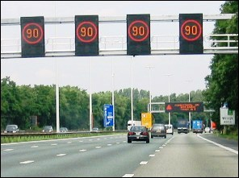 | A different maximum speed can also be imposed by matrix signs which are placed above the lanes. |

### Maximum speed on the exit

|  |  |
| --- | --- |
| 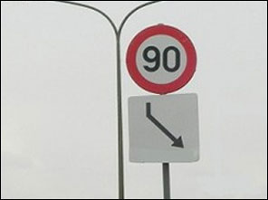 | Near exits there is sometimes this combination of signs. The speed limit then **only applies on the exit**. |

### Leaving a motorway

|  |  |
| --- | --- |
| 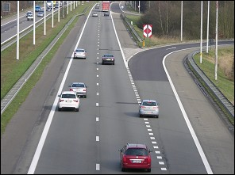 | If you want to leave a motorway, it is best not to brake until you drive on the exit. |

### Studded tires

|  |  |
| --- | --- |
| 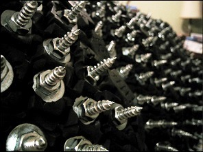 | Nail tires may be placed between 1 November and 31 March on vehicles with an M.T.M. up to 3,5 tons.  Speed:   * **Motorways and roads with 2x2 lanes separated by a central verge** up to **90 km/h**. * **Normal roads** up to **60 km/h**. |

---

## Express roads and ordinary roads

### Minimum speed

On an express road and other roads, there is no mandatory minimum speed. However, you should not forget that driving abnormally slowly somewhere is also a violation.

### Maximum speed: directions of travel separated by a central verge

|  |  |
| --- | --- |
| 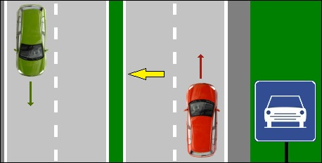 | On express roads and ordinary roads outside the built-up area, under normal conditions, you are allowed to drive **120 km/h**   * if each direction of travel has **at least 2 lanes**, * and these are separated by **a central verge**. |
| 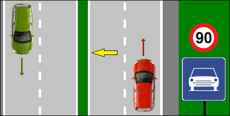 | However, road signs can impose a lower speed limit. |

### Maximum speed: directions of travel separated by a road marking

|  |  |
| --- | --- |
|  | On roads "outside the built-up area", the directions of which are separated by road markings and therefore there is no middle verge, you can ...   * In Flanders: **70kph**. * In the Brussels region: **70kph**. * In Wallonia: **90kph**.   Of course, other speed limits can be imposed by traffic signs. |

---

## Ordinary roads

### Maximum speed

|  |  |
| --- | --- |
| 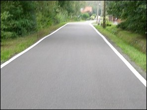 | On ordinary roads "outside the built-up area", the maximum speed limit is:   * In Flanders: **70kph**. * In the Brussels region: **70kph**. * In Wallonia: **90kph**. |

### Traffic signs

|  |  |
| --- | --- |
| 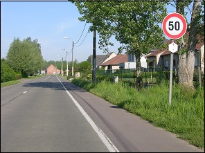 | The maximum permitted speed can be changed by traffic signs. |

### Bottom board

|  |  |
| --- | --- |
| 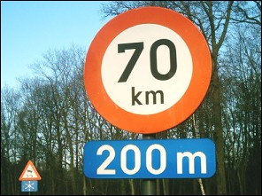 | Sometimes it says on a blue bottom board from where the speed limit starts.  In this example from 200 meters further until the next intersection. |

---

## Special places

### Residential area

|  |  |
| --- | --- |
| 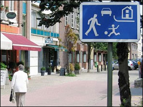 |    Within a residential area:   * **pedestrians** are allowed to walk on the roadway, * **children** are allowed to play there.   That is why you can only drive **20 km/h** at most.  Drivers should be doubly careful with regard to children. |

### Built up area

|  |  |
| --- | --- |
|  |  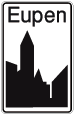  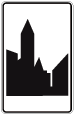       The maximum speed limit is:   * In Flanders: **50kph**. * In the Brussels region: **30kph**. * In Wallonia: **50kph**. |
| 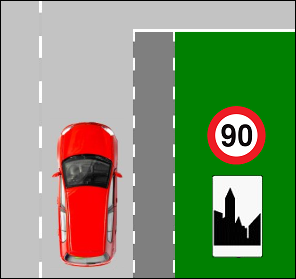 | The only exception is when a traffic sign on the sign of past the sign of a built up area indicates that another speed limit is permitted. |
| 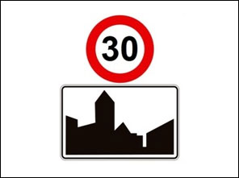 | But beware, if a sign is placed up to **30 km/h** above the built-up area sign, it applies 30 km/h in the entire built-up area! |

### Within a zone

|  |  |
| --- | --- |
| 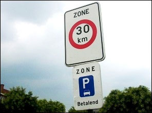 | As long as you drive within a zone, the obligation you have received when entering that zone applies: **day and night**. |
| 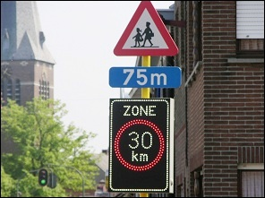 | If you drive past an electronic zone sign, the obligation only applies **if the sign lights up**. |

### Bicycle zone or bike zone

|  |  |
| --- | --- |
| 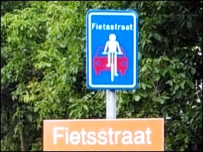 |   A bike zone is a zone where cyclists are the main road users, but where motor vehicles are also allowed. They're like "guests" there. In a bicycle zone, cars (or other motor vehicles) are not allowed to overtake cyclists on the left or not on the right.  The maximum permitted speed is **30 km/h**. |

### Reserved road for

|  |  |
| --- | --- |
| 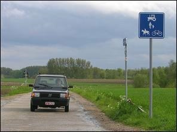 | Drivers who are allowed on a road reserved for agricultural vehicles, pedestrians, cyclists and riders may only drive **30 km/h**. |

### School street

Drivers who are allowed to drive in a school street may only drive maximum **at walking pace**.

### Play street

|  |  |
| --- | --- |
| 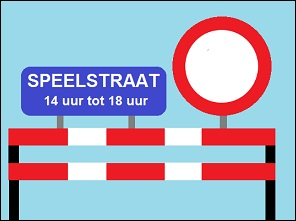 | Drivers who are allowed to drive in a play street may only drive maximum **at walking pace**. |

### Pedestrian zone

Drivers who are allowed to drive in a pedestrian zone may only drive maximum **at walking pace**.

---

## Elevated section (or speed hump or elevated devic)

### Rules

|  |  |
| --- | --- |
| 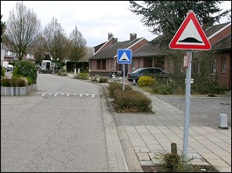 |    The definition of a speed hump has been changed by the Royal Decree of 12/3/2023 to: **"It is an increased construction that has been laid across the public road and that is intended to moderate the speed.**"  If this establishment is announced by the (first) danger sign and the design itself is the (second) indicator board, or it is at an intersection, or in a Zone 30, then maximum speed on a raised device is **30 km/hour**.  Since **1 April 2023** you can overtake along the left a cyclist on a speed hump. |

### Signs

|  |  |  |
| --- | --- | --- |
| 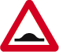  This danger sign says that 150 meters away is an elevated device. |     This bottom sign says the elevated device is 200 meters away. |     This bottom sign says that 150 meters further there are some raised devices over a distance of 500 meters. |

---

## Towing a defective car

|  |  |
| --- | --- |
|  | It is forbidden on motorways and express roads.  On a **regular road** is the maximum speed **25kph**. |

---

## Traject control

|  |  |
| --- | --- |
| 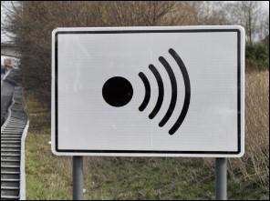 | Traject control works with number plate recognition (ANPR). The speed at which you are driving is measured at two locations. If you have a high average speed between these two measuring points, the system will send your data to the federal police. The system also detects flagged cars and hard shoulder drivers. |

---

## Read this very carefully

### Immediate temporary withdrawal of your driving license

You risk an immediate withdrawal of your driving license as soon as:

* you drive more than **30 km/h too fast** on:
  + motorways,
  + express roads,
  + regular roads.
* you drive more than **20 km/h too fast**:
  + in the built-up area,
  + a zone 30,
  + a residential area.

The police is doing that immediate repeal because you're committing a serious offense. In case of ANY serious violation, your driver's license can be revoked immediately.

### A revocation of the right to drive a motor vehicle

You risk a declaration of lapse of the right for driving a motor vehicle as soon as:

* you drive more than **40 km/h too fast** on:
  + motorways,
  + express roads,
  + ordinary roads.
* you drive more than **30 km/h too fast**:
  + in the built-up area,
  + a zone 30,
  + a residential area.

So this is not done by the police, but by the **JUDGE in court**, when your case is being handled. Depending on the judgment, you may not drive any motor vehicle on public roads for at least 8 days, up to a maximum of 5 years.

---

## Traffic signs

| Sign | Kind | Meaning |
| --- | --- | --- |
|  | Information sign (or informative or indication sign) | Start or access of a motorway.  Important Maximum 120 kph and minimum 70 kph |
|  | Information sign (or informative or indication sign) | End or exit of a motorway. |
| 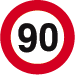 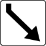 | Prohibitive sign | The speed limit is restricted on the exit lane. |
|  | Information sign (or informative or indication sign) | Start of an express road. |
|  | Information sign (or informative or indication sign) | End of an express road. |
|    | Information sign (or informative or indication sign) | Start of a built up area.  Important Maximum 50kph. (Brussels region 30kph) |
|    | Information sign (or informative or indication sign) | Start of a built up area.  Important Maximum 50kph. (Brussels region 30kph) |
|    | Information sign (or informative or indication sign) | End of a built up area. |
| 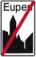   | Information sign (or informative or indication sign) | End of a built up area. |
|  | Information sign (or informative or indication sign) | Start of a residential area.  Important Maximum 20 kph. |
| 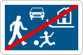 | Information sign (or informative or indication sign) | End of a residential area. |
|  | Information sign (or informative or indication sign) | Start of a zone 30.  Important Maximum 30 kph. |
|  | Warning sign (or danger sign | Speed hump. Is placed 150m in front of the speed hump. |
|   | Warning sign (or danger sign | Speed hump at 200m. |
|   | Warning sign (or danger sign | At 150m there are several speed humps over a distance of 500m. |
|  | Information sign (or informative or indication sign) | Speed hump.  Important Maximum 30 kph. |
| 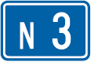 | Information sign (or informative or indication sign) | Regular road. |
| 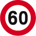  | Prohibitive sign | At 200m the maximum speed limit is 60 kph. |
| 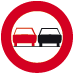   | Prohibitive sign | Until the next junction no overtaking on the left of motor vehicles.  At 200m you may not exeed the maximum speed limit of 60 kph.  (The right meaning of the sign above is explained in another chapter) |
|  | Information sign (or informative or indication sign) | Start of a pedestrian zone. |
|  | Information sign (or informative or indication sign) | End of a pedestrian zone. |
| 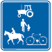 | Information sign (or informative or indication sign) | Reserved road for agricultural vehicles, pedestrians, cyclists and riders. |

---

[Back to the previous page](theory)