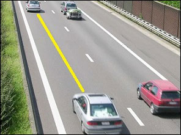
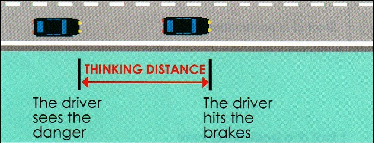
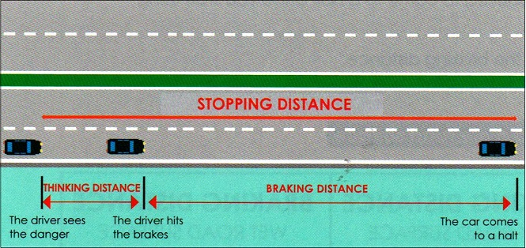
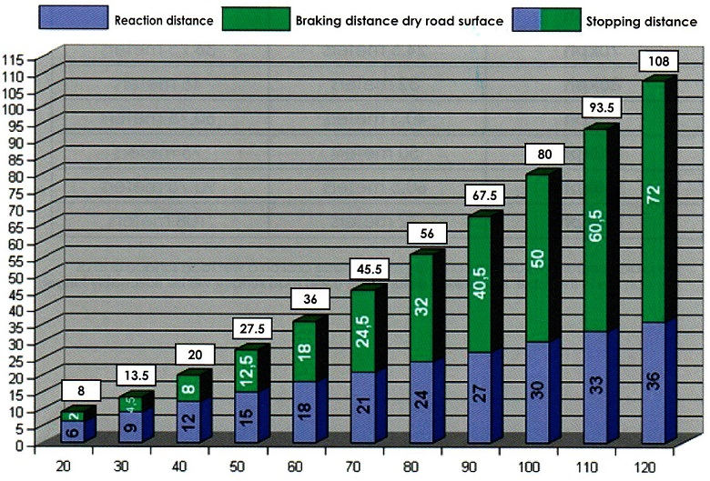
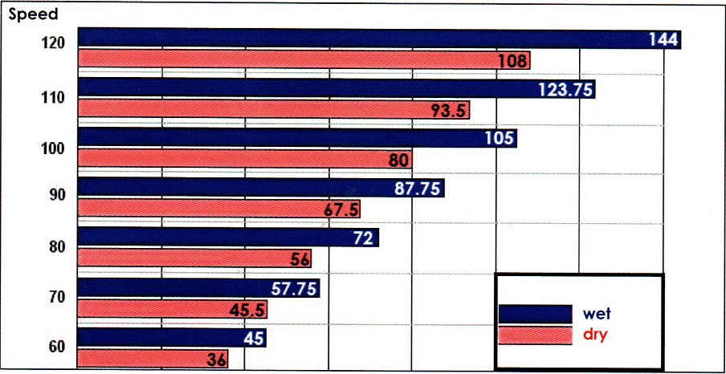
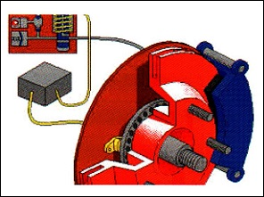
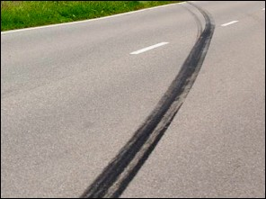
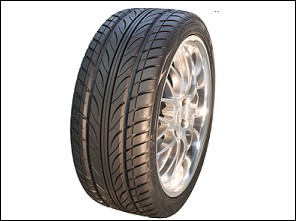
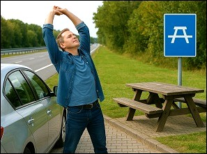

## Part D: speed

# Lesson 13: Stopping distance

## Safe distance

### Speed and the safe distance

|  |  |
| --- | --- |
|  | The faster you drive, the more distance you need to keep. With a simple formula, you can calculate the safe distance: **namely the speed at which you drive, divided by two**.  Suppose in this example the cars drive 120 km/h, then the safe distance is: 60 meters. And if they drive 100 km/h, it will be 50 meters. |

### The two-second rule

There is a so called trick to estimate the safe distance and that is the two-second rule. You pick a fixt point as a reference (a pole, a tree, a bridge) and when the driver in front of you passes there, you count slowly: ‘one crocodile, two crocodiles’ (that takes 2 seconds). When you pass that particular point, then you have a safe distance between your car and the car ahead of you.

---

## Reaction time - thinking distance

### What is the thinking distance

|  |  |
| --- | --- |
|  | Let's say this driver suddenly sees an accident happening.  Between the moment the driver sees the accident and the moment he incorporates that stimulus into his brain and realizes that he has to put his foot on the brake pedal, **the car has already driven a few meters further**.  The **faster you drive**, the **greater the distance travelled** during the response time and the longer the reaction distance.   * At 50 km/h, for example, the reaction distance is 15 meters. * At 90 km/h 27 meters. * At 120 km/h 36 meters, even before you have pressed the brake pedal. |

### Drunk

Someone who is drunk, reacts slower. In that case, the reaction distance will therefore be longer.

---

## Braking distance

### What is the braking distance

The **braking distance** is the distance traveled by the car, from the moment the driver presses the brake pedal, until the car is completely stationary. Also here: the faster you drive, the longer the braking distance.

### Difference between a wet and a dry road surface

The braking distance also **differs on a dry and on a wet road surface**.

The braking distance on a wet road surface is longer.

---

## Stopping distance

### What is the stopping distance

|  |  |
| --- | --- |
|  | The stopping distance is the total distance a car travels during:   * the **reaction distance or thinking distance**, * together **with the braking distance**. |

### Graph stopping distance on a dry road surface

### Graph stopping distance on a wet road surface

### What you have to know

On the internet you will find many different formulas to calculate the stopping distance. Still, it is difficult to find the right formula. After all, many factors have to be taken into account.

Example: what is the condition of the road surface. What is the condition of the car tires etc ...

We advise you to remember these 4 numbers.

| Speed | Dry surface |
| --- | --- |
| **50 kph** | +- 30 meters |
| **70 kph** | +- 45 meters |
| **90 kph** | +- 70 meters |
| **110 kph** | +- 95 meters |

Suppose one would ask:

*You drive 40kph, the stopping distance is...*

1. Between 10 and 30 meters
2. Between 30 and 50 meters
3. Between 50 and 70 meters

Then you know that 1 is the right answer, because 30 meters is already the stopping distance at 50kph.

Suppose one would ask:

*You drive 100kph, the stopping distance is...*

1. Less than 50 meters
2. Over 50 meters

Then you know that 2 is the right answer, because it is already 70 meters if you drive 90kph.

---

## ABS

### What is ABS

|  |  |
| --- | --- |
|  | Some vehicles are equipped with ABS or **anti-blocking system**.  This system prevents the tires from slipping on the road surface if you brake fiercely. |

### Stopping distance with ABS

|  |  |
| --- | --- |
|  | Braking with ABS does **not necessarily mean** that the braking distance becomes shorter than braking without ABS.  And when you brake with ABS on a wet road surface, the distance will be longer than with ABS on a dry road surface. |

---

## Tires

|  |  |
| --- | --- |
|  | To drive and brake safely, the tires of the car must be **in good condition**.  The tread depth must be **at least 1.6 mm**. But that is an absolute minimum.  The **tire pressure** must be in accordance with the manufacturer's instructions.  If you make a long trip, or you have to carry a heavy load, then it is best to increase the pressure a little. |

---

## Take a break on time

|  |  |
| --- | --- |
|  | A driver who drives for a long period of time becomes tired. This reduces his reaction ability’  That’s why it is important, during a long car journey, **to take a short break of at least 15 minutes** **approximately every two hours**, to prevent fatigue and stay alert. During the break, make sure to get out of the car, stretch your legs, breathe deeply, and stay hydrated with water or light snacks. |

---

[Back to the previous page](theory)