## Part F: priority

# Lesson 17: The authorized person

## Arm signals

### The arm raised vertically

|  |  |
| --- | --- |
| 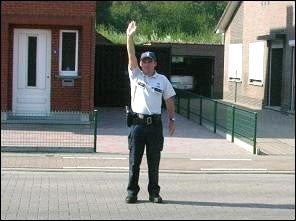 | When you are on a crossroads and an **officer raised one arm vertically**, all road users, including pedestrians must stop.  Whoever is already on the junction, should clear the junction as soon as possible without waiting for an extra signal of the officer. |

### One or two arms stretched horizontally

|  |  |
| --- | --- |
| 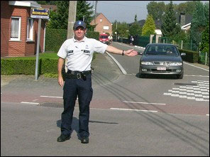 | If an officer has **one or two arms stretched horizontally**, this is a stop signal for all traffic approaching from in front or from behind the outstretched arms.  The other traffic may still ride through on the crossroads or turn left or right. |
| 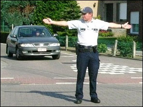 | An officer with two arms stretched horizontally gives the same instruction as one with one arm stretched horizontally. |

---

## Signalling

### Back and forth with a red torch

|  |  |
| --- | --- |
| 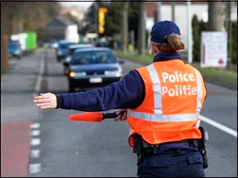 | Sometimes an officer signals with a red torch in the direction of a driver. Then the driver has to **stop**.  The officer may also indicate that the driver may not continue straight ahead and **must turn in the direction he indicates**. |

### Up and down with the arms

When an officer signals with his arms up and down, he wants to make clear that you have to **slow down**.

### Rotating arm movement

When an officer signals with a rotating arm movement, he wants to make clear that you have to **drive faster**.

### Whistle

|  |  |
| --- | --- |
| 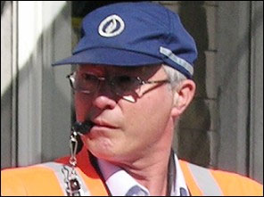 | We often hear an officer blowing a whistle. He does this in order **to attract the attraction** of people to watch him giving signals with his arms. |

### Stop

An illuminated panel with a STOP sign on top of the roof of some vehicles, is a **stop signal**.

---

## Other people who can give signals

### Who are they

|  |  |
| --- | --- |
| 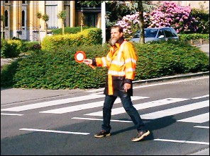 | There are persons such as:   * officials at races or events, * traffic sergeants, * school crossing supervisors, * group leaders for pedestrians or cyclists or motorcycles or horseback riders, who can signal the road users.   These persons are **not authorized persons** and **can't give penalties**. |

### At crossroads with no traffic lights

|  |  |
| --- | --- |
| 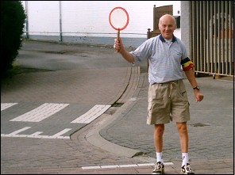 | At crossroads with no traffic lights they are allowed to hold up traffic when they are wearing a black-yellow-red armband and hold up the sign C3 on a stick. |

---

## Emergency/priority vehicles

### What is an emergency/priority vehicle

|  |  |
| --- | --- |
| 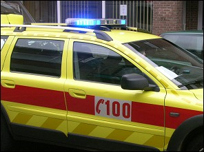 | It is a vehicle equipped with **one or more blue rotating/flashing lights** AND **a specific warning siren**.  The best known are the vehicles of the police, ambulances and fire services. |

### How to react

|  |  |
| --- | --- |
| 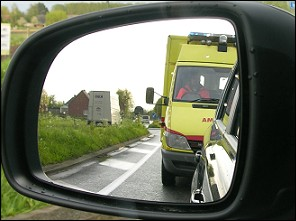 | If only the blue flashing light is in use and no siren, you are allowed to drive on.  If the **blue flashing light AND the siren both are in use**, then you must give way and if necessary leave the road, or slow down or stop. |

### International emergency number

|  |  |
| --- | --- |
| 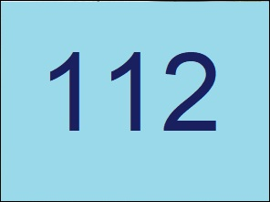 | **112 is the international emergency number**, a very important number that you have to memorize. |

### Rescue strip

|  |  |
| --- | --- |
| 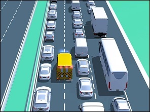 | In the event of a traffic jam, drivers driving on a carriageway with two or more continuous lanes in their direction of travel (not just on motorways) must preventively form a rescue lane for the emergency services. This must be done before traffic comes to a stop.   * **On a two-lane carriageway** between the left and right lanes. * **On a three-lane carriageway** between the left and center lanes.   When forming a rescue lane, the drivers in the right-hand lane are in principle not allowed to divert to the closed rush-hour lane, the hard lane, the bus lane or the special drive-over bed for buses. |

---

## Hierarchy

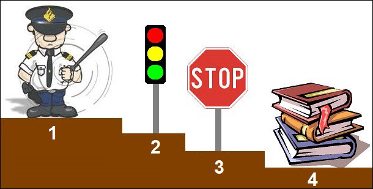

Here you can see the **hierarchy order** with:

1. on top the **police officer**.
2. one step down, the **traffic lights**.
3. then the traffic **signs concerning priority**.
4. and at the bottom the **traffic rules**.

---

## Firefighters

|  |  |
| --- | --- |
| 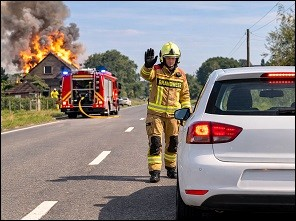 | A firefighter can manage traffic and give orders at the location where firefighters are intervening, however, they cannot write a report. |

---

## Traffic signs

| Sign | Kind | Meaning |
| --- | --- | --- |
| 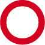 | Prohibitive sign | No entrance or drivers in both directions. |

---

[Back to the previous page](theory)