## Part A: the public road

# Lesson 3: The bicycle lane

## The bicycle lane

### What is a bicycle lane

|  |  |
| --- | --- |
| 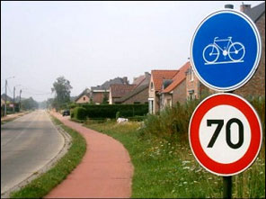 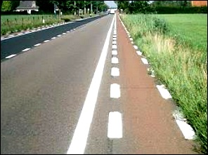 | 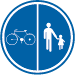 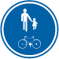 The bicycle lane is the **part of the public road** reserved for the use of **bicycles and 2-wheeled class A mopeds** (max 25kph).  Sometimes the drivers of a moped class B must drive on the cycle lane.  A bicycle lane is indicated:   * by one of the two traffic signs above; * or by two parallel broken lines, between among no car traffic is allowed.   It can be left or right of the road.  Sometimes it is colored red, but that is not necessary.  A road marking can be a **continuous white line** or a **broken white line** in the middle of the road. Such markings can divide the road into two, three or more lanes. |

### Sign giving orders: pedestrian and the bicycle next to each other

|  |  |
| --- | --- |
| 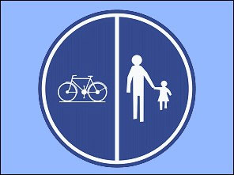 | This traffic sign, with the pedestrian and the bicycle next to each other indicates that **cyclists and mopeds class A and pedestrians** must use this part of the public road. |

### Sign giving orders: pedestrian and the bicycle under each other

|  |  |
| --- | --- |
| 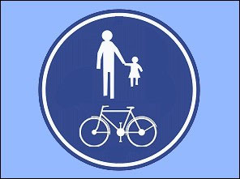 | When the pedestrians and the cyclists are not next to each other, but under each other, then the pedestrians and the cyclists must use this part of the public road.  **Mopeds class A or class B are not allowed to use this part.** |

### White under plates

|  |  |
| --- | --- |
| 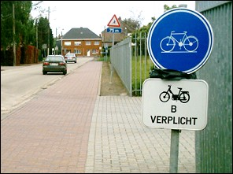 | A white plate can indicate when mopeds class B must use a cycle lane or when they are not allowed to use it. |

### May bicyclists also use the footpath

|  |  |
| --- | --- |
| 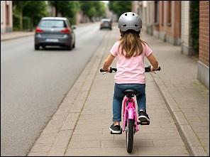 | If a bicycle lane is present, a bicyclist is obliged to use it (unless it is not passable).  **Within a built up area:** only children **younger than 10 years** are allowed to drive on a footpath. |
| 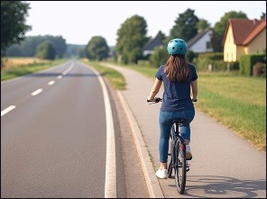 | **Outside a built up area:** If there is no bicycle lane and on the condition that they ride to the right in the direction of travel, bicyclists are allowed to ride on the footpath and the raised verges. |

---

## Considered cyclists

### A non-motorised mobility device

|  |  |
| --- | --- |
|  | It is any vehicle that:   * is **not a cycle** (see below); * has **no motor**; * is propelled by **muscular power**.   Examples: manual wheelchair, roller skates, scooters, skateboards, unicycles.  If they travel **faster than walking speed**, they are considered **cyclists** |

### A motorised mobility device

|  |  |
| --- | --- |
|  | is any mobility device that can travel at a **maximumspeed of 25** km/h.  Examples: motorised scooters, electric wheelchairs, mobility scooters, self-balancing electric devices (segway). |

---

## Important

### Parts of the public road

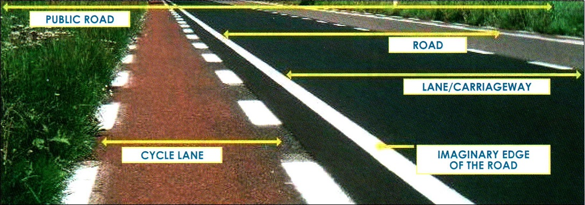

The cycle lane is a part of the public road. It is **not a part of the carriageway**.

This means that you are **not allowed to drive your car, to wait or to park on the cycle lane**.

---

## Crossing

### A crossing for cyclists and 2-wheeled mopeds

|  |  |
| --- | --- |
| 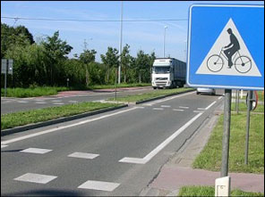 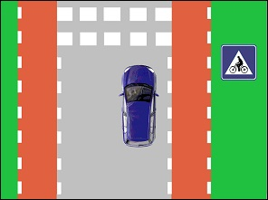 |    These two traffic signs indicate a crossing for cyclists and two-wheeled mopeds:  The **blue indication/information sign** is placed immediately **beside the crossing**.  The **red danger/warning sign** is placed about 150 metres before the crossing.  **Cyclists and moped riders who wish to use this crossing must yield to traffic on the carriageway.** (But once they are on the crossing, they have priority.) |
| 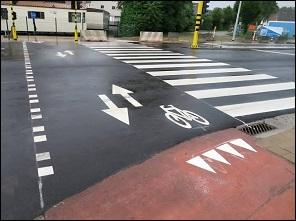 | At busy crossing points in Flanders, bicycle guidance lines are sometimes painted on the road surface instead of the white rectangular markings that indicate a crossing. |
| 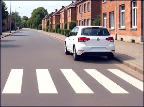 | * It is forbidden to **stop or park** on a crossing for cyclists (or pedestrians), both on the carriageway and on the verge. * It is also forbidden to park on the carriageway **within 5 metres BEFORE** the crossing for cyclists.  **Attention AFTER a cyclists’ crossing or AFTER a pedestrian crossing/zebra crossing** (see Lesson 7), you may stop and park. (So this car may park there, unless signs or road markings prohibit it.)   * It is forbidden to overtake a driver who slows down or stops before a cyclists’ crossing. * A driver may approach a cyclists’ or moped crossing only at a moderate speed, so as not to endanger users who are already on the crossing or hinder them from crossing at a normal speed. |

---

## Bicycle suggested/reserved lane

### Part of the carriageway

|  |  |
| --- | --- |
| 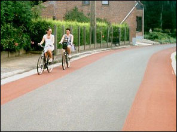 | In some places a part oof the carriageway is painted, as if it is a bicycle lane. It can be red, green, blue (...).  This colored lane we call a suggested/reserved lane. But it is not a bicycle lane, because there are no two parallel broken white lines or a traffic sign indicating a bicycle lane.  This suggested lane is nothing else but a painted part of the carriageway, where you can drive by car, wait and park. |

---

## The central road

|  |  |
| --- | --- |
| 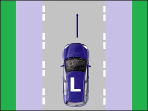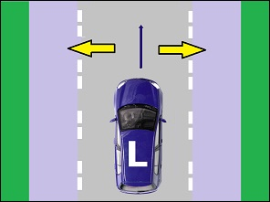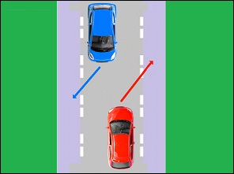 | In a center lane or (central lane), car traffic is pushed to the center of the road on narrow roads. The part where the cars drive is demarcated by two parallel broken lines.  The side lane to the left and right of the central road is the location for riders of bicycles, class A mopeds, speed pedelecs, disconnected draft animals, mounts or livestock. Pedestrians can take the left side lane in the direction followed. If cars have to cross or want to overtake each other, they are allowed to swerve to the side lane without hindering other road users.  Parking in the center lane or the side lane is prohibited. Standing still is allowed on the side strip, if the berm is not wide enough.  When cars need to pass oncoming traffic or overtake, they may use the side strips, provided they do not hinder others and keep sufficient lateral distance.  If the road shoulder is not wide enough, you may stop on the side strip to allow a passenger to get in or out of the vehicle. |

---

## End of a bicycle lane

### Traffic sign

|  |  |
| --- | --- |
| 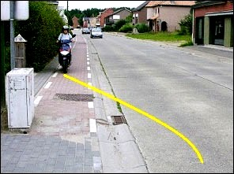 |   This traffic sign has two meanings:   * It indicates of course that you are nearing a crossing for cyclists and 2-wheeled moped drivers. * The second meaning is that cyclists and moped drivers are going to leave the bicycle lane because it ends here. |

### Rules

When a cyclist or a moped driver drives on the carriageway because the bicycle lane ends (not because there is something on the bicycle lane) they have right of way and therefore the drivers of the cars of motor vehicles on the road have to give priority.

You are not allowed to wait or to park, on the road and on the verge, within 5 meters in front or past te place where the bicycle lane ends.

---

## Cyclists in group

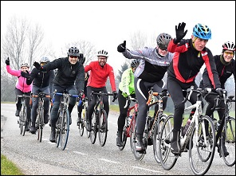

### Group of 15 to 50 participants

Cycling tourists who ride in a group of **at least 15 to a maximum of 50 participants** are not obliged to follow the cycle paths and they are allowed to ride continuously with two of them next to each other on the carriageway, provided that they remain grouped.

Cyclists riding with two of them next to each other may only use the right lane of the carriageway; if the carriageway is not divided into lanes, they shall not occupy more than a width equal to that of a carriageway and in no case take up more than half of the carriageway.

They **may be preceded and followed**, at a distance of about 30 meters, by an accompanying car; if there is only one accompanying car, it must follow the group.

### Group of 51 to 150 participants

Cyclists riding in a group of at least 51 to no more than 150 participants are not obliged to follow the cycle paths and they are allowed to ride continuously with two of them next to each other on the carriageway, provided that they remain grouped.

They **must be preceded and followed**, at a distance of about 30 meters, by an accompanying car. The roof of the accompanying cars must have a blue sign with the image of the A51 traffic sign and below it the symbol in white of a bicycle. This sign must be affixed to the vehicle in such a way that it precedes the group, that it is clearly visible to oncoming vehicles and, on the vehicle behind, that it is clearly visible to following traffic.

### Intersections

At intersections where traffic is not controlled by traffic lights, at least one of the road masters may stop traffic in the intersections while the group including the two accompanying vehicles is crossing.

---

## Bike zone (bike street)

### What is it?

|  |  |
| --- | --- |
| 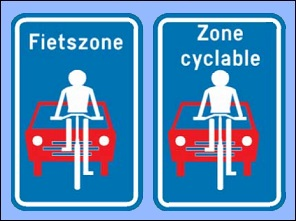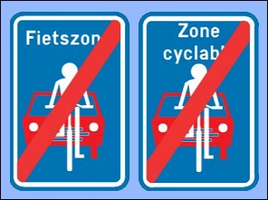 |    The BIKE STREET has been deleted again from the road code in the Royal Decree of **March 12, 2023** and will be replaced by a BICYCLE ZONE. But because there is a transition period of 9 years, we still give the theory below)  This traffic sign indicates a bike street (Dutch Fietsstraat - French Rue Cyclable).  A bicycle street ends **at the next intersection**, or where the "End of bicycle street" sign is placed.  It is a street where the cyclists are the most important road users, but **also motor vehicles are allowed**.  Motor vehicles may not overtake a cyclist.  The maximum speed is **30kph**.  A **BIKE ZONE**  A bike zone starts at the sign BEGIN zone sign and ends at the END zone sign.  Cyclists and drivers of bicycles and speed pedelecs may use the entire width of the roadway. But only half the width along the right-hand side, if the roadway is open in both directions. Motor vehicles are also allowed to drive there, but are not allowed to overtake cyclists. |

|  |  |
| --- | --- |
| 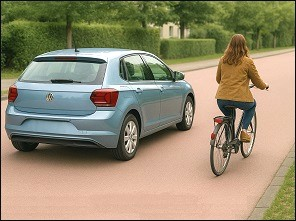 | The maximum allowed speed in a bicycle zone is 30 km/h.  In a bicycle zone, motor vehicles are not allowed to overtake cyclist, scooter, or any other means of transport that is considered equivalent to a bicycle. |
| 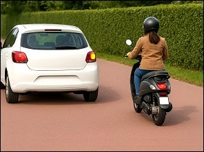 | Other vehicles (for example, a moped) may be overtaken on the left in a bicycle zone, provided that the maximum permitted speed is not exceeded.  (What this car is doing is allowed in a bicycle zone.) |

---

## Traffic signs

| Sign | Kind | Meaning |
| --- | --- | --- |
| 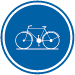 | Sign giving orders (or mandatory sign) | Obligatory bicycle lane. |
|  | Sign giving orders (or mandatory sign) | Segregated route for, on the one side for pedestrians, on the other for cyclists and class A mopeds. |
|  | Sign giving orders (or mandatory sign) | Pedestrians and cyclists only. |
|  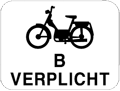 | Sign giving orders (or mandatory sign) | Class B mopeds are obliged to use the bicycle lane. |
|  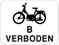 | Sign giving orders (or Instruction sign / mandatory sign) | Class B mopeds are prohibited to use the bicycle lane. |
| 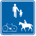 | Information sign (or informative or indication sign) | A road or path for the use of pedestrians, cyclists and riders. It may be modified according to the categories permitted. |
|  | Prohibitive sign | No entry for cyclists. |
|  | Warning (or danger sign) | 1. Crossing for cyclists and moped drivers (!: placed 150m in front of the crossing) 2. Crossing for cyclists and moped drivers at a place where a bicycle lane emerges onto a road (!: placed at the crossing) |
| 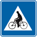 | Information sign (or informative or indication sign) | Crossing for cyclists and moped drivers (!: placed at the crossing). |
|  | Information sign (or informative or indication sign) | No through roadexcept for cyclists and pedestrians. |
| 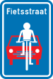 | Information sign (or informative or indication sign) | Bicycle street. |
|  | Information sign (or informative or indication sign) | End of a cyclists street.  On 1/8/2021 the traffic sign End of bicycle street will be abolished. A bicycle street stops at the next intersection. |

---

[Back to the previous page](theory)