## Part B: the road users

# Lesson 8: The drivers

## The drivers

### Who are the drivers

|  |  |
| --- | --- |
| 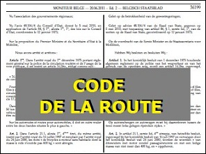 | According the traffic regulations (Dutch: wegcode) a driver is a person who drives a vehicle. |

#### This can be a non-motorized vehicle.

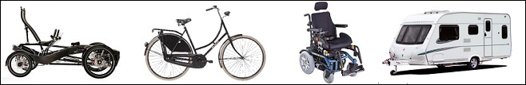

#### This can be a motorized vehicle.

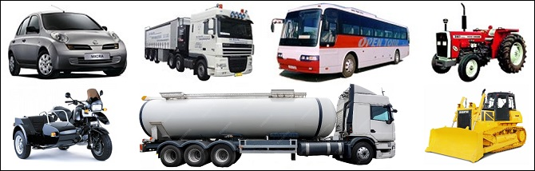

### Who are also drivers

|  |  |
| --- | --- |
| 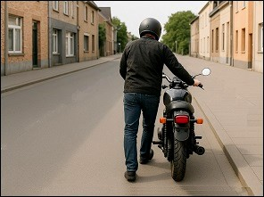 | Someone who **pushes a motorcycle** or **a car** is a driver.  This man must have a driving licence and wear a helmet and walk on the road. |
| 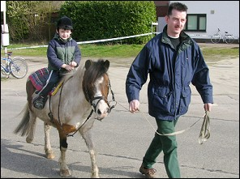 | A driver is also someone accompanying or guarding draft animals, farm animals, horses on the public road.  For example:   * a horse rider. * a farmer taking his cows to the field. * a man accompanying a young rider. * someone driving a covered wagon. |

---

## Very important

### Road users

When we are talking in the next lessons about the **road users** =

* **pedestrians,**
* **drivers of non-motorized vehicles,**
* **drivers of motorized vehicles.**

### Drivers

When we are talking in the next lessons about the **drivers** =

* **pedestrians are not included.**

---

## Prohibitive signs and regulations

|  |  |  |  |  |
| --- | --- | --- | --- | --- |
|  |  |  |  | 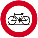 |

As you will learn in the next lessons, a prohibitive sign or a traffic regulation is not binding for every kind of driver, but sometimes for some categories of drivers.

---

## Drivers of vehicles with a M.A.W. to 3,5 ton

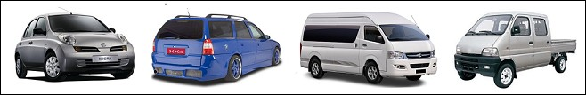

The next lessons are usually about drivers of vehicles with a M.A.W. of maximum 3,5 ton.

This may sound complicated, but these are the vehicles you are allowed to drive with a **temporary or an official driving licence B**

* a **car**,
* a **car for double use**,
* a **minibus**.
* a **light truck**.

---

## Traffic signs

| Sign | Kind | Meaning |
| --- | --- | --- |
|  | Warning sign (or danger sign) | Cattle. |
|  | Prohibitive sign | No entry for pedestrians. |
|  | Prohibitive sign | No entry for cyclists. |
|  | Prohibitive sign | No entry for mopeds. |
| 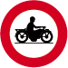 | Prohibitive sign | No entry for motorcycles. |
| 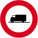 | Prohibitive sign | No entry for goods vehicles. |
| 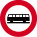 | Prohibitive sign | No entry for busses. |
| 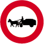 | Prohibitive sign | No entry for animals in harness. |

---

[Back to the previous page](theory)