## Part A: the public road

# Lesson 2: The lanes

## A carriageway divided into lanes

### The lanes

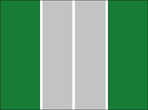 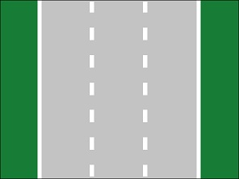

A carriageway is divided into lanes by road markings.

A road marking can be a **continuous white line** or a **broken white line** in the middle of the road.

Such markings can divide the road into two, three or more lanes.

### Arrows on the lanes

|  |  |
| --- | --- |
| 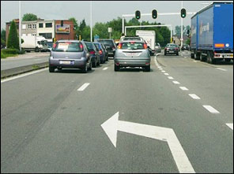 | Sometimes you come across arrows painted on the road surface near a junction. These arrows are also road markings. The arrows show you **the direction you need to follow**.  If there are more lanes, you will find this blue information sign placed next to the road.   |

### Where to drive?

|  |  |
| --- | --- |
| 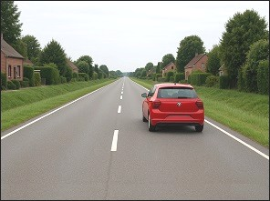 | Even when the road is divided into lanes, the drivers must drive in normal circumstances **on the right lane**.  Driving on the left lane for no reason is a traffic offence. |

### Maximum speed

|  |  |
| --- | --- |
| 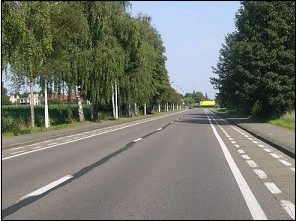 | The maximum speed limit on the lanes of a regular carriageway is:   * In the **Flanders**: **70** kph. * In **Wallonia**: **90** kph. * In **Brussels region**: **70** kph.   Exception: when traffic signs impose a different maximum speed. |

---

## Overtaking

### A broken white line

|  |  |
| --- | --- |
| 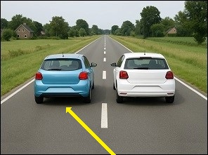 | When the driver in front of you drives slower than the maximum speed limit, you are allowed to drive over **a broken white line**, to overtake that driver (Except when a traffic sign prohibit you to do so). |

### A continuous white line

|  |  |
| --- | --- |
| 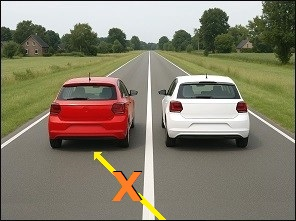 | You are not allowed to drive over **a continuous white line** when overtaking another vehicle. |

### A broken white line and a continuous white line

|  |  |
| --- | --- |
| 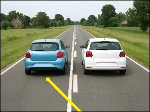 | Sometimes there is a broken white line painted next to a continuous white line.  When the broken white line is on your site of the road, you may drive across to overtake a driver.  Once you have overtaken the vehicle, you drive across the continuous white line to go back to the right lane. |

---

## Reduction of the number of lanes

### Signs that indicate a reduction of the number of lanes

|  |  |
| --- | --- |
| 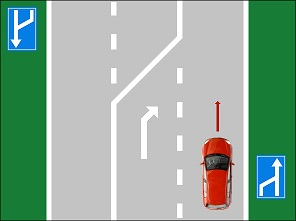 | 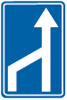  These two information signs indicate the reduction of the number of lanes.   * The first sign indicates a lane reduction on the left. * The second sign indicates a lane reduction on the right. |

---

## Zipping

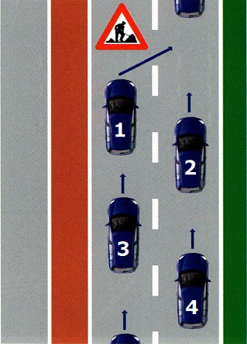 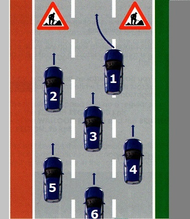

### When zip-merge

Drivers should zip-merge when there is **slow traffic** (traffic jam) because **one or more lanes are closed** due to:

* road works,
* obstacle,
* accident.

### Regulations

1. Zip-merge is **obligatory**.
2. You must **drive in the open lane just before the lane reduction**.
3. A lane reduction **on the left OR on the right**. Drivers on the free lane must give way.
4. A lane reduction **on the left AND on the right**. Drivers on the free lane must give way in turn, starting with the car on the right, then the car on the left and then the driver on the free lane may continue.

---

## Bus lane

### What is a bus lane?

|  |  |
| --- | --- |
| 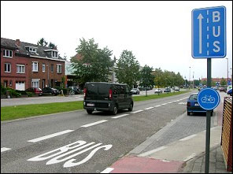 |   A bus lane is **not a part of the carriageway** (KB 12/3/2023).  It is a special lane intended for the regular services for common transport, which is indicated by 1 or 2 wide white interrupted stripes (or checkerboard markings) and the information sign F17.  You are **not allowed:**   * **to drive** on this lane with your car; * **to park** on a bus lane; * **to wait or to be stationary** to get a passenger in or out;   You can thwart a bus lane to reach a property (shop, petrol station ...) or a parking space. |

### When are you allowed to drive on a bus lane?

The only exception when you are allowed to drive your car on a bus lane is, **the last meters before a junction**, when you want to turn left or right, or in order to drive around an obstacle on the road.

### Are other drivers allowed to use a bus lane?

When other drivers are allowed to drive on the bus lane, it will be mentioned on the traffic plates below.

|  |  |  |  |
| --- | --- | --- | --- |
|  |    |    |    |

These emblems can be used:

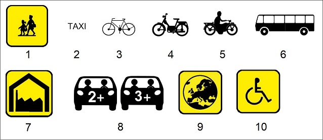

### Note: difference between two traffic signs

 

* The first traffic sign with the **broken white line** = bus lane.
* You will learn the meaning of the second traffic sign with the **continuous white line** in lesson 24.

---

## Te gore

## What is it

|  |  |
| --- | --- |
| 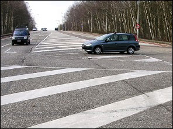 | Sometimes there are **solid slanting white lines** painted next to or on parts of the lane. We call it a traffic displacement area or traffic displacement surface.  You are not allowed on it:   * to drive, * to wait, * to park. |

---

## Road works

### Traffic sign

|  |  |
| --- | --- |
|  | This warning (or danger) sign indicates that there are road works. |

### Orange lines

|  |  |
| --- | --- |
| 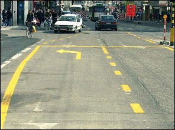 | When there are road works they usually paint temporary orange colored continuous or broken lines on the road surface. These markings have the same meaning as the white ones.  When you see white and orange lines, you should only consider the temporary orange colored road markings. |

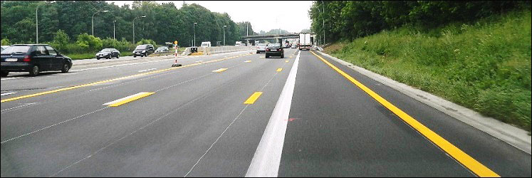

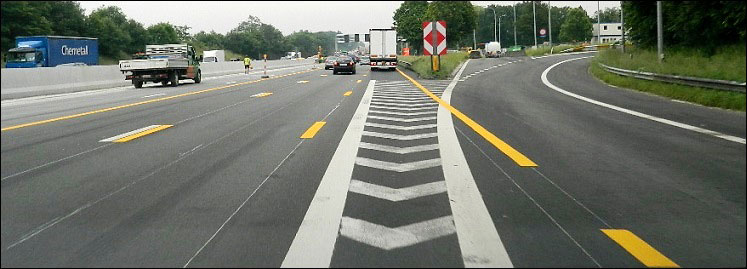

When the temporary orange road markings tell you for instance to drive over the hard shoulder or over white markings, then it is allowed because only the orange road markings count.

---

## Traffic signs

| Sign | Kind | Meaning |
| --- | --- | --- |
|  | Information (or informative or indication sign) | Advance warning or arrow markings, showing your choice of lane. This sign can indicate the different directions. The white line may be broken or solid. |
|  | Information (or informative or indication sign) | Advance warning or arrow markings, showing your choice of lane. This sign can indicate the different directions. The white line may be broken or solid. |
| 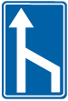 | Information (or informative or indication sign) | Lane reduction to the right. |
|  | Information (or informative or indication sign) | Lane reduction to the left. |
|  | Information (or informative or indication sign) | Indicates the lanes and shows which is the bus lane. |
|  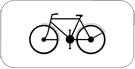 | Information (or informative or indication sign) | Indicates the lanes and shows which is the bus lane.  Cyclists can use this lane too. |
|   | Information / indication sign | Indicates the lanes and shows which is the bus lane.  Mopeds can use this lane too. |
|   | Information (or informative or indication sign) | Indicates the lanes and shows which is the bus lane.  Motorcycles can use this lane too. |
|  | Warning sign (or danger sign) | Road works. |
| 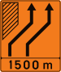 | Information (or informative or indication sign) | Advance road sign indicating a temporary lane diversion. |
| 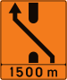 | Information (or informative or indication sign) | Advance road sign indicating a temporary crossover on the verge. |
| 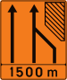 | Information (or informative or indication sign) | Advance road sign indicating a temporary lane closure. |
| 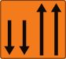 | Information (or informative or indication sign) | Advance road sign two traffic on a normally one way road. |

---

[Back to the previous page](theory)