## Part C: the car

# Lesson 11: The lights and the horn

## The lights of a car

### What are the lights for

|  |  |
| --- | --- |
| 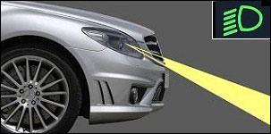Dipped beam headlights | 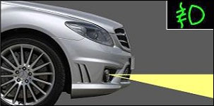Fog lights |
| 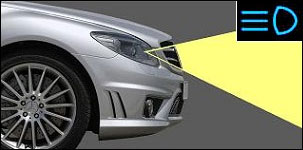Headlights or driving lamps | 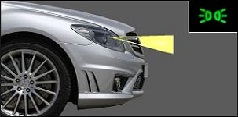Sidelights |

The lights of a car have a **double function**:

* to see clearly for yourself.
* to be seen by other road users, without blinding them.

For this purpose a driver has 4 kinds of lights:

* There are **the dipped beam headlights**, one uses when it is dark.
* The **driving lamps** or **headlights**, also called the main beam.
* Most of the cars have **fog lights** at the front.
* And then there are the **sidelights**, they give the least light.

---

## The dipped beam headlights and the headlights when driving

### The dipped headlights and the headlights

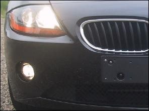 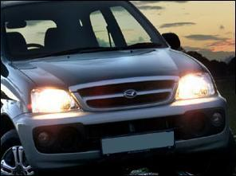

When the dipped beam headlights or the headlights are on, the next lights are switched on as well:

* at the front two sidelights.
* at the rear two red lights.

### During darkness

This lights must be switched on **as soon as it gets dark or when it is dark**.

### During the day

This lights must be switched on during the day:

* due to **rain**, whenever the visibility is reduced to less than **200 meters**.
* due to **fog**, whenever the visibility is reduced to less than **200 meters**.
* due to **snowfall**, whenever the visibility is reduced to less than **200 meters**.
* due to **whatever circumstances** (e.g. smoke, fire) whenever the visibility is reduced to less than **200 meters**.

### When are the headlights (driving lamps) not allowed to be switched on

|  |  |
| --- | --- |
| 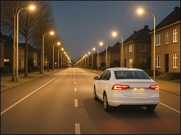 | The headlights (driving lamps) are **not allowed** when:   * the road is straight through and the lighting is adequate and you can see 100 meter ahead. * you can blind an oncoming car. * the distance between the driver in front of you is less than 50m and you are not going to overtake him. * you approach a train vehicle or a vessel. |

---

## The fog lights

### At the front

|  |  |
| --- | --- |
| 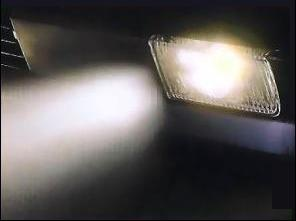 | The **front fog lights are not obligatory** on a car. They are never obligated to be switched on.  They may be used due to:   * fog, * heavy rainfall, * snowfall.   Together with the dipped headlights or without the dipped headlights. |

### At the rear

|  |  |
| --- | --- |
| 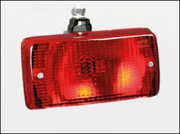 | A car **must have 1 or 2 red fog lights** at the back.  They must be switched on:   * due to **fog, whenever the visibility is reduced to less than **100 meters**.** * due to **snowfall**, whenever the visibility is reduced to less than **100 meters**. * due to **heavy rainfall, always** in Belgium. (In Holland absolutely not) |

### Fog bank

|  |  |
| --- | --- |
| 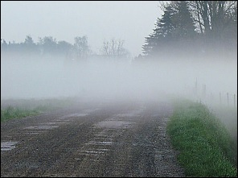 | If you suddenly end up in a fog bank, do not press the brake pedal hard, but brake gradually. |

---

## To be stationay and parking

### What lights must be used

When you are stationay or park on the road or on the verge:

* between dusk and dawn,
* and in whatever circumstances whenever the visibility is reduced to less than **200 meters**,

you must switch on:

* at the **front** one or two white or yellow sidelights.
* at the **back** one or two red lights.

### What lights can be used

When you are stationary or park your car and there is **fog, snow or heavy rain**, the dipped beam headlights or front and rear fog lights are allowed to be switched on, but it is not obligatory.

### Within a built up area

When you wait or park your car within a built up area, the side lights and the red rear light can be replaced by a parking light:

* when the car is parked lengthways on the road,
* and is not hitched to a trailer.

Only the parking light on the side of the road may be used.

---

## The four hazard warning lights

### What is it

|  |  |
| --- | --- |
| 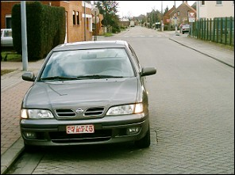 | The four hazard warning lights of a car can only be switched on when:   * your car has **broken down**. * in order **to warn other road users** of a real danger, a tail back of traffic, an accident, a load on the road. * by a **school bus** when pupils are getting in or out. |

### Wrong use

|  |  |
| --- | --- |
| 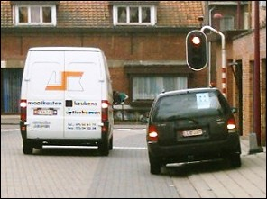 | Under no circumstances may the four hazard warning lights be used as a warning or an attempt to legitimize wrong parking. This only worsens the offence. |

### School bus

|  |  |
| --- | --- |
| 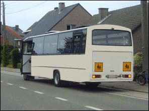 | When a school bus is stopped to let students out, the driver is required to flash the four direction indicators to indicate that the bus is stopped to release a student from the bus. Vehicles behind are then obliged to slow down and possibly stop. They may carefully pass the bus. |

---

## The direction indicators

### What is it

|  |  |
| --- | --- |
| 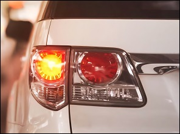 | A car has got direction indicators at the front and at the back.  How and when to use, you will learn in the next lessons. |

---

## Tunnel

### Driving through a tunnel

|  |  |
| --- | --- |
| 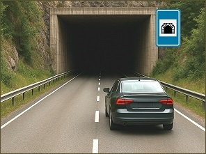 | When you drive through a tunnel, the **dipped beam headlights must be switched on** because the visibility is mostly reduced to less than 200 meters.  It is also better to put off your sunglasses. |

### Smoke in a tunnel

|  |  |
| --- | --- |
| 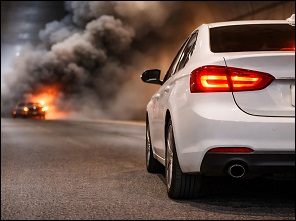 | When there is a lot of smoke in a tunnel, you must:   * park your car on the **right lane**. * leave your **key in the ignition**. * leave the tunnel through an **emergency exit**. |

---

## The horn

### In general

|  |  |
| --- | --- |
| 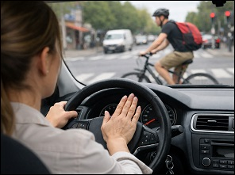 | You are not allowed to use another horn than the one made by the manufacturer of the car.  The audible warnings you make have to be short. |

### When to use the horn

#### During the day

* **Within and outside the built-up area** to warn others and to prevent an accident.
* **Outside a built-up area** to warn a driver you want to take over.

#### Between nightfall and dawn

* Only in case of eminent danger.
* In all other cases you have to flash the headlights.

---

[Back to the previous page](theory)