## Part A: the public road

# Lesson 4: The motorway

## The motorway

### What is it

|  |  |
| --- | --- |
|  |    A **motorway** is a public road.  The access is indicated with the first traffic sign and the exit with the second traffic sign.  A motorway is a road designed for fast traffic. It is an easy drive because there are no level crossroads or crossroads with traffic lights.  Vehicles with trailers are allowed on the motorway, except:   * mopeds, * farm vehicles, * motorized quads without passenger space, * and tows of fairground vehicles. |

---

## Speed

### Maximum speed limit

|  |  |
| --- | --- |
| 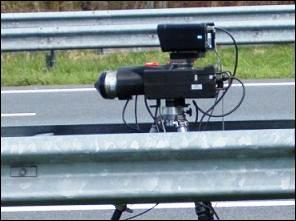 | In contrast with regular roads, you can drive **120kph** on the lanes of a motorway.  This is only possible when driving conditions are safe and authorized persons or traffic signs do not prohibit it. |

### Traffic sign

|  |  |
| --- | --- |
| 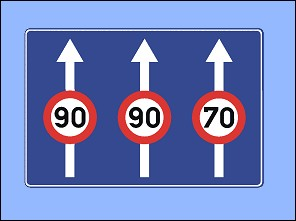 | This sign means a maximum speed limit of:   * 90kph on the two left lanes * and 70kph on the right lane. |
| 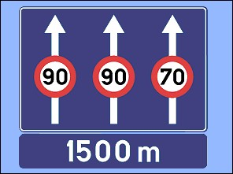 | This sign indicates the distance of 1,5 km where the maximum speed limit starts:   * on the left and the middle lane: 90kph, * on the right lane: 70kph. |

### Minimum speed limit

|  |  |
| --- | --- |
| 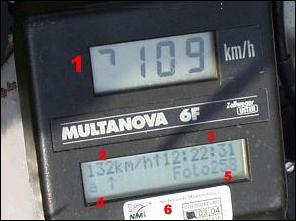 | On a motorway you have to drive **at least 70kph**, of course in the right circumstances.  Vehicles that cannot drive so fast (mopeds, farm vehicles …) are prohibited on a motorway. |

### Broken down car

The towing with an emergency clutch/link is prohibited on motorways (and express roads).

### Maximum speed on an exit

|  |  |
| --- | --- |
|  | At some exits you can see this combination of signs. This indicates a maximum speed limit of 90kph **on the exit**. |

### Smog

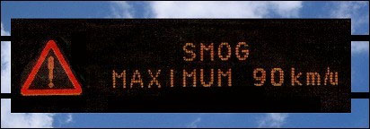 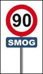

Traffic in windless weather can be the source of SMOG. The small dust particles cause health problems.

In order to not increase this smog, a temporary (one or several days) **speed limit of 90kph** can be imposed on motorways.

The speed limit is indicated by:

* electronic signs,
* a sign 90 (C43) with a plate SMOG.

### Studded tires

|  |  |
| --- | --- |
| 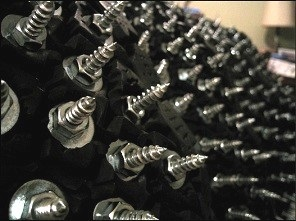 | Studded tires can be placed **from 1 November till 31 March** on vehicles with a M.G.W. up to 3.5 ton.   * **Max 90kph** on motorways and roads with 2x2 lanes separated by a central reservation. * **Max 60kph** on regular roads. |

---

## Breakdown lane

### What is it

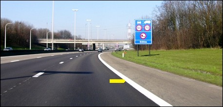

At the edge of the right lane there is a solid continuous white line painted. Next to this line is the **breakdown lane**.

On this lane you can:

* not drive,
* not wait,
* not park, (even for looking at a map or for answering your mobile)

This breakdown lane can only be used **when your car breaks down or with an accident**.

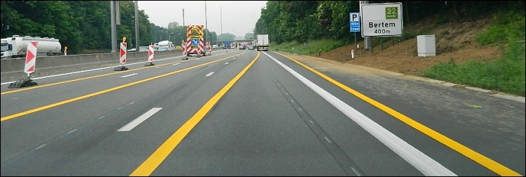

If the orange road markings indicate that you are allowed to drive on the hard shoulder, this is of course allowed.

### Warning triangle

|  |  |
| --- | --- |
| 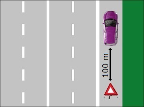 | When you stop on a breakdown lane, you have to put immediately a warning triangle at least:   * **100 meters** behind your car (on ordinary roads 30 meters). * The triangle must always be visible for oncoming traffic from a **distance of 50 meters**. |

### Where waiting for help

|  |  |
| --- | --- |
| 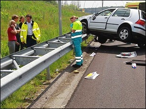 | Passengers and driver should wait **behind the crash barriers** for the emergency services. |

### Reflective safety jacket

|  |  |
| --- | --- |
| 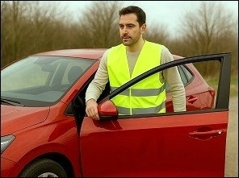 | A **driver** who leaves the vehicle, must be wearing a reflective safety jacket, that is obligatory in the car.  Passengers are not obliged, but should do it too. |

### International emergency number

**112 is the international emergency number**, a very important number that you have to memorize.

---

## The rush hour lane

### What is it

|  |  |
| --- | --- |
| 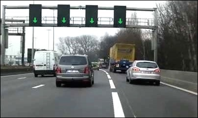 | In order to keep the traffic flowing at some places or some periods, the **rush hour lane** is open for traffic. This way there is more road capacity at rush hours. |

### How it works

* A **white discontinuous line** separates the rush hour lane from the regular lanes.
* A **red cross above the lane** indicates that you are not allowed to drive on it.
* A **green arrow above the lane** indicates thar you are allowed to drive on the rush hour lane.

Because the rush hour lane can be smaller than a regular lane, you see a sign above that indicates a lower maximum speed.

### Broken down car

|  |  |
| --- | --- |
| 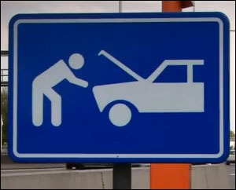 | **When your car breaks down**, then you are not allowed to stop on the rush hour lane. Try to drive until you are at a refuge. |

### Rescue strip

|  |  |
| --- | --- |
| 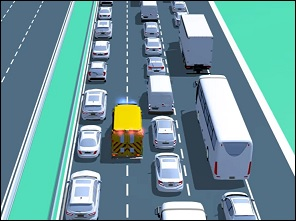 | In the event of a traffic jam, drivers driving on a carriageway with two or more continuous lanes in their direction of travel (not just on motorways) must preventively form a rescue lane for the emergency services. This must be done before traffic comes to a stop.   * **On a two-lane carriageway**: between the left and right lanes. * **On a three-lane carriageway**: between the left and center lanes.   When forming a rescue lane, the drivers in the right-hand lane are in principle not allowed to divert to the closed rush-hour lane, the hard lane, the bus lane or the special drive-over bed for buses. |

---

## Wrong-way drivers

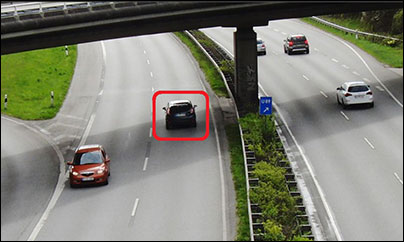

### What is it

On the motorway, you do not expect to meet another road user driving in the opposite direction on the left-hand lane. This is then referred to as a wrong-way driver.

Fortunately, not every wrong-way driver causes an accident. But when it does, the consequences are usually dramatic. These are usually head-on collisions at high speeds, where the occupants of the vehicles have little chance.

### How to react

* Slow down and **drive in the right lane**. That is the best way to limit the consequences of such an "encounter". Studies show that wrong-way drivers are very inclined to drive on the right (so in front of you the left lane).
* If necessary, flash your lights when you cross the wrong-way driver, but not before, as you could cause him to panic.
* Report the wrong-way driver to the police.

---

## Overtaking

### Overtaking on the left

|  |  |
| --- | --- |
| 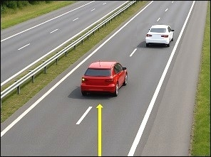 | Even on a motorway, you should drive **on the right lane** as much as possible. If the driver in front of you drives slower than the maximum speed limit, then you are allowed to **overtake on the left**. |
| 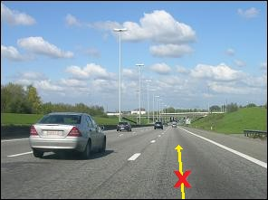 | Obstinate drivers who always drive in de middle or on the left lane are a pest on the motorway. They act as if the road belongs to them alone, and they provoke others to overtake on the right witch is prohibited. **It is a serious offence**. |

### Traffic jam

|  |  |
| --- | --- |
| 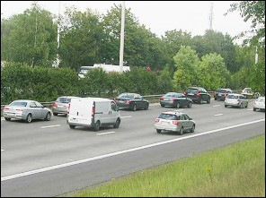 | When there is a lot of traffic, or there are queues of traffic it doesn’t matter if the traffic on the right lane is faster than the one on the left or in the middle, because this is not considered as overtaking in the traffic regulations.  It is safer to use your queue to drive on. |

### Motorcycles and queues

|  |  |
| --- | --- |
| 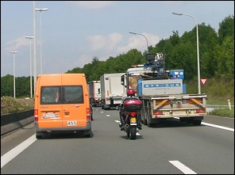 | If there is a traffic jam, motorcycles are allowed to ride:   * between the two left lanes of traffic, * at a maximum speed of 20kph faster than the other vehicles, * and at maximum 50kph. |

---

## To drive up a motorway

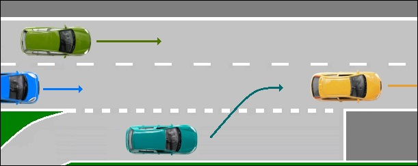

When driving up the motorway via the acceleration lane, you must give right of way to the drivers who are already on the motorway. There is no zipping.

---

## What is prohibited on a motorway

**On a motorway is prohibited**:

1. **Waiting or parking** on the lanes or on the breakdown lane. Also on the entry or exit lane.
2. Driving on a **cross connection or a verge**.
3. Driving **backwards**.
4. Driving in the **wrong direction**.
5. **Towing** a vehicle with an emergency clutch/link.
6. Driving slower than 70kph or faster than 120kph.

---

## Interchange

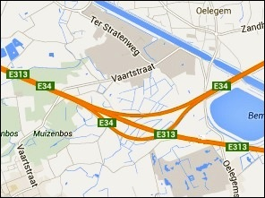 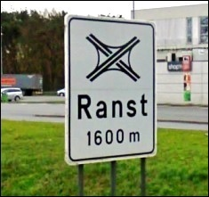 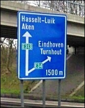

The place where two motorways merge.

There are **no junctions** on a motorway.

There are still places where two motorways merge. This place is called **an interchange**. Via an interchange, you can drive from one motorway to another.

---

## Temporary driving licence

### Driving with an "L"

|  |  |
| --- | --- |
| 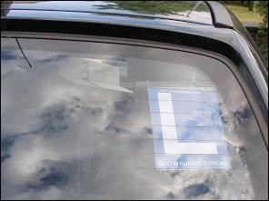 | When you have a temporary driving licence, you are allowed to drive with a car on a motorway in Belgium. |

---

## Traffic signs

| Sign | Kind | Meaning |
| --- | --- | --- |
|  | Information sign (or informative or indication sign) | Start or entry of a motorway. |
| 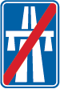 | Information sign (or informative or indication sign) | End or exit of a motorway. |
| 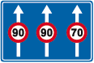 | Information sign (or informative or indication sign) | * Maximum 90 kph on the two left lanes. * Maximum 70 kph on the right lane. |
| 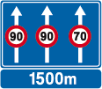 | Information sign (or informative or indication sign) | Advance warning 1500m:   * Maximum 90 kph on the two left lanes. * Maximum 70 kph on the right lane. |
|   | Prohibitive sign | Maximum speed limit on the exit: 90 kph. |
| 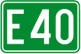 | Information sign (or informative or indication sign)n | Number of an international road. |
| 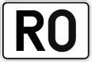 | Information sign (or informative or indication sign) | Number of a motorway. |

---

[Back to the previous page](theory)