## Part B: the road users

# Lesson 7: The pedestrians

## The road users

### What are road users

|  |  |
| --- | --- |
| 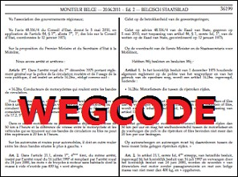 | According the traffic regulations (wegcode) a road user is **anyone who uses the public road**.  They are **persons**. An animal like a horse or a dog and things like a bicycle or a car are not road users.  Road users are:   * the **pedestrians**, * the **drivers of vehicles**. |

---

## The pedestrians

### What are pedestrians

|  |  |
| --- | --- |
| 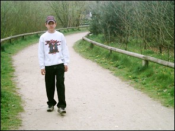 | A pedestrian is a person who moves on foot on the public road.  A pedestrian is obliged to use the footpath, sidewalk, pavement or the verge.  When there is no footpath or verge, he can walk preferably on the cycle lane or on the road. |

### Examples

|  |  |
| --- | --- |
| 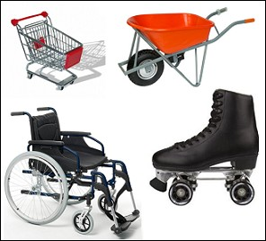 | Anyone pushing a shopping cart, a wheelbarrow, a wheelchair or any other non-motorized vehicle moving step by step are pedestrians. |
| 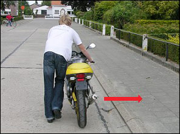 | Anyone pushing a broken down moped or a bicycle is a pedestrian (not a car or motorbike).  In this example the pushing should be done on the pavement. |

---

## Zebra crossing or pedestrian crossing

### Traffic sign

|  |  |
| --- | --- |
| 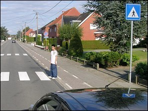 |  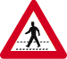  The **red traffic sign** is placed about **150 meters in front** of the pedestrian crossing.  The **blue traffic sign** is placed **at the pedestrian crossing**.  When there is a pedestrian crossing or a zebra crossing **within 20 meters**, the pedestrian must use it. |

### A winged pedestrian crossing

|  |  |
| --- | --- |
| 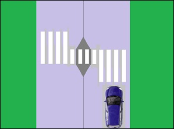 | This type of pedestrian crossing is designed to make pedestrian crossing safer. In addition, the aim is to make the crossing more visible to truck drivers who are sitting higher up. |

---

## Three things you have to remember

### Priority

|  |  |
| --- | --- |
| 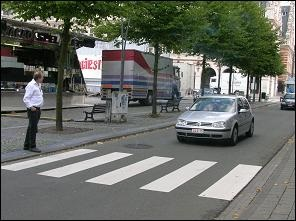 | Pedestrians:   * **on the zebra crossing,** * **or intending to use it,**   must get priority.  So drive very carefully when you approach a zebra crossing. |

### Overtaking

|  |  |
| --- | --- |
| 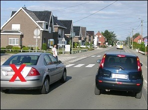 | You may **not overtake** a driver on the left,   * who **slows down**, * or **stops**,   in front of a zebra crossing.  What the driver of the grey car does in this picture is absolutely forbidden. |

### Waiting and parking

|  |  |
| --- | --- |
| 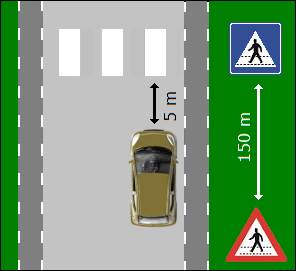 | To be stationary and parking is prohibited:   * On the **road and on the verge** on the zebra crossing. * And **on the road** till 5 meters in front of the crossing.   This is also the case with a crossing for bicycles and two-wheeled mopeds.  Past a crossing you are allowed to be stationary or to park (except when traffic signs prohibit it). |

---

## No crossing for pedestrians

### Priority

|  |  |
| --- | --- |
| 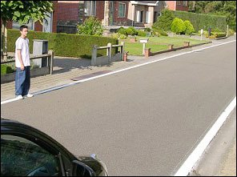 | A pedestrian who wants to cross over the road where there is no zebra crossing, he himself **has to give priority**. |

### Pedestrians and a staging point

|  |  |
| --- | --- |
| 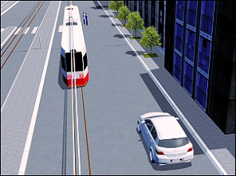 | If a tram or a bus stops on the carriageway and **there is no escape hill near the staging point**, then the driver driving along the side where the passengers embark and disembark:   * has to stop, * give passengers the opportunity to cross the carriageway safely. |

---

## Pedestrian zone

### Traffic signs

|  |  |
| --- | --- |
|   | These information signs indicate the beginning and the end of a pedestrian zone. |

### Rules

|  |  |
| --- | --- |
| 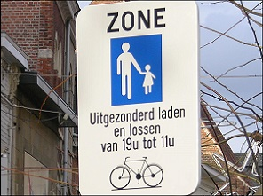 | Drivers who are allowed to drive in a pedestrian zone:   * must do this **step by step**. * they must leave the passageway clear for pedestrians and stop if necessary. * they may not hinder the pedestrians. |

---

## Traffic signs

| Sign | Kind | Meaning |
| --- | --- | --- |
| 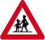 | Warning sign (or danger sign) | Children present. |
| 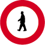 | Prohibitive sign | No entry for pedestrians. |
|  | Information sign (or informative or indication sign) | Pedestrian crossing. |
|  | Warning sign (or danger sign) | Pedestrian crossing (is placed 150 meters in front of the crossing). |
|  | Sign giving orders (or mandatory sign) | Segregated road for the use of pedestrians or cyclists or two-wheeled mopeds class A. |
|  | Sign giving orders (or mandatory sign) | Part of the road for the use of pedestrians or cyclists. |
| 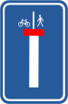 | Information sign (or informative or indication sign) | No through road except for pedestrians and cyclists. |
| 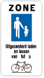 | Information sign (or informative or indication sign) | Pedestrian zone. |
| 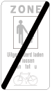 | Information sign (or informative or indication sign) | End of a pedestrian zone. |

---

[Back to the previous page](theory)