## Part A: the public road

# Lesson 1: The public road and the carriageway

This first lesson is freely accessible to everyone.

With your BANK code (not an SMS nor BOOK code) you also have access to the other theory lessons, our practice questions with voice and mock exams during 10 days.

## The difference between a public road, a public area and a non-public area

### A public road

|  |  |
| --- | --- |
| 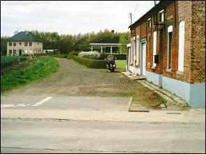 | A public road is a public place such as a street, a bridge, a tunnel, a path, a dirt track, a square, a motorway etc. where **we are allowed to come without any problems** with all or with some vehicles.  Pedestrians, people with pack or draught animals or herding livestock and cattle are also allowed on some public roads or parts of the public road.  We do not have to explain to anyone why we want to ride there. |

### A public area

|  |  |
| --- | --- |
| 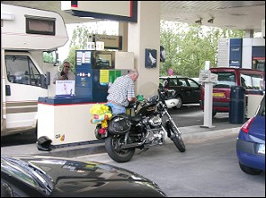 | A public area is a public place such as a parking of a restaurant or a petrol station where we only go to **when we really need to be there for something**. |

### A Non-public area

|  |  |
| --- | --- |
| 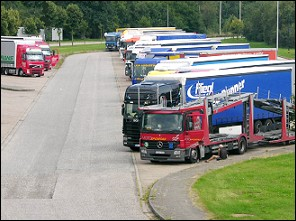 | It is a private property such as a practice ground of a driving school or a factory parking. We are only allowed to drive there **if we have a special permit or a licence**. |

### Where traffic regulations (wegcode) apply

|  |  |
| --- | --- |
| 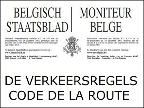 | The traffic regulations only bind on **the public road**. For traffic rules violations committed on the public road, you get a fine.  **But** you cannot do what you want on a public area or a non-public area. For certain violations you commit regarding alcohol abuse, an accident with casualties or driving without driving licence etc. you can be fined or be prosecuted. |

### A private road (private weg)

|  |  |
| --- | --- |
| 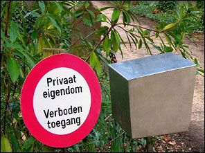 | Roads with a '**Private property**' sign are not public roads.  **The traffic regulations** do not apply here (except when the owner gives permission for his property to be used by everyone). |

### Tram drivers

|  |  |
| --- | --- |
| 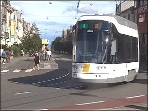 | Tram drivers do not have to follow the traffic regulations, except:   * the **orders of an authorized person**; * the **traffic lights**. |

---

## Different parts of the public road

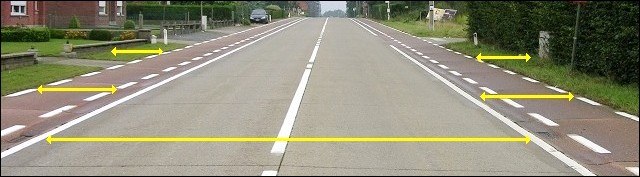

Some people think that the public road is only the **hardened surface** where the cars ride. But that is incorrect.

Also the **cycle lane**, the **soft or hard verge**, the **raised verge**, the **central reservation** and the **pavement** (or a footpath) are parts of the public road.

Usually the boundaries of a public road are a canal or a private property.

---

## The carriageway

### What the carriageway is

|  |  |
| --- | --- |
| 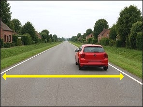 | The carriageway is the **hardened surface of the public road** designed for the use of vehicular traffic where vehicles such as a car, a bus, a moped and an agricultural vehicle are allowed to drive.  Cyclists and moped class A riders may use the carriageway when there is no cycle lane.  A public road may have two or more carriageways separated by a grass verge, a raised verge or guard rails, e.g. along motorways. |

### A continuous white line along the edge of the carriageway

|  |  |
| --- | --- |
| 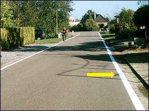 | Sometimes there is a **white line** painted along the edge of the carriageway.  This line marks **the edge of the carriageway** and has **no other meaning**. |

### Where you have to drive

|  |  |
| --- | --- |
| 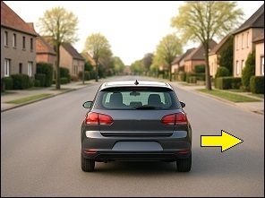  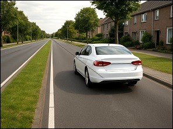 | Drivers should drive **as far as possible on the right** of the carriageway.  You are not allowed to drive in the middle or to the left of the carriageway for no reason. This is a traffic offence.  A public road may have **two or more carriageways** separated from each other.  If the public road comprises of two or more carriageways that are clearly separated from each other, in particular with a solid ground, a space inaccessible for vehicles, a difference in levels, drivers may not follow the carriageway which is left in relation to their driving direction (except when a pliceman or a traffic sign says you must). |

### Normal maximum speed on a carriageway

|  |  |
| --- | --- |
| 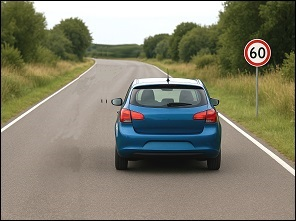 | The maximum speed limit on a **regular carriageway** is:   * In the **Flanders**: **70**kph. * In **Wallonia**: **90**kph. * In **Brussels region**: **70**kph. |

---

## The central carriageway or central lane

### What is a central carriageway or central lane?

|  |  |
| --- | --- |
|  | A **central carriageway or central lane** is a part of the public road and is **intended for motorised traffic**.  You can recognize a central carriageway by two parallel white dashed stripes on either side of the carriageway, each consisting of two pairs of short strokes. |

### 2. Maximum speed

|  |  |
| --- | --- |
| 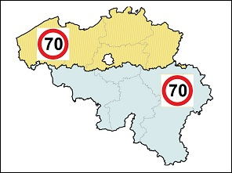 | maximum permitted speed is:   * In the **Flemish region: 70 kph.** * In the **Brussels region: 70 kph.** * In the **Walloon region: 70 kph.** |

### The side lane

|  |  |
| --- | --- |
| 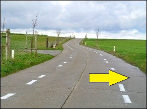 | The **side lane** is the strip that lies next to the central carriageway.  The side lane is **not part of the carriageway**. This means that **you are not allowed to drive your car on it**. |

### Who is allowed to drive on a side lane?

* Cyclists, speed pedelecs and two-wheeled mopeds A.
* Drivers of unharnessed draught animals, pack or mount animals or livestock.

---

## Animals on the roadway

|  |  |
| --- | --- |
| 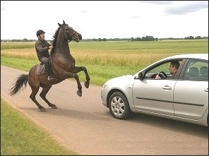 | Every driver must immediately slow down when approaching draft, pack, riding animals, or livestock on the public road.  If a horse on the road gets scared by a car and rears up, the driver must stop the vehicle and avoid any sudden movements, so that the rider can calm the horse and regain control of the situation before it escalates. |

---

## Some important issues concerning driving and the driving licence

### When you are not allowed to drive on the public road with a temporary driving licence

* from Friday night 22h00 till Saturday morning 06h00
* from Saturday night 22h00 till Sunday morning 06h00
* from Sunday night 22h00 till Monday morning 06h00
* from the night before a legal holiday 22h00 till the morning of that holiday 06h00
* from the evening of a legal holiday 22h00 till the morning of the next day 06h00

### How to hold the steering wheel while driving

|  |  |  |
| --- | --- | --- |
| 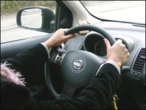 **Correct** | 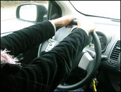 **Wrong** | 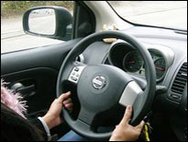 **Wrong** |

While driving, you have to **hold your both hands** on the steering wheel clockwise '**ten to two**' or '**a quarter to three**'.

Keep your **arms slightly bent**. This way you can make the necessary small movements at the steering wheel to the left or to the right without removing your hands from the steering wheel.

### Medically unfit to drive

|  |  |
| --- | --- |
| 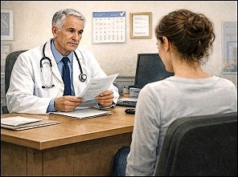 | When a doctor claims that you are not healthy physically and/or mentally, you have to bring your driving licence to the local authorities **within four working days** after you heard it.  You can get your driving licence back when you get a certificate from the doctor that says you can drive again. |

---

## Traffic signs concerning this lesson

| Sign | Type | Explanation |
| --- | --- | --- |
|  | Warning (or danger sign) | Dangerous bend to the right. |
|  | Warning (or danger sign) | Dangerous bend to the left. |
|  | Warning (or danger sign) | Two or more bends, the first to the left. |
|  | Warning (or danger sign) | Two or more bends, the first to the right. |
| 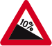 | Warning (or danger sign) | Steep hill downwards. |
|  | Warning (or danger sign) | Steep hill upwards. |
| 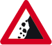 | Warning (or danger sign) | Falling rocks. |
| 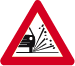 | Warning (or danger sign) | Loose gravel. |
|  | Warning (or danger sign) | Road narrows on both sides. |
| 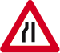 | Warning (or danger sign) | Road narrows on the left. |
|  | Warning (or danger sign) | Road narrows on the right. |
| 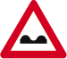 | Warning (or danger sign) | Uneven road. |
|  | Warning (or danger sign) | Speed hump(s). |
| 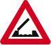 | Warning (or danger sign) | Opening or swing bridge ahead. |
| 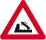 | Warning (or danger sign) | Way out on a quay or a riverbank. |
| 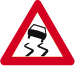 | Warning (or danger sign) | Slippery road. |
|   | Warning (or danger sign) | Slippery road due to ice or snow. |
| 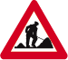 | Warning (or danger sign) | Road works. |
| 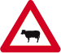 | Warning (or danger sign) | Passage of cattle. |
| 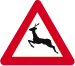 | Warning (or danger sign) | Big game crossing. |
| 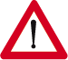 | Warning (or danger sign) | Danger. A plate indicates the nature of the hazard. |
|  | Warning (or danger sign) | Crossing of a public road by one or more tracks in the carriageway. |
| 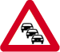 | Warning (or danger sign) | Traffic jam |
| 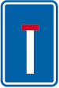 | Information (or informative or indication sign) | No through road to all road users. |
|  | Information (or informative or indication sign) | No through road except for cyclists and pedestrians. |
|  | Information (or informative or indication sign) | Road number |

---

[Back to the previous page](theory)