## Part I: miscellenea

# Lesson 31: Tires - brakes - abs - esp - ...

## The tires of a car

### Tires must be in order

|  |  |
| --- | --- |
| 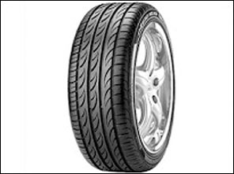 | The tires ensure direct contact between the car and the road surface.  In order to drive safely, it is therefore very important that the tires of your car are in order.  Badly worn tires or too low tire pressure:   * **increase the braking distance**; * **increase fuel consumption**; * also **reduce road handling**.   Old tires get harder, too. |

### The tread depth

|  |  |
| --- | --- |
| 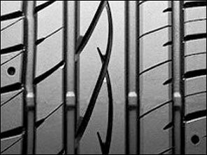 | **The tread depth** of the deep-lying main grooves of a tire shall be at least **1.6 mm**.  (But at that depth you can no longer really talk about safe driving, because with a tread depth of less than 2 mm you already have an extra chance of aquaplaning).  The **profile or wear indicators** that you find on a lot of tires indicate when the tires need to be replaced. So check that regularly. |

### Badly worn tires

|  |  |
| --- | --- |
| 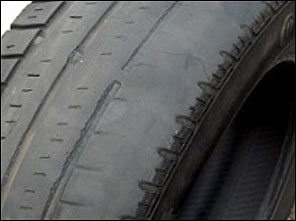 | Badly worn tires are **not allowed to be re-cut**. |

### Tire pressure

|  |  |
| --- | --- |
| 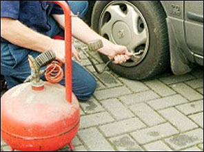 | In normal use, a tire loses between 3 and 5% of the tire pressure per month. In cold weather, you lose about the same thing.  The tire pressure must comply with the manufacturer's requirements.   * That pressure needs to be checked when the tires are cold. * If the tires have too low pressure, or excessively high, it will ensure more chance of aquaplaning.   Important:   * before a **very long ride**, * or you have to **carry a heavy load**,   then it is best to increase the tire pressure slightly by 0.2 bar. |

### Diagonal / radial tires

|  |  |
| --- | --- |
| 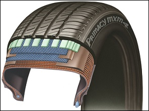 | Radial tires and diagonal tires are two concepts that are frequent in the tire world.  The difference between the two depends on how the bond is constructed. Both variants have both advantages and disadvantages.   * Radial tires are permitted at the front and rear. * Front and rear diagonal tires are permitted. * Diagonal and rear radial is permitted at the front. * **Front radial and rear diagonal is not allowed.** (Because: You can only place radial tires at the front if there are also radial tires at the back.) |

### Studded tires / snow tires

|  |  |
| --- | --- |
| 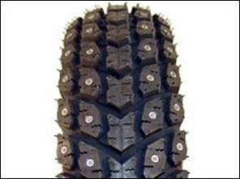 | Nail tires may be placed **between 1 November and 31 March** on vehicles with an M.T.M. up to 3,5 ton.  Important speed:   * **Normal roads** up to **60 km/h**. * **Motorways and roads with 2x2 lanes** up to **90 km/h**. |

### Winter tires

|  |  |
| --- | --- |
| 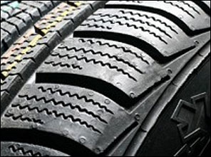 | It is best to us them **on the four wheels**. |

### Snow chains

|  |  |
| --- | --- |
| 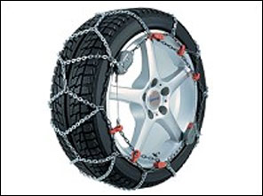 | Snow chains can only be placed **if there is snow or ice on the roads**. |

### Markings on a tire

|  |  |
| --- | --- |
| 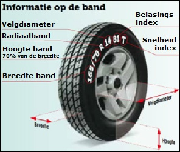 | There are a lot of markings on a tire.  For example: 165/70 R 14 81 T   * 165 = Width of the tire in mm * 70 = Height/width ratio * R = Radial tire * 14 = Rim diameter, expressed in inch * 81 = Load index indicating the maximum load capacity * T = Speed index. This indicates the maximum speed that can be driven with the tire |

### E-markering DOT

|  |  |
| --- | --- |
| 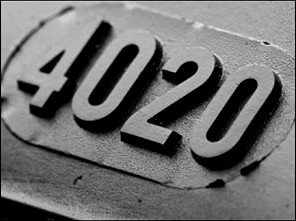 | - **First two digits**: week of manufacture.  - **Last two digits**: year of manufacture. |

### Changing tires

|  |  |
| --- | --- |
| 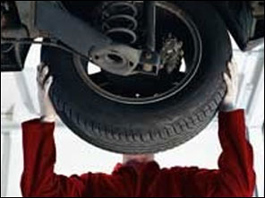 | It is important to change your tires every 10,000 to 15,000 kilometers, even if no wear is visible. |

### Crosswise screwing of the bolts

|  |  |
| --- | --- |
| 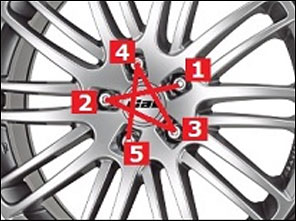 | When tightening the bolts or nuts, pay attention to the correct tightening order.  Always follow a **crosswise pattern**, as in the schematic views on the right. |

---

## Oil

### Function of the motor oil

|  |  |
| --- | --- |
| 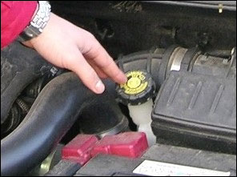 | * The engine oil ensures smooth operation of the engine and prevents it from overheating and blocking. * The oil also protects internal parts from rust and cleans the engine. |
| 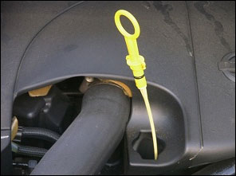 | There must always be enough oil in the engine.  So make sure you know where the dipstick is located and regularly check the oil level.  By the way, you have to do that when:   * the engine is cold (or stationary for a while), * and the car is levelled. |
| 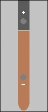 | Make sure that, if you need to take a long drive, there is enough oil (close to the +). If not, you need to add some oil. |

---

## Brakes

### Brakes

|  |  |
| --- | --- |
| 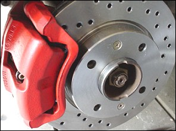 | The brakes of a car allow you **to slow down and stop** in a timely manner.  It goes without saying that they must be in good condition.  Also check regularly if there is still enough **brake fluid**. |

### Brakes and bends

|  |  |
| --- | --- |
| 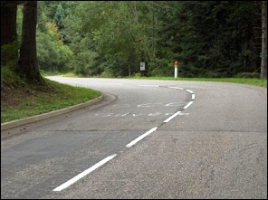 | When you approach a bend:   * you need to slow down enough for the bend. * do not slow down extra in the bend. |

### Turn left/right and brake

|  |  |
| --- | --- |
| 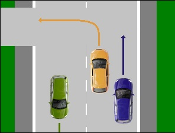 | When you need to turn left or right, do the following:   * First **look in the mirrors**; * Then **turn on the turn signal**; * **Slow down**. |

### ABS

|  |  |
| --- | --- |
| 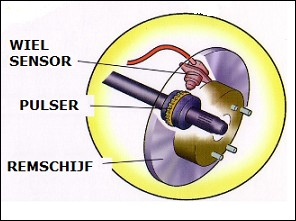 | Many cars are equipped with ABS or anti-blocking system. This prevents the wheels from blocking during braking and the car from slipping.  Braking with ABS does not mean that you brake faster, but the car remains more controllable while braking with ABS. On a dry road surface: Braking with ABS does not necessarily mean that the braking distance will always be shorter than without ABS.  This also has to do with the surface on which you drive and brake. Example: on a loose surface, the braking distance may be longer. On a wet road surface: The braking distance with ABS is longer than with ABS on a dry road surface.  The ABS kicks in when you press the brake pedal hard.    If the light of ABS stays on, you est go to the garage. |

---

## ESP: Electronic Stability Program

### Function

|  |  |
| --- | --- |
| 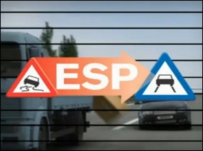 | This technology is described by experts as the most important safety contribution since the seat belt and airbag.  ESP or **Electronic Stability System**, helps the driver of a vehicle when it finds himself in a critical situation where the vehicle is in danger of slipping. This can be, for example, in the case of sudden swerve manoeuvres for obstacles- or in misjudged bends or in the case of treacherous road surfaces. It helps prevent the vehicle from slipping by braking one or more wheels separately. |

---

## Coolant

### Function

|  |  |
| --- | --- |
| 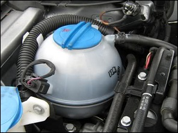 | A fuel engine heats up because a (fairly large) part of the energy released when fuel is burned is converted into heat. This heat has to go somewhere.  In cooperation with the radiator, **the coolant ensures that this heat is discharged**.  This allows the engine to operate at the ideal operating temperature, the temperature at which the engine performs optimally. |

---

## Alternator

### Function

|  |  |
| --- | --- |
| 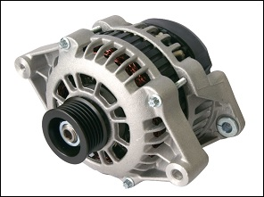 | If a car is stationary, the car's battery provides the necessary power, so that, for example, the radio can play, or the lights can be lit and you can start the engine.  If you drive the car, the alternator arranges:   * the **power supply**; * **charging the battery**. |

---

## Changing gear

### Recommended revs

|  |  |
| --- | --- |
| 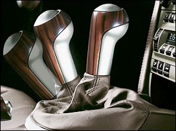 | When driving normally on a horizontal road surface, you switch:   * a **petrol engine best at 2500 rpm**; * a **diesel best at 2000 rpm**.   If you drive in too low a gear, the car consumes more fuel. Always try to shift to a higher gear when it is safe. |

### Where do you put your foot after changing gear

|  |  |
| --- | --- |
| 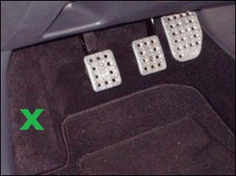 | After switching and at all other times when you are not using the clutch, **it is best to place the left foot next to the pedal** (not underneath or in front of it), on the footrest provided for this.  This way you avoid pressing the clutch or resting your foot on it, causing the clutch to slip. |

### Mountains

|  |  |
| --- | --- |
| 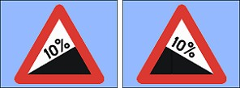 | If you have to go **steep hill downwards or upwards**, it is best to **change into a lower gear**. |

---

## Electronic devices

|  |  |
| --- | --- |
| 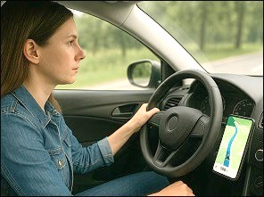 | Electronic devices such as a phone, tablet (…) in the car distract the driver.  That is why drivers are not allowed to use, hold or handle any “mobile electronic device with a screen” while driving, unless the device is placed in a suitable holder that is attached to the vehicle.  When a smartphone is placed in a fixed holder, it may be used as a GPS. |
| 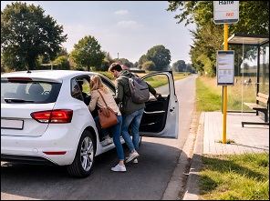 | They may, however, use the device when they are stopped or parked. But stopping at a traffic light, for example, or in a traffic jam, is not considered as “being stopped”. |

---

## Skidding

|  |  |
| --- | --- |
| 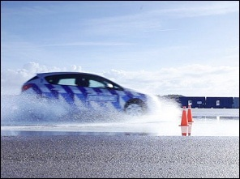 | The car slides in a direction you did not intend. |

### Voorwielslip

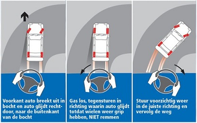

The front of the car loses grip because the front wheels lose traction. The vehicle moves toward the outside of the bend.

**What should you not do?**

Avoid braking too hard, as this can lock the wheels and cause loss of grip.

### Achterwielslip

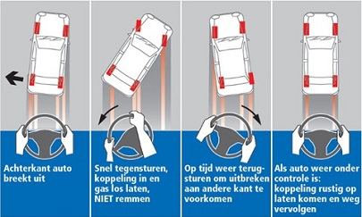

The rear of the car loses grip. You recognize this when the rear of the car wants to swing forward.

**What should you not do?**

- Do not brake suddenly.

- Avoid sudden steering movements.

- Do not accelerate (unless the road surface has very good grip).

**What should you do?**

- Look in the direction you want to go.

- Counter-steer (turn the steering wheel in the direction of the skid).

- Press the clutch.

- Release the accelerator.

### Aquaplanning

|  |  |
| --- | --- |
| 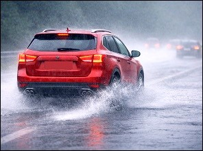 | Aquaplaning is the phenomenon where a thin layer of water forms between the tyres of a car and the road surface. The car then slides on this film of water, which makes it temporarily uncontrollable.  In that case, you should steer in the direction you want the vehicle to go and avoid braking. Depending on the speed at which you drive through the water and the amount of water on the road, aquaplaning can occur even when the main grooves of your tyres still have a depth of 1.6 mm (the legal minimum), or even 2, 3, 4, 5 mm or more. |

### Skid and ABS

If your car has ABS and you start to skid, press the brake pedal even harder to activate the ABS.

---

[Back to the previous page](theory)