## Part F: priority

# Lesson 18: Traffic lights

## Round red traffic light

### What does it mean

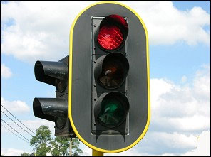 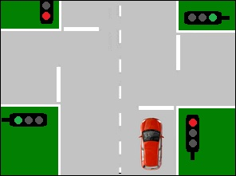

|  |  |
| --- | --- |
| Geen video ondersteuning in deze browser... | If you see a **round red traffic light** to the right of you, a stop line indicates the place where you must stop.  If there is no stop line, you are not allowed to drive past the traffic light. |

### Where are the round traffic lights

|  |  |
| --- | --- |
| 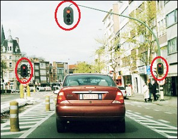 | A round traffic light should be **on your right**.  It may be repeated above the carriageway and also to the left of the carriageway. |

### What if the light is only on your left side

|  |  |
| --- | --- |
| 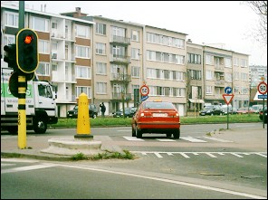 | If it is **only to your left**, then you **don't have to take it into account**.  For example, the driver of this red car is allowed to enter the intersection. |

### Waiting place for cyclists and two-wheeled mopeds

|  |  |
| --- | --- |
| 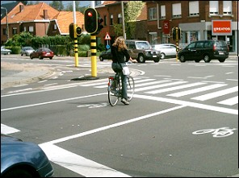 | At some intersections a **waiting space for cyclists and two-wheeled mopeds** has been created with road markings.  **Cars must stop before the first stop line** when the light turns orange-yellow or red. That is the line that the drivers see first.  Cyclists and two-wheeled mopeds stop before the second stop line. That's the line closest to the intersection. |

---

## Round green traffic light

### What does it mean

|  |  |
| --- | --- |
| 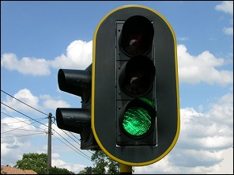 | If the light turns **green**, you may enter the intersection, provided it is clear. |
| 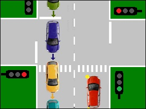 | Note Although the light is green, the driver of the red car is not allowed to enter the intersection yet. He has to wait for it to be free.  However, **he may NOT remain standing in a crosswalk** while he waits. |

### Traffic signs concerning priority under the traffic light

|  |  |
| --- | --- |
| 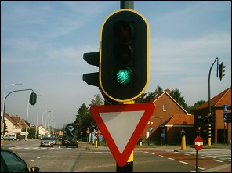 | In many places you will see under the green light a traffic sign that regulates the priority.  **These signs do not apply when the traffic lights are working.** |

### Green light replaced by an orange-yellow flashing light

|  |  |
| --- | --- |
| 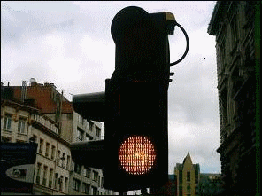 | Sometimes the green light is replaced by an orange-yellow flashing light. Even then you are allowed to continue, but then you have to be **doubly careful** and **take into account the applicable priority rules**. |

---

## Round orange-yellow traffic light

### What does it mean

|  |  |
| --- | --- |
| 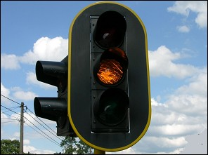 | When the light turns **orange-yellow**, you are not allowed to drive past it and you stop in front of the stop line. After a few seconds, the light will turn red.  You may only drive past an orange-yellow light if you really cannot stop safely (see animation below). |
| Geen video ondersteuning in deze browser... |  |

### Flashing orange-yellow light

|  |  |
| --- | --- |
| 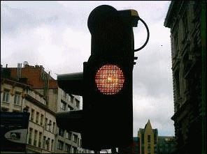 | You are allowed to drive past **a flashing orange-yellow light**, but then you have to take into account the signs that regulate the right of way, and the right of way rules and be doubly careful. |

---

## Cyclists past a red or orange-yellow light

### Traffic sings B22 and B23

|  |  |
| --- | --- |
| 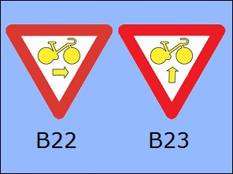 | If the signs B22 and / or B23 are at the traffic lights, cyclists and speed pedelecs are allowed to drive past the red or orange-yellow light without any problems. **These traffic signs therefore have priority over these traffic lights**.  The signs B22 and B23 are attached to the post of the traffic lights.  When it comes to the **B22 sign**, a cyclist or speed pedelec may pass the red or orange-yellow light and turn to the right.  At the **sign B23**, the cyclist or speed pedelec may drive straight on past the red or orange light. Cyclists or speed pedelecs driving past these lights must, however, give way to other road users who are moving on the open road or on the carriageway. |

---

## Arrows replacing the round traffic lights

### What does it mean

|  |  |
| --- | --- |
| 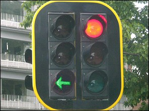 | The red light, the solid orange-yellow light and the green light may be replaced respectively by one or more red, orange-yellow or green arrows.  **These arrows have the same meaning as the round lights**, but the prohibition (red) or permission (green) then only applies to the directions indicated by the arrows. |

## Round red traffic light and a green arrow

### What does it mean

|  |  |
| --- | --- |
| 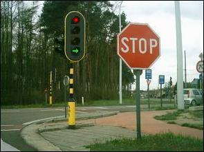 | Sometimes a green arrow is placed at the round traffic lights.  If a green arrow lights up while the round red light is also on, this means that vehicles are **allowed to turn in the direction of the arrow**.  However, if a driver wants to enter the intersection, he must be very careful and **give way to all road users coming from the other directions**. |

### Example

|  |  |
| --- | --- |
| 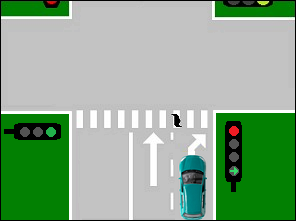 | The car may enter the intersection, but de driver must first give way to road users (here the pedestrian) coming from other directions. |

---

## A green evacuation arrow at a junction

### What does it mean

|  |  |
| --- | --- |
| 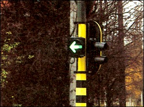 | At an intersection, where most of the traffic normally turns left, a separately placed **green arrow** can indicate that the traffic coming from the opposite direction is stopped by a red light.  Drivers who have to turn left can easily clear the intersection. |

### How to react

|  |  |
| --- | --- |
| 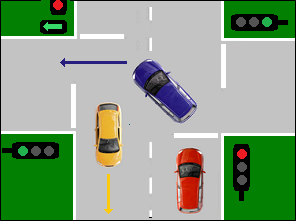 | If there are no oncoming traffic, you can of course already evacuate the intersection before the green evacuation arrow lights up.  If the green evacuation arrow is lit, you are not allowed to drive quickly past a red light into the intersection.   * The blue car may leave the intersection. * The red car has to wait. |

---

## Arrows above the lane

|  |  |
| --- | --- |
| 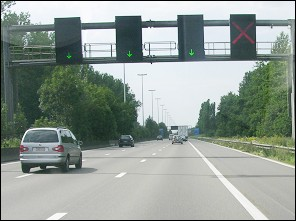 | Sometimes there are arrows above the lanes of motorways, express roads... |

### Green arrow

|  |  |
| --- | --- |
| 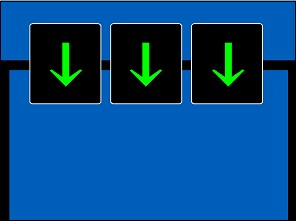 | **Green arrows** above the lanes indicate that it is **allowed to drive in these lanes**. But keep in mind that under normal circumstances you should choose the rightmost lane.  You can use the left lanes:   * for overtaking on the left, * or where there are blue signs with arrows to get you to a specific destination, * or with a traffic jam or queues. |

### Orange-yellow arrow

|  |  |
| --- | --- |
| 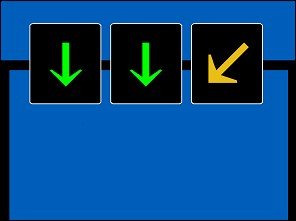 | An **orange-yellow arrow** tells you **to leave that lane** in the direction indicated by the arrow. |

### Red cross

|  |  |
| --- | --- |
| 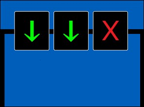 | If a **red cross** appears, you are **no longer allowed to drive in that lane at all**. |

---

## Lights at a level crossing

### Moon-white flashing lights

|  |  |
| --- | --- |
|  | If you are approaching a level crossing and the **moon-white light flashes**, you may **drive onto the level crossing**. |

### Overtaking on the left on a level crossing

|  |  |
| --- | --- |
| 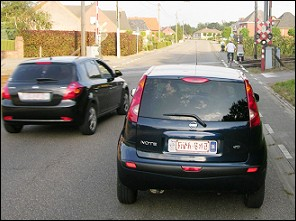 |    Let me remind you that if a level crossing is indicated by one of these signs and the moon white light is flashing, or if there are barriers, you may overtake vehicles on the left. |

### Red flashing lights

|  |  |
| --- | --- |
|  | **Alternately flashing red lights** say that **no one is allowed to cross the level crossing**, including pedestrians. The two alternately flashing red lights are always accompanied by the **sound of a bell** ringing just before and during the closing of the barriers.  Tip exam Driving past these red lights is a serious offense and, as with any serious offense, your driver's license can be immediately revoked. |

---

## Traffic lights for pedestrians and cyclists

### The traffic lights

|  |  |
| --- | --- |
| 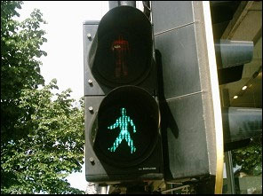 | The **light with the silhouette of a pedestrian** only applies to pedestrians. |
| 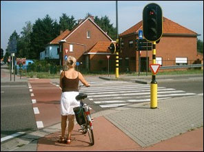 | The **light with the silhouette of a bicycle** applies to cyclists and drivers of two-wheel mopeds. |
| 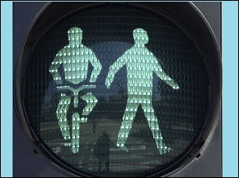 | The **light with the silhouette of pedestrian and bicycle together**, applies only to pedestrians and cyclists. |
| 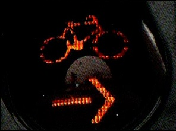 | When an additional orange-yellow flashing light with a bicycle silhouette and an orange-yellow flashing arrow illuminates together with a red light or an orange-yellow light, this means that cyclists and drivers of two-wheel mopeds may only continue in the direction indicated by the arrow, on provided that priority is given to drivers who regularly come from other directions and to pedestrians.  Car drivers do not have to take into account the special lights for pedestrians or for cyclists and two-wheel mopeds. |

### Green arrows in square

|  |  |
| --- | --- |
| 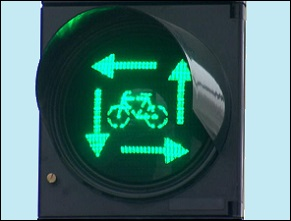 | Some intersections are equipped with **traffic lights with arrows around the silhouette of a cyclist (or pedestrian)**.  Cyclists (or pedestrians) then know that they are allowed to cross the intersection in any direction, even diagonally. After all, all other drivers have a red light. This also applies to drivers of two-wheeled mopeds who are allowed to ride on the cycle path. |

---

## Tram

### Meaning of the lights

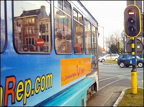 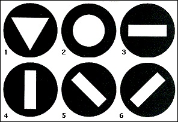

1. **Inverted triangle** has the same meaning as green light.
2. **Circle** has the same meaning as solid orange-yellow light.
3. **Horizontal bar** has the same meaning as red light.
4. **Vertical bar** allows you to drive straight ahead only.
5. **Angled bar to the left** allows you to drive in that direction only.
6. **Angled bar to the right** allows you to drive in that direction only.

A round orange-yellow flashing light may be driven past with double caution, but take into account the applicable right of way rules.

---

[Back to the previous page](theory)