## Part F: priority

# Lesson 22: Train - tram - bus

## Train

### In general

|  |  |
| --- | --- |
| 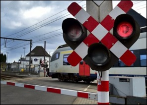 | A train runs on tracks or rails. His stopping distance is very long and he can never evade.  Therefore, you should be careful when approaching a level crossing and take into account the signs and instructions. |

### Signs

|  |  |
| --- | --- |
| 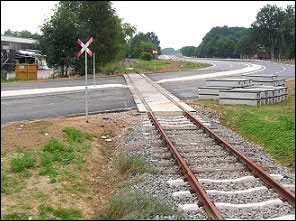 | 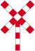  This warning sign:   * is placed at the level crossing. * means a **level crossing with a single track.** |
| 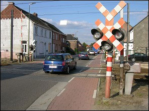 |   This warning sign:   * is placed at the level crossing. * means a **level crossing with two or more tracks.** |
| 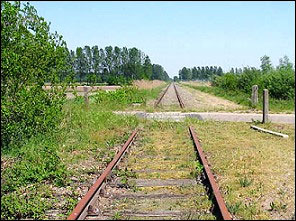 |   This warning sign:   * is placed 150 meter in front of the level crossing. * means a **level crossing without barriers.** |
| 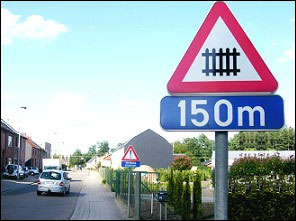 | 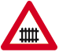  This warning sign:   * is placed 150 meter in front of the level crossing. * means a **level crossing with barriers.** |

### Lights

|  |  |
| --- | --- |
| 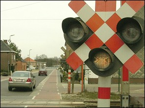 | If the **moon white light flashes**, then there is no train approaching and **you are allowed to drive over the level crossing.**  You can also overtake a vehicle on the left.  (Remember: if there are no lights or no barriers, overtaking on the left is prohibited).  Of course you are not allowed to stand still (to let someone get off) and not park on a level crossing. |
| 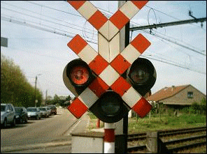 | If you hear the **sound signal** and/or the **red lights flash**, you must not go on the level crossing.  Driving quickly on a level crossing while the barriers are already going down is a serious violation, where your driving license can be revoked immediately. |

---

## Tram - bus: special reserved route

### In general

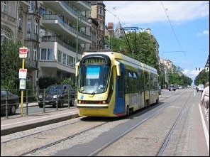 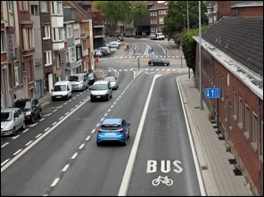 

This traffic sign indicates that a tram or bus runs on a special reserved route.

The special reserved route **is not a part of the carriageway**.

The white solid line that delineates the special reserved route is therefore not the same as a white crossed-out stripe between the lanes.

A bottom sign indicates when some drivers are allowed to drive there.

|  |  |  |
| --- | --- | --- |
|    |    |    |

### What is not allowed

A special over-drive-able bed is NOT part of the roadway.

So with a car:

* you may **not drive**;
* you may **not be stationary**;
* you may **not park**.

You are also not allowed to drive the last meters before an intersection over special over-drive-able bed to sort in front if you want to turn left or right.

### What is allowed

|  |  |
| --- | --- |
| 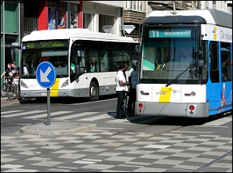 | With a car you can cross a special over-drive-able bed:   * to be able to reach your property, * a parking lot or a petrol station, shop, (...) * or to drive around an obstacle.   The checker-board markings (see image) indicate the place where drivers can drive over the special reserved route at intersections. |

---

## Motorway and a special over-drive-able bed

### In general

|  |  |
| --- | --- |
| 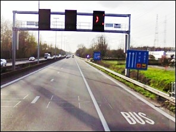 | On some motorways, the former breakdown lane has been transformed into a special over-drive-able bed.  The necessary road markings and signs have been affixed:   * a continuous 'full' line; * the word 'BUS' on the road surface at regular intervals; * and signs 'F18' at each start as shown below.   So it is no longer an emergency lane. |

### Traffic sign

|  |  |
| --- | --- |
| 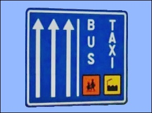 | Signs such as this indicate which vehicles are allowed to use the special over-drive-able bed.  In this example: public transport (bus); the common commuting transport; and taxis. |

### Maximum speed

|  |  |
| --- | --- |
| 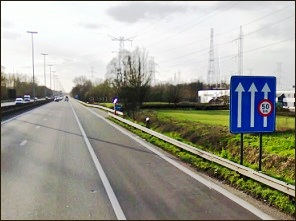 | It is possible that a maximum speed applies to this special reserved route.  In this example, vehicles travelling on the special reserved route may not exceed 50 km/h.  Cars driving in the lanes may drive up to 120 km/h in this example. |

---

## Tracks in the road

|  |  |
| --- | --- |
| 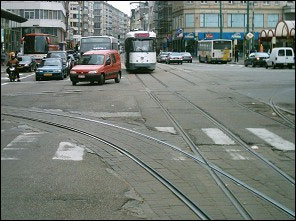 | 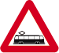  Sometimes tram tracks are also in the roadway.  This warning sign informs drivers that (150 meters further) there is a crossing of one public road through one or more tracks built in the roadway. |

---

## Tram and priority

|  |  |
| --- | --- |
| 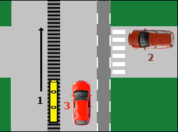 | A tram does not follow the traffic rules. He always has right of way.  The tram driver must only take into account:   * the **orders of an authorized person**; * the **traffic lights**. |

---

## Bus

### A lane for busses

|  |  |
| --- | --- |
| 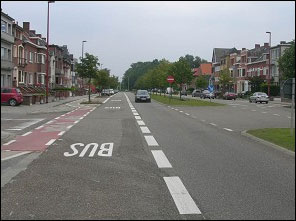 |    These signs indicate that there is a special lane for buses (bus lane).  Plates can indicate when some drivers are allowed to drive on a bus lane.  A car is not allowed:   * to drive. * to be stationary. * to park.   You are allowed to drive the last meters before an intersection on a bus lane to sort for, if you want to turn left or right. |

### A bus stop

|  |  |
| --- | --- |
| 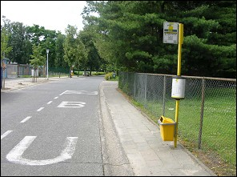 | 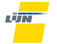  You are allowed to drive on a bus stop. |

### Parking and waiting on a bus stop

|  |  |
| --- | --- |
| 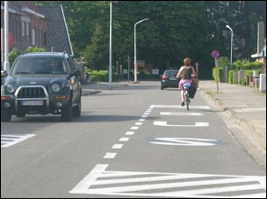 | A bus stop is often indicated by a road marking, indicating the place where you are not allowed to park.  If there is no road marking, you are not allowed to park up to **15 meters in front of or past the sign** indicating the bus stop.  A driver shall moderate his speed when driving past a car, a bus, a troley bus, a minibus or a railway vehicle stationary to allow passengers to get on or off. |
| 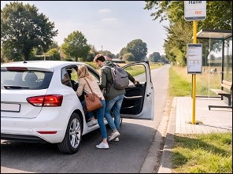 | **WARNING:** You may stop at a bus stop only to let passengers get in or out. |

### Priority

|  |  |
| --- | --- |
| 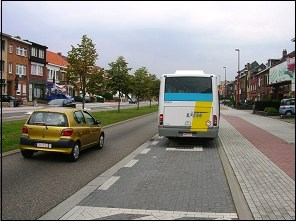 | Finally, I mention that you have to give priority to a bus that leaves the bus stop **within the built-up area**, if the direction indicator lights up.  (Drivers of coaches, buses for the transport of schoolchildren or workers shall not take precedence when they leave on the road again after persons have boarded or disembarked).  (This driver has to give priority) |
| Geen video ondersteuning in deze browser... |  |

---

## Traffic signs

| Sign | Kind | Meaning |
| --- | --- | --- |
|  | Warning signs (or danger sign) | Single line level crossing. |
|  | Warning sign (or danger sign) | Level crossing with two or more tracks. |
| 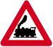 | Warning sign (or danger sign) | Level crossing without barriers. |
|  | Warning sign (or danger sign) | Level crossing with barrier. |
|  | Warning sign (or danger sign) | Trams crossing ahead with one or two tracks simply set into the road. |
|  | Information sign | Indicates a specific lane reserved for the use of public transportation. |
|   | Information sign | Indicates a specific lane reserved for the use of public transportation.  Drivers of mopeds are allowed. |
|  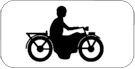 | Information sign | Indicates a specific lane reserved for the use of public transportation.  Drivers of motorcycles are allowed. |
|   | Information sign | Indicates a specific lane reserved for the use of public transportation.  Cyclists are allowed. |
|  | Information sign | Indicates the lanes available and shows which is the bus lane. |
|   | Information sign | Indicates the lanes available and shows which is the bus lane.  Cyclists are allowed. |
|   | Information sign | Indicates the lanes available and shows which is the bus lane.  Mopeds are allowed. |
|   | Information sign | Indicates the lanes available and shows which is the bus lane.  Motorcycles are allowed. |
|    | Information sign | Start of a built area.  Important Maximum 50 kph. |
|    | Information sign | End of a built up area. |
| 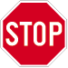 | Priority sign | You must stop and give way. |

---

[Back to the previous page](theory)