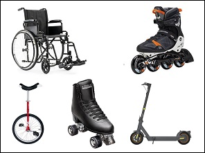
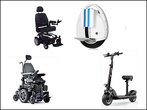
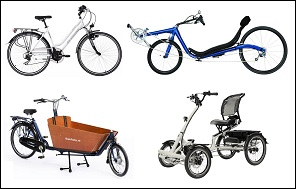
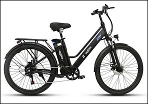
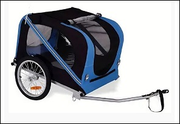
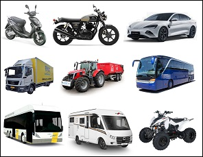

# Types of vehicles

## With what types of vehicles can road users travel?

Before we begin the **driving licence B course**, we will first review the different types of vehicles road users can use to travel.

These movements can be made with:

* **non-motorised mobility devices;**
* **motorised mobility devices;**
* **cycles;**
* **motor vehicles** (including cars).

---

## Non-motorised mobility devices

### What is a non-motorised mobility device?

|  |  |
| --- | --- |
|  | It is any vehicle that:   * is **not a cycle** (see below); * has **no motor**; * is propelled by muscular power.   Examples: manual wheelchair, roller skates, scooters, skateboards, unicycles. |

### Which rules must the users follow?

* If they travel at **walking speed**, they are considered **pedestrians** (see lesson 7).
* If they travel **faster** than walking speed, they are considered **cyclists** (lesson 3).

**Important for the exam:**

*When you learn in a later lesson that you must give way to a pedestrian who wants to* *cross at a pedestrian crossing, this rule also applies, for example, to a beginner skater* *moving at walking speed.*

---

## Motorised mobility device

### What is a motorised mobility device?

|  |  |
| --- | --- |
|  | It is any mobility device that can travel at a maximum speed of **25 km/h.**  Examples: motorised scooters, electric wheelchairs, mobility scooters, self-balancing electric devices (segway). |

### Which rules must the users follow?

* Motorised mobility devices are **not considered motor vehicles.**
* Their users are **treated as cyclists** (see lesson 3).
* **Exception**: a person with reduced mobility who drives a motorised wheelchair at **walking speed** is considered a **pedestrian**.

---

## Cycles

### What is a cycle?

|  |  |
| --- | --- |
|  | A cycle is a vehicle **with two or more pedals**, propelled by one or more users by means of foot pedals or hand pedals, and **without a motor.**  Three- or four-wheeled vehicles with a maximum width of **1 metre** are also considered cycles. |
|  | A **pedal-assist bicycle** that can travel at a maximum speed of **25 km/h** is also considered a cycle (e.g. e-bike). |
|  | Even when a **trailer** is attached to a cycle, it still remains a cycle. |

---

## Motor vehicles

### What is a motor vehicle?

|  |  |
| --- | --- |
|  | It is any vehicle that has a **motor** and can move by its **own power.**  Examples: moped, motorcycle, passenger car, truck.  Note: a **speed pedelec** (or class P moped – maximum 45 km/h) is considered a **class B moped.** |

### Driving licence

To drive a motor vehicle, **a driving licence is required**. Because there are different types of motor vehicles, there are also different categories of driving licences.

In the following lessons, we will discuss the motor vehicles for which a **category B driving licence is required.**

---

[Back to the previous page](theory)