## Part H: waiting and parking

# Lesson 25: Waiting and parking - part 1

## Definitions

### To be stationary (or stanstill)

|  |  |
| --- | --- |
| 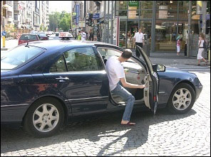 | Persons Being stationary or standstill means the time it takes for **someone to get in or out the car**.  This can happen quite quickly when it is only 1 person, but it can also take a few minutes, when, for example, many children have to get off the school bus. |
| 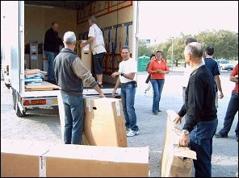 | Goods To be stationary or standstill also means the **time it takes to load or unload goods**.  This can also take a while, for example when petrol is delivered or when moving house. |

### Parking

|  |  |
| --- | --- |
| 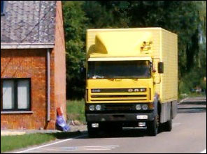 | If you stand longer than necessary to get someone in or out, or to load or unload a load, we are talking about: parking. |

### Stopped vehicle

|  |  |
| --- | --- |
| 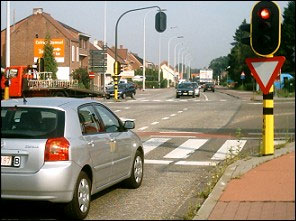 | Sometimes a vehicle has to stop, for example because the traffic light is red or because there is a stationary traffic jam, or to give priority to another driver.  Stopping on public roads for these reasons is not considered waiting or parking. |

### Defective vehicle

|  |  |
| --- | --- |
| 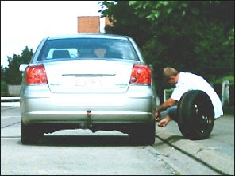 | A vehicle that is broken down on the public roads and is no longer permanently driven is not a stationary vehicle or a parked vehicle. It's **a defective vehicle**.  A defective vehicle that cannot be parked in a safe place must be made recognizable to other road users by means of **the warning triangle**.  The traffic signs concerning waiting and parking do not apply to a defective vehicle. |

---

## General rules: where can you be stationary and park

### On the verge

|  |  |
| --- | --- |
| 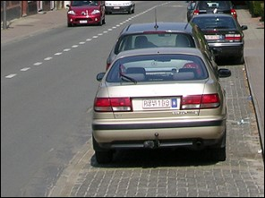 | Is there place:   * **within a built-up area** on the **ground level verge**; * **outside the built-up area** on the **ground level or on the raised verge**;   then you have to park your car there. |
| 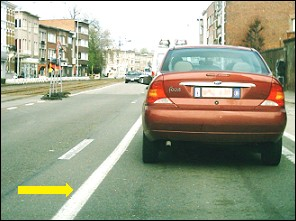 | On some roads a thick white solid line has been painted to the right of the roadway. You are allowed to be stationary and park next to it. |

### Partly on the verge and partly on the carriageway

|  |  |
| --- | --- |
| 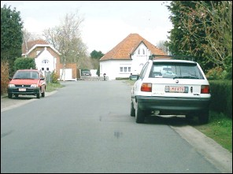 | If the verge is not wide enough, you partly park on the verge and partly on the carriageway.  But: you have to make sure that there is still **at least 1.5 meters of free passage for pedestrians** who use the verge, which is not the case here. |

### On the carriageway

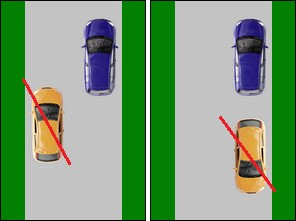 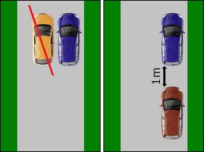

If you park on the carriageway, you do it as follows:

* as close as possible **to the edge of the carriageway**,
* right in the **direction of travel**.

So just standing still or parking somewhere on the roadway or along the left is forbidden.

* In a **single line**. Double parking or waiting is prohibited.
* Leave at least 1 meter of free space between two parked cars.

### One-way street

|  |  |
| --- | --- |
| 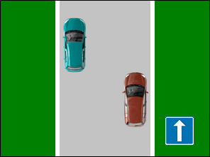 | On a one-way street, the car may be positioned both on the right or on the left. |

---

## General rules: where is being stationary and parking prohibited

### Endanger or nuisance

|  |  |
| --- | --- |
| 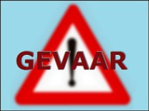 | You are **not allowed to be stationary or to park**   * in all places where your vehicle may be **a danger to other road users** or **unnecessarily hinder** them. |

### Motorway

|  |  |
| --- | --- |
| 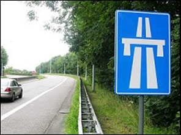 |    You are **not allowed** **to be stationary** **or to park**   * **on the lanes**, on the **entrances or exits**, or on the **emergency lane**. |

### Express road

|  |  |
| --- | --- |
| 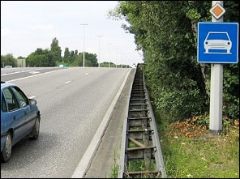 |    You are **not allowed** **to be stationary** **or to park**   * **on express roads**. |

### Pavement or footpath

|  |  |
| --- | --- |
| 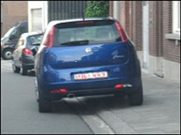 | You are **not allowed** **to be stationary** **or to park**   * on a pavement or on a footpath. * within a built-up area on a heightened verge. |

### On an elevated device

|  |  |
| --- | --- |
| 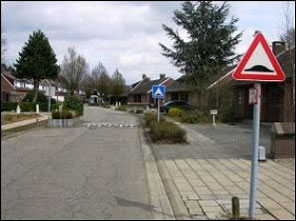 | 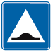  You are **not allowed** **to be stationary** **or to park**   * On an **elevated device**. |

### On a cycle lane

|  |  |
| --- | --- |
| 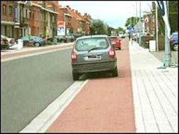 | You are **not allowed** **to be stationary** **or to park**   * On an **cycle lane**. |

### On a checker-board marking

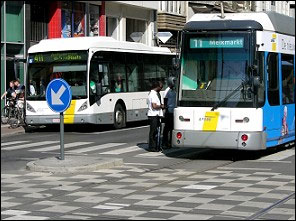 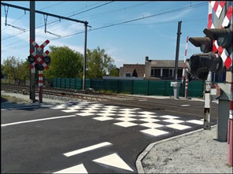

You are **not allowed** **to be stationary** **or to park**

* On a **checker-board marking** .

### On a special reserved route and on a bus lane

|  |  |
| --- | --- |
| 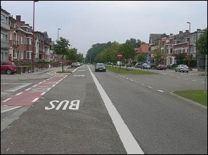 | You are **not allowed** **to be stationary** **or to park**   * On an **special reserved route and on a bus lane**. |

### On a gore or traffic displacement area

|  |  |
| --- | --- |
| 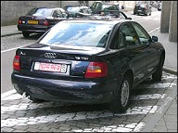 | You are **not allowed** **to be stationary** **or to park**   * On an **traffic displacement area or gore.** |

### On a traffic island or traffic conductor

|  |  |
| --- | --- |
| 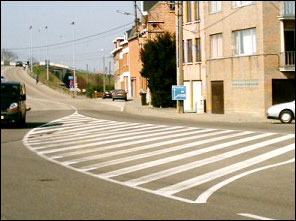 | You are **not allowed** **to be stationary** **or to park**   * On an **traffic island**. |

### On tram tracks

|  |  |
| --- | --- |
|  |   You are **not allowed** **to be stationary** **or to park**   * On **tram tracks**. |

### On a level crossing

|  |  |
| --- | --- |
|  |    You are **not allowed** **to be stationary** **or to park**   * On an **level crossing**. |

---

## Where is being stationary and parking prohibited - on the carriageway and on the verge

### On a crossing for pedestrians and cyclists

|  |  |
| --- | --- |
| 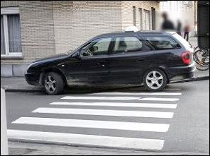 | You are not allowed **to be stationary** **or to park on the road and on the verge**:   * on a pedestrian crossing. * on a cyclists crossing. |

### On a junction (crossroads) without traffic lights

|  |  |
| --- | --- |
| 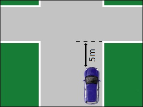 | You are not allowed **to be stationary** **or to park on the road and on the verge**:   * at intersections **less than 5 meters** from the extension of the adjacent edge of the cross carriageway. |

### On a junction (crossroads) with traffic lights

|  |  |
| --- | --- |
| 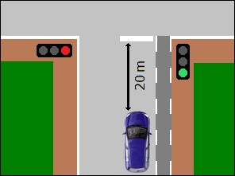 | You are not allowed **to be stationary** **or to park on the road and on the verge**:   * at a junction/crossroads with traffic lights **within 20 meters of the traffic lights**. |

### Traffic lights and traffic signs outside a crossroads/junction

|  |  |
| --- | --- |
| 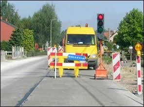 | You are not allowed **to be stationary** **or to park on the road and on the verge**:   * **within 20 meters of the traffic lights** outside a crossroads/junction. * **within 20 meters of traffic signs**. |
| 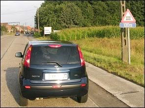 | **But**   * If the bottom of the road sign or light is **at least 2 meters high**, * and the top of the car with load does **not exceed 1 meter 65,**   then the 20 meters does not apply.  This car may therefore park or stop in that place because it does not interfere with the visibility of the sign. |

---

## Where is being stationary and parking prohibited - on the carriageway

### In front of a crossing

|  |  |
| --- | --- |
| 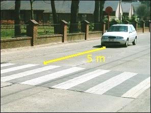 | You are not allowed **to be stationary** **or to park on the carriageway**:   * **within 5 meters** of a pedestrian crossing or a cyclists crossing. |

### Under bridges

|  |  |
| --- | --- |
| 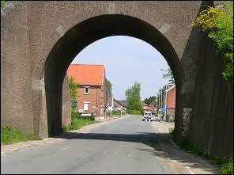 | You are not allowed **to be stationary** **or to park on the carriageway**:   * under bridges. |

### In tunnels

|  |  |
| --- | --- |
| 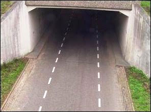 | You are not allowed **to be stationary** **or to park on the carriageway**:   * in tunnels. |

### Near the brow of a hill

|  |  |
| --- | --- |
| 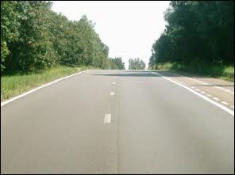 | You are not allowed **to be stationary** **or to park on the carriageway**:   * near the brow of a hill. |

### Before or in a dangerous bend

|  |  |
| --- | --- |
| 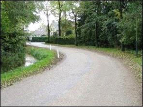 | You are not allowed **to be stationary** **or to park on the carriageway**:   * before or in a dangerous bend. |

---

## Traffic signs

| Sign | Kind | Meaning |
| --- | --- | --- |
| 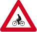 | Warning (or danger sign) | 1. Crossing for cyclists and drivers of two-wheeled mopeds. 2. Or a place where a cycle lane emerges onto a road. |
| 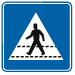 | Information sign | Pedestrian crossing. Is placed at the crossing. |
|  | Information sign | Crossing for cyclists and drivers of two-wheeled mopeds. Is placed at the crossing. |
|  | Information sign | Start or access of a motorway.  Important Maximum 120 kph and minimum 70 kph |
|  | Information sign | End or exit of a motorway. |
|  | Information sign | Start of an express road. |
|  | Information sign | End of an express road. |
|  | Warning (or danger sign) | Trams crossing ahead with one or two tracks simply set into the road. |
|  | Information sign | Indicates a specific lane reserved for the use of public transportation. |
| 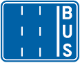 | Information sign | Indicates a specific lane reserved for the use of public transport vehicles. |
| 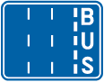 | Information sign | Indicates the lanes available and shows which is the bus lane. |

---

[Back to the previous page](theory)