## Part H: waiting and parking

# Lesson 26: Waiting and parking - part 2

## Where is parking prohibited and being stationary allowed

### 1 meter free space

|  |  |
| --- | --- |
| 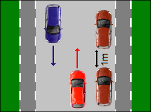 | You are not allowed to park:   * if you can't leave **1 meter of free gap** along the front and back of your car. |

### Bus – tram – trolley stop

|  |  |
| --- | --- |
| 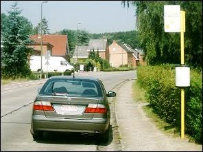 | You are not allowed to park:   * **15 meters in front and past a sign** indicating a bus, trolley or tram stop. |
| 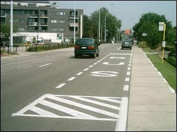 | Often the space in which you are not allowed to park is indicated by a road marking.  So it's okay to wait to let someone get in or out the car. |

### Entrance or exit of a private property

|  |  |
| --- | --- |
| 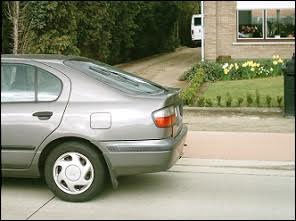 | You are not allowed to park:   * **in front of a drive-in of property**.   The owner is allowed to park when his number plate is clearly displayed on the exit/entrance. |

### In front of a garage gate

|  |  |
| --- | --- |
| 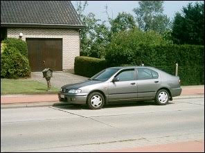 | You are not allowed to park:   * **in front of a garage gate**.   The owner is allowed to park when his number plate is clearly displayed on the gate. |

### Entrance or exit of an off-road parking

|  |  |
| --- | --- |
| 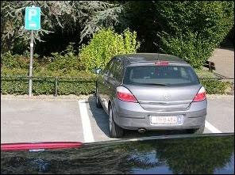 | You are not allowed to park:   * where you obstruct access to off-road parking spaces; * where you hinder the driving away of vehicles. |

### An obstacle obliges cyclists to leave the cycle lane

|  |  |
| --- | --- |
| 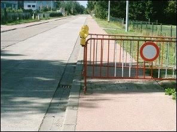 | You are not allowed to park:   * if **there is an obstacle**, so that cyclists or 2 wheel moped riders or pedestrians have to come onto the carriageway. |
| 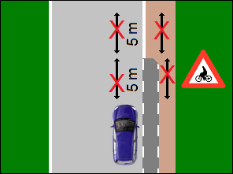 | But **if the cycle lane ends**, you may not being stationary and not park on the roadway and on the roadside up to 5 meters before and beyond the place where the cycle lane ends and you must also give priority. |

### Narrow road

|  |  |
| --- | --- |
| 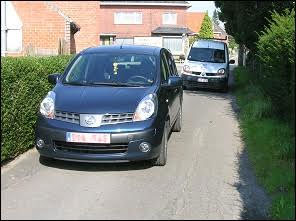 | You are not allowed to park:   * if the **roadway is too narrow**. There must be **at least 3 meters** of free passage left. |

### Opposite another vehicle

|  |  |
| --- | --- |
| 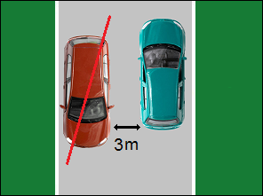 | You are not allowed to park:   * on a two-way roadway opposite a car that is already stationary or parked, if this makes crossing two other vehicles more difficult. |

### Priority road outside a built-up area

|  |  |
| --- | --- |
| 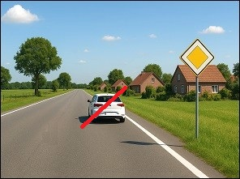 | Outside a built-up area, it is forbidden to park on the roadway of a priority road. |

|  |  |
| --- | --- |
| 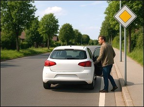 | Outside a built-up area, you may, however, stop on the roadway of a priority road, for example to let someone get in or out.  Outside a built-up area, you may park on the paved or unpaved verge next to the roadway. |

|  |  |
| --- | --- |
| 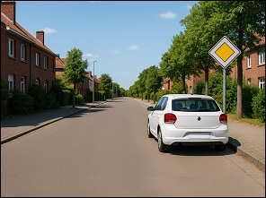 | Inside a built-up area, you may stop and park on the roadway of a priority road. |

### Road segregated in lanes

|  |  |
| --- | --- |
| 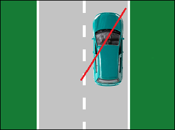 | You are not allowed to park:   * on **a carriageway divided into lanes**.   BUT it is allowed if these traffic signs allow it.    |

|  |  |
| --- | --- |
| 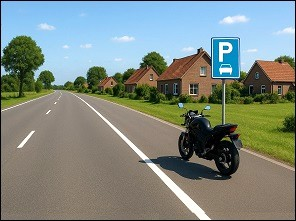 | This motorcycle is parked correctly, but it may also be parked beyond the traffic sign. |

### Public road with 3 roads

|  |  |
| --- | --- |
| 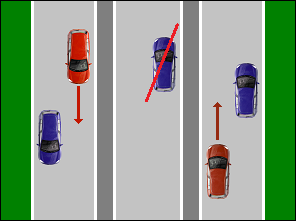 | You are not allowed to park:   * **on the middle lane** of public roads with 3 lanes. |

### Public road segregated into two carriageways

|  |  |
| --- | --- |
| 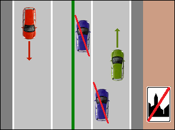 | You are not allowed to park:   * **outside the built-up area** along the left on a public road with two lanes. |
| 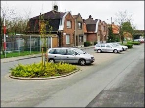 |   Within the built-up area, you can park on the left side of the roadway on the level shoulder to the left of the road.  Cars may park in that place:   * **within** built-up areas; * the lanes are separated by a level verge (where the cars are). |

### Yellow broken line

|  |  |
| --- | --- |
| 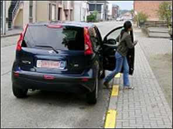 | You are not allowed to park:   * next to **a broken yellow line** on the edge of the carriageway. |

### Parking facilities for disabled

|  |  |
| --- | --- |
| 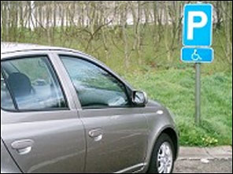 | You are not allowed to park:   * in parking spaces for persons with disabilities. |

---

## Traffic signs and arrows

### Parking prohibited

|  |  |
| --- | --- |
| 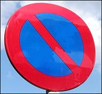 | This round sign, with 1 slanting stripe, says that, on the side where this sign is, **parking is prohibited**:   * on **the carriageway**, * and on **the verge**,   up to the next intersection. |

### Parking and waiting prohibited

|  |  |
| --- | --- |
| 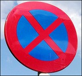 | This round sign, with 2 slanting stripes, says that, on the side where this sign is, **being stationary and parking are prohibited**:   * on **the carriageway**, * and on **the verge**,   up to the next intersection. |

### Arrows

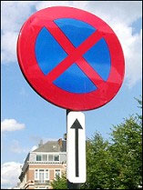 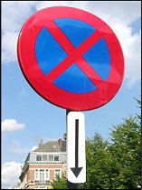 

There may be arrows under parking signs that provide additional information.

* Arrow pointing up means prohibition starts beyond the sign.
* Arrow pointing down means that the prohibition applies up to this sign.
* Arrow pointing up and down means: in front of and past this sign.

---

## Traffic signs and arrows

### From the 1st to the 15th of the month

|  |  |
| --- | --- |
| 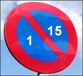 | This sign means that you are **not allowed to park** on this side of the lane from the 1st to the 15th of the month.  Note that the ban now **only applies to the carriageway** and that you are allowed to park on the verge. So you have to park on the other side of the road, where the sign below is. |

### From the 16th to the 31st of the month

|  |  |
| --- | --- |
| 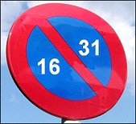 | This sign means that you are **not allowed to park** this side of the lane from the 16th to the 31th of the month.  Note that the ban now **only applies to the carriageway** and that you are allowed to park on the verge. So you have to park on the other side of the road, where the sign below is. |

### Arrows

|  |  |
| --- | --- |
| 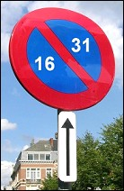 | There may be arrows under parking signs that provide additional information.   * Arrow pointing up means prohibition starts beyond the sign. * Arrow pointing down means that the prohibition applies up to this sign. * Arrow pointing up and down means: in front of and past this sign. |

### When is the changeover

You have to move your car on the last day of a period **between 7:30 pm and 8:00 pm**.

---

## Traffic signs

| Sign | Kind | Meaning |
| --- | --- | --- |
|  | Sign concerning being stationary and parking | Parking permitted. |
|  | Sign concerning being stationary and parking | Parking permitted for cars, estate cars (station wagons) and mini buses and mopeds. |
| 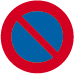 | Sign concerning being stationary and parking | Parking prohibited on the road and on the verge. |
| 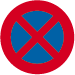 | Sign concerning being stationary and parking | Parking and waiting prohibited on the road and on the verge. |
| 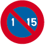 | Sign concerning being stationary and parking | Parking prohibited on this side of the road, from the 1st till the 15th of the month. (Changeover: between 7.30 pm and 8 pm) |
| 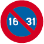 | Sign concerning being stationary and parking | Parking prohibited on this side of the road, from the 16th till the end of the month. (Changeover: between 7.30 pm and 8 pm) |
| 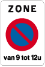 | Sign concerning being stationary and parking | Zone parking prohibited with a time restriction from 9 am till 12 am on the road and the verge. |
|  | Sign concerning being stationary and parking | * Arrow up: prohibition starts past this sign. * Arrow down: prohibition applies till here and ends past the sign. * Arrow up and down: prohibition applies in front and past this sign. |
|  | Sign concerning being stationary and parking | Prohibition starts past this sign and applies over a distance of 20m. |
| 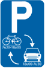 | Sign concerning being stationary and parking | Parking reserved for bicycles from 07:30 to 18:00 and for motorcycles, passenger cars, dual-use cars and minibuses from 18:00 to 07:30. |

---

[Back to the previous page](theory)