## Part H: waiting and parking

# Lesson 27: Waiting and parking - part 3

## Restricted parking

### Signs zone with limited parking time

|  |  |
| --- | --- |
| 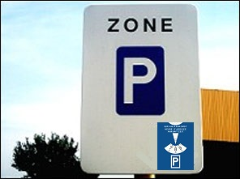 | This sign indicates the beginning of a zone with limited parking time. Such a zone is also called **blue zone**. |

### When

|  |  |
| --- | --- |
| 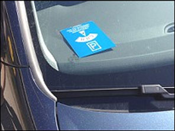 | Within this zone, all drivers of a cars must use the **parking disc** on working days when parking their car.  You have to do it **from Monday to Saturday, between 9am and 6pm**, unless otherwise stated on the board.  The parking disc must be clearly displayed behind the front windscreen. |

### How to use a parking disk

|  |  |
| --- | --- |
| 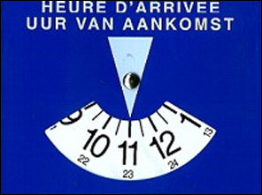 | On the parking disc you **place the arrow on the dash that follows the time of arrival.** (You arrive at 10h30 so arrow at 11h00.)  You may then **park for two hours**, counting from the time the arrow indicates. Unless a road sign indicates a different time.  After that, you **need to move the car** and not change the time on the parking disc. |

### A parking disk outside the zone

|  |  |
| --- | --- |
| 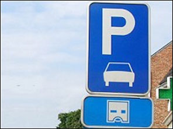 |   Please note: often the parking disc must also be used outside a blue zone. |

---

## Parking meter and ticket dispenser

|  |  |
| --- | --- |
| 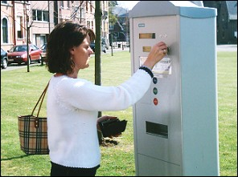 | In many places there are parking machines or parking meters.  You have to pay the amount that is stated on the vending machine or on meter.  If the vending machine is defective, use the parking disc. |

---

## Zone 3,5 ton

|  |  |
| --- | --- |
| 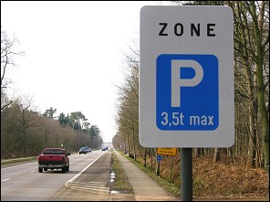 | There are also other parking zones, such as this one.  This sign means that parking is allowed for vehicles with a **MAW of 3.5 tons or less**.  A passenger car is therefore allowed to park there. |

---

## Signs

### Parking allowed

|  |  |
| --- | --- |
| 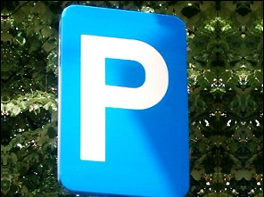 | This is the general sign that says **vehicles are allowed to park**. |

### Sign parking + car

|  |  |
| --- | --- |
| 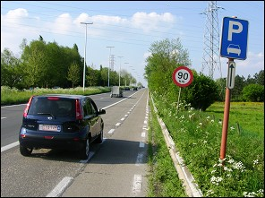 | If there is a car under the P, you can park past this sign:   * passenger car; * dual-use car; * minibus; * motorcycle.   (Note the arrow below the board.) |

### Parking on the verge

|  |  |
| --- | --- |
| 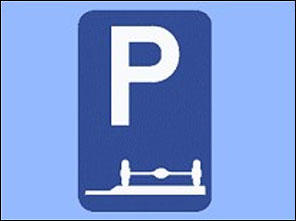 | If you see this sign, it means that if you park, you have to do it **on the verge**.  You can't do it on the carriageway. |

### Parking on the carriageway

|  |  |
| --- | --- |
| 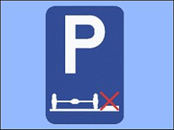 | If you see this sign, it means that if you park, you have to do it **on the carriageway**.  You can't do it on the verge. |

### Parking partly on the carriageway and partly on the verge

|  |  |
| --- | --- |
| 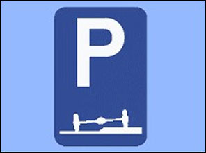 | If you see this sign, it means that if you park, you have to do it **partly on the carriageway and partly on the verge**. |

### Alternating parking for certain vehicles

|  |  |
| --- | --- |
| 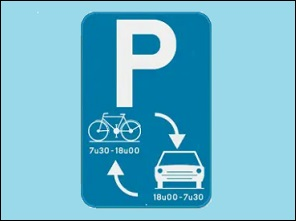 | This traffic sign indicates that the parking space is reserved for alternating parking, for example for bicycles and cars.  In this example: from 6:00 p.m. to 7:30 a.m., cars are allowed to park. |

---

## Getting in or out

### Getting out of the car

|  |  |
| --- | --- |
| 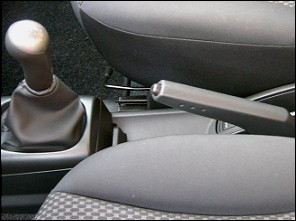 | Before you get out, you must:   * pull up the handbrake; * close all windows and the open roof; * you turn off the engine; * removes the key from the ignition; * close the doors as soon as you got out. |

### Leaving the car

|  |  |
| --- | --- |
| 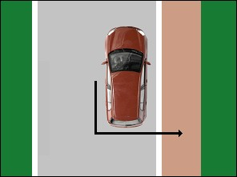 | Leaving the car is done **in the direction of the back of the car**. This way you have a view of the traffic coming from behind. |

### Getting in the car

|  |  |
| --- | --- |
| 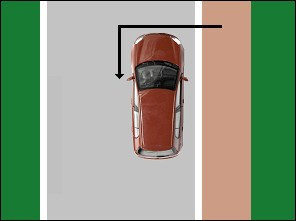 | If you want to get in the car, you **go past the front of the car**. This way you have a view of the traffic coming from behind. |

---

## Time

### Rules

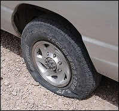 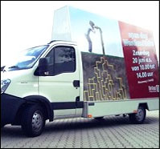 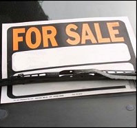

* A **defective car** may remain on public roads for a **maximum of 24 hours**.
* An **advertising vehicle** may remain on public roads for a **maximum of 3 hours**.
* Offering a **vehicle for sale** on public roads is **prohibited**.

---

## Traffic signs

Je moet voor het examen kennen welk soort verkeersbord het is en de betekenis.

| Sign | Kind | Meaning |
| --- | --- | --- |
|  | Sign concerning being stationary and parking | Parking allowed. |
| 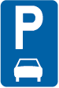 | Sign concerning being stationary and parking | Parking for cars, station wagons, mini buses and motorcycles. |
| 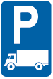 | Sign concerning being stationary and parking | Parking for lorries and trucks. |
| 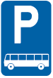 | Sign concerning being stationary and parking | Parking for coaches. |
| 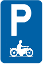 | Sign concerning being stationary and parking | Parking only allowed for motorcycles. |
|  | Sign concerning being stationary and parking | Parking allowed, use of parking disc obligatory. |
|  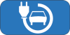 | Sign concerning being stationary and parking | This supplementary traffic sign indicates that parking is only allowed for electric cars while the battery is charging. |
|  | Sign concerning being stationary and parking | Parking allowed, on the verge only. |
|  | Sign concerning being stationary and parking | Parking allowed, partly on the verge and partly on the road. |
| 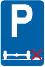 | Sign parking and waiting | Parking allowed, on the road only. |
| 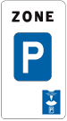 | Sign concerning being stationary and parking | Start of a zone with restricted parking times (blue zone). Use parking disc. |
| 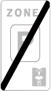 | Sign concerning being stationary and parking | End of the zone with restricted parking times. |

---

[Back to the previous page](theory)