## Part I: miscellanea

# Lesson 30: Energy use

## Do you really need the car

### STOP

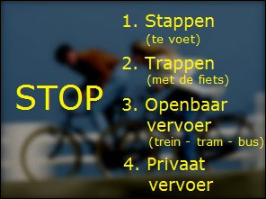 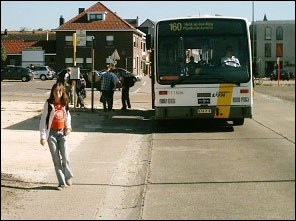

Driving a car is not only expensive, but also harmful to the environment.

Ask yourself before you leave whether you really need the car?

* Is the distance not too short and it might be better to walk (up to 1 km)?
* Or is the bicycle perhaps the preferred means of transport (1 to 10 km)?
* Or do you get to your destination by public transport?

Driving short distances with a cold engine is not only harmful to the engine, it also increases fuel consumption.

---

## Tips for economical driving

### Recommended speed acceleration

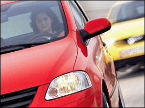 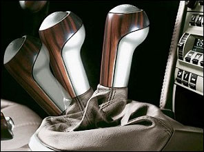

If you do take the car, realize that **sporty driving**, where you **constantly shift gears** and reach high revs, requires a lot of fuel.

Therefore, take into account the recommended speeds for switching, which may change depending on the circumstances:

* **Petrol**: 2500 rpm
* **Diesel**: 2000 rpm

If you wait for a red light with a motor in freewheel mode, **repeated acceleration** (broem ... broem ... broeoemm ...) is not allowed. Not even in winter to keep the engine warm.

### Load and extra fuel

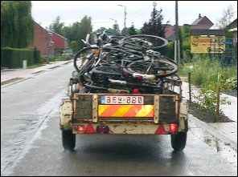 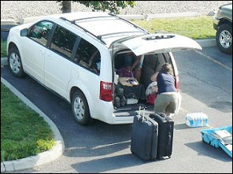

The heavier the load, the more fuel consumption.

Check regularly that there are no unnecessary items in the trunk of the car.

### Ski box and roof racks

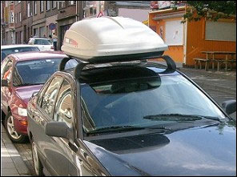 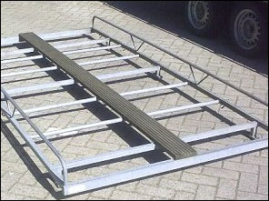

A ski box on the roof of a car and an imperial increase the air resistance.

It is also best to **remove these as soon as you no longer need them.**

### Bicycle at the back

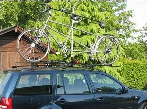 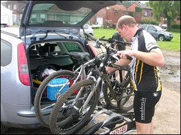

It's better not to transport a bicycle on the roof of the car, but place it on a rack at the back of the car.

### Windows closed

|  |  |
| --- | --- |
| 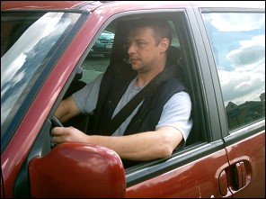 | Driving with the windows open, increases the air resistance and costs extra fuel.  Better than turning on the fan. |

### Electric consumptions

|  |  |
| --- | --- |
| 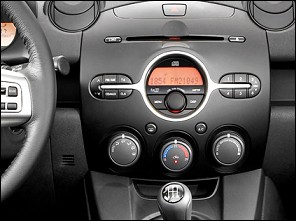 | You should also switch off the various power consumers, such as air conditioning, heating, rear window heating, fan (...) if they are not really needed. |

### Tyres

|  |  |
| --- | --- |
| 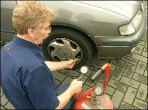 | It is important that you drive with the tyre pressure prescribed by the manufacturer.  If you have to carry a heavy load, or travel a long distance, it's best to increase the tyre pressure a bit. |
| 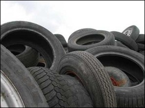 | Worn-out tires are completely out of the question and should not be re-cut. |

### Motor

|  |  |
| --- | --- |
| 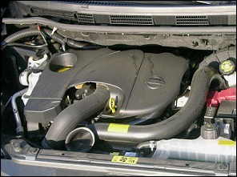 | Regular maintenance of the engine is also necessary.  For example, a dirty air filter ensures extra fuel consumption. |
| 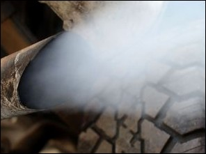 | Dirty exhaust fumes are converted into ozone, as soon as they come into contact with air. |
| 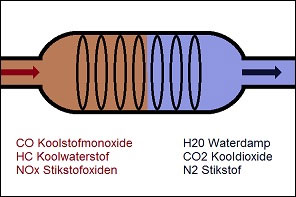 | The catalyst is located at the front of the exhaust system, just after the engine, under the car. The goal of each catalyst is to reduce harmful emissions that leave the exhaust of an internal combustion engine. The catalyst thus removes the harmful and toxic substances from the exhaust gases (nitrogenoxides, carbon monoxide, hydrocarbons). |

### Fuel

|  |  |
| --- | --- |
| 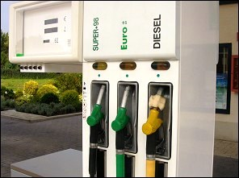 | The fuel used by the car also affects the environment.   * LPG or GAS is the most environmentally friendly, * followed by gasoline, * Low-sulphur diesel is more environmentally friendly than regular diesel. |

### Engine off

|  |  |
| --- | --- |
| 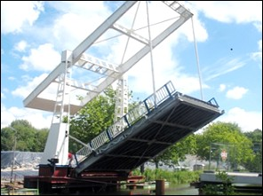 | And finally, it's best to switch the engine off, if you have to wait anywhere longer than 30 seconds. |

### Low emission zone

|  |  |
| --- | --- |
| 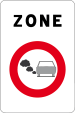 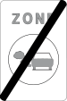 | These traffic signs indicate the **beginning and end of a low-emission zone**.  This is an area where certain vehicles are **not allowed** because they emit too many pollutants. Each city or municipality can decide for itself where such a low-emission zone applies.  *(Good to know: In Belgium there are currently three LEZs: Antwerp, Brussels and Ghent. The access conditions differ in these cities, so always check the rules online in advance.)* |

### EURO norm

|  |  |
| --- | --- |
| <i class="fa-solid fa-leaf" style="font-size:32px;color:var(--success)"></i> | The **EURO standard** is stated on the vehicle registration certificate. The EURO standard (also called the emission class) is a European regulation that limits the emission of harmful substances by vehicles.  It indicates how many pollutants, such as particulate matter, carbon monoxide and nitrogen oxides, a car emits. **The higher the number (from 1 to 6), the cleaner the car and the lower its emissions.**  *(The registration certificate is, as it were, the identity card of the vehicle and contains all its details.)* |

### Petrol station

|  |  |  |  |  |  |
| --- | --- | --- | --- | --- | --- |
|   Gasoline and diesel | 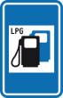  LPG | 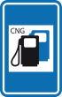  CNG | 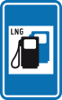  LNG | 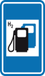  H2 | 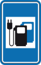  Electricity |

---

## Defensive driving

### What is it?

You drive defensively when you look beyond just the driver in front of you and **anticipate problems or possible mistakes made by others.**

You recognise potentially dangerous situations before they occur. By anticipating in time what will happen, you can release the accelerator and let the engine slow down the vehicle (**engine braking**). This saves fuel and brake pads, and increases safety thanks to **shorter braking and stopping distances**.

---

[Back to the previous page](theory)