## Part A: the public road

# Lesson 6: Special places

## The built-up area

### What is it

|  |  |
| --- | --- |
|  |      Dutch: *bebouwde kom*  The built-up area is a region where the access roads are indicated by one of the above traffic signs.  You leave or exit a built-up area as soon as you are past one of the below traffic signs.  There are specific regulations for the traffic in or out a built-up area.     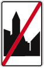 |

### Orange traffic sign

|  |  |
| --- | --- |
| 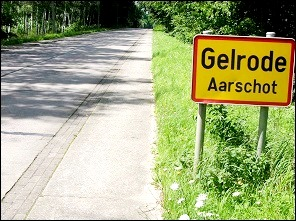 | This traffic sign with the red border only indicates **the administrative boundary** of a city and has no significance in the traffic regulations. |

### Speed in a built-up area

|  |  |
| --- | --- |
| 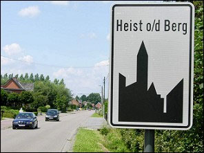 | The maximum speed in a built-up area is:   * in Flanders: **50kph**. * in Wallonia: **50kph**. * in Brussels region: **30kph** |
| 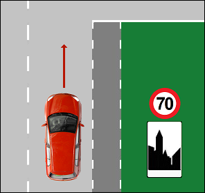 | The only exception is when a traffic sign imposes on or past the start sign of a built-up area another speed limit.  In this example drivers are allowed to drive 70kph until the next junction. |
| 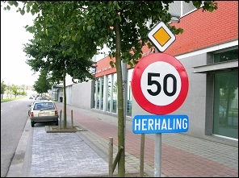 | To make sure you don’t forget that you are still in a built-up area past that junction, you will be remembered by this combination of traffic signs. |
| 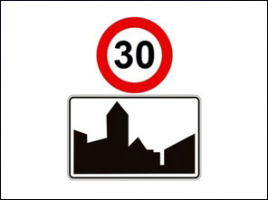 | Only when you see a sign '30' above a sign 'start of a built-up area' you must drive 30kph within the whole built-up area. |

### Speed when leaving a built-up area

|  |  |
| --- | --- |
| 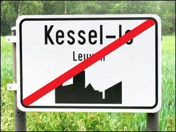 | When you leave a built-up area, you are allowed to drive on regular roads:   * in Flanders: **70kph**. * in Wallonia: **90kph**. * in Brussels region: **70kph** |
| 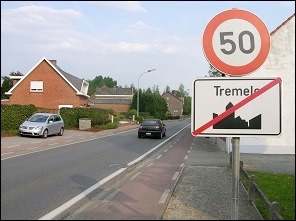 | Except when a traffic sign indicates another speed limit.  The top sign in this picture indicates that you are allowed to drive maximum 50kph until the next cross roads. |

---

## Residential area

### What is it

|  |  |
| --- | --- |
|  |    Dutch: *woonerf*  The beginning of a residential area is indicated by the first traffic sign and the end by the second.  In a residential area, the residential function is more important than the traffic function.   * The **pedestrians** are allowed to walk in the street. * **Children** are allowed to play on the road. However, they may not unnecessary hinder the traffic. |

### Speed

|  |  |
| --- | --- |
| 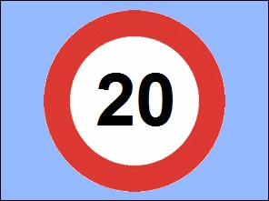 | The maximum speed in a residential area is **20kph**. |

### Parking

|  |  |
| --- | --- |
| 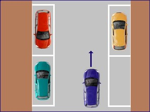 | In a residential area, you are only allowed to park a car **in special landscaped areas for parking**.  You are allowed at the right or at the left of the travel direction. |

---

## Play street

### What is it

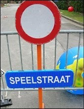 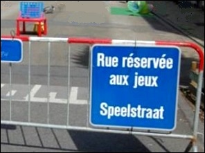

Dutch: *speelstraat*

In a play street, the whole width of the public road is reserved for playing.

### Rules

|  |  |
| --- | --- |
| 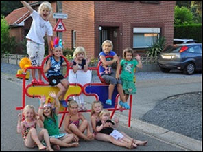 | Drivers of motor vehicles are allowed:   * when they **live in the street**. * when they are **owner of a garage** in the street. * when they are **priority vehicles**.   You can only drive **at footpace**. |

---

## School street

### What is it

|  |  |
| --- | --- |
| 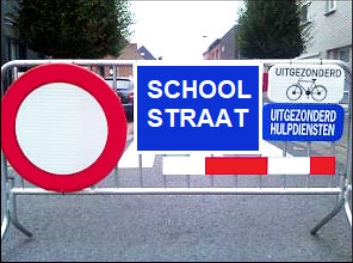 | Dutch: *schoolstraat*  To lower the flow of traffic at the beginning or end of a school day, a street can be closed for motor vehicles near a school twice a day. This way the street becomes a school street. |

### Who is allowed in a school street

* Pedestrians and cyclists are allowed.
* Inhabitants who live in the street or are owner of a garage in that street.
* Priority vehicles.
* Vehicles with a permission.

### Speed in a school street

Drivers in a school street are only allowed to drive **at walking speed**.

Drivers must give right of way to pedestrians and cyclists and not hinder or endanger them.

---

## Bike zone

### What is it

|  |  |
| --- | --- |
| 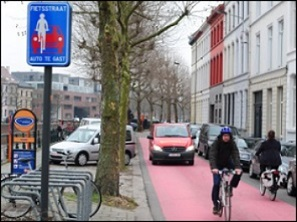 |   A bicycle zone is one or more public roads where cyclists (and drivers of bicycles and speedpedelecs) are the most important road users, but where motor vehicles are also permitted. They are, as it were, "guests"..  In a bicycle zone, motor vehicles (also not mopeds) are not allowed to overtake cyclists, speed pedelecs and road wheels up to 1 m wide.  The maximum permitted speed is 30 km/hour. A bicycle zone stops at the board end zone.  Due to the Royal Decree of 12 March 2023, the bicycle street has been removed from the road code. But the signs with bicycle street and end of the bicycle street may remain until 1 January 2032. |

### Rules

* In a cyclist street motor vehicles are **not allowed to overtake the cyclists**.
* The maximum speed limit is **30kph**.

---

## Zone

### What is it

|  |  |
| --- | --- |
|  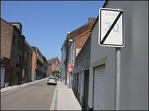 | Dutch: *zone*  A Zone consists of one or more public roads where the beginning is indicated by a traffic sign: 'Start Zone' and the end with a traffic sign 'End Zone'.  As long as you are in a zone, it is mandatory to do what is indicated when driving into the zone: **day and night**. |

### Electronic zone sign

|  |  |
| --- | --- |
| 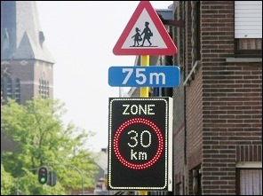 | When you drive past an electronic sign, it is **only mandatory when it lights up**. |

---

## School environment

|  |  |
| --- | --- |
| 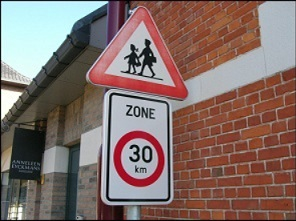 | Dutch: *schoolomgeving*  This combination of signs indicates a **school environment**. It is an area of one or more public roads or parts thereof, which includes access to a school and the beginning and end of which are marked out by these road signs. |

---

## Reserved road for...

### What is it

|  |  |
| --- | --- |
| 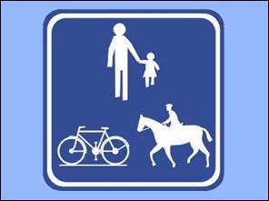 | Some roads are reserved for special groups of road users. The beginning of such a road is indicated by a traffic sign. The end is indicated by the same sign with a red line across.  Symbols in the sign show us which road users are admitted. |

### Rules

* Drivers must exercise **extra caution** in the presence of children.
* The maximum speed limit is **30kph**.

---

## Special reserved route

### What is it

|  |  |
| --- | --- |
| 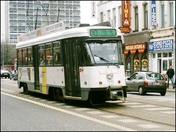 | Dutch: *bijzondere overrijdbare bedding*  It is a part of the public road especially for trams and busses. They are indicated by road markings, one or two solid white lines or a checkered pattern with white squares. |

|  |  |  |  |
| --- | --- | --- | --- |
|  |    |   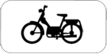 |    |

### Rules

Such a special reserved route is not a part of the carriage way.

Other vehicles are allowed to cross over when:

* they need to park or exit a parking space next to the reserved crossing.
* they drive up or exit a property.
* there is a junction.

---

## Read this very carefully

### Immediate temporary suspension of your driving licence

You risk **an immediate temporary suspension of your driving licence** from the moment:

* you drive more than **30kph too fast**
  + on motorways,
  + express roads,
  + regular roads.
* you drive more than **20kph too fast**
  + in a built-up area,
  + a 30 Zone,
  + a residential area.

The immediate suspension is done by the **police** because you commit a serious offence. With every serious offence, your driving licence can be suspended immediately.

### A declaration of lapse of right for driving a motorized vehicle

You risk **a declaration of lapse of right for driving a motorized vehicle** from the moment:

* you drive more than **40kph too fast**
  + on motorways,
  + express roads,
  + regular roads.
* you drive more than **30kph too fast**
  + in a built-up area,
  + a 30 Zone,
  + a residential area.

This isn’t done by de police but by the **judge** in court when your case is dealt with.

---

## Traffic signs

| Sign | Kind | Meaning |
| --- | --- | --- |
|    | Information sign | Start of a built up area.  Important Maximum 50 kph until the end of the built up area. |
|   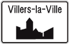 | Information sign | Start of a built up area.  Important Maximum 50 kph until the end of the built up area. |
|   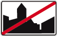 | Information sign | End of a built up area. |
|    | Information sign | End of a built up area. |
| 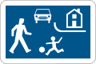 | Information sign | Start of a residential area.  Important Maximum 20 kph till the end of this area. |
|  | Information sign | The end of a residential area |
| 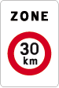 | Information sign | Start of a zone 30.  Important Maximum 30 kph till the end of the zone. |
|  | Information sign | Road for specific categories of road users.  Important Maximum 30 kph till the end of this zone. |
| 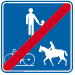 | Information sign | The end of the road for these specific categories. |
|  | Information sign | Indicates a specific lane reserved for the use of public transport vehicles. |
| 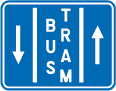  | Information sign | Indicates a specific lane reserved for the use of public transport vehicles.  Mopeds are allowed to drive here. |
|   | Information sign | Indicates a specific lane reserved for the use of public transport vehicles.  Motorcycles are allowed to drive here. |
|   | Information sign | Indicates a specific lane reserved for the use of public transport vehicles.  Cyclists arre allowed to ride here. |
|  | Information sign | Start of a cyclists street. |
| 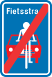 | Information sign | End of a cyclists street. |

---

[Back to the previous page](theory)